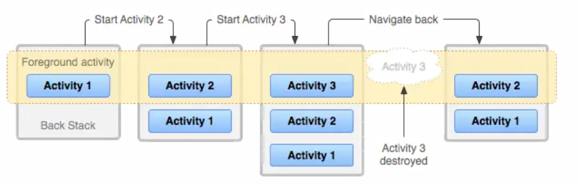

[TOC]

# Activity篇

  

## 一、Activity简述

#### 1、概念引入：什么是Activity


Activity作为Android的四大组件之一，Activity在Android系统中是以界面的形式进行体现。实际上是一个与用户交互的接口。其中Activity实现了如**Window.Callback, KeyEvent.Callback**等接口用于与用户进行交互。

#### 2、源码释义

```csharp
    An activity is a single, focused thing that the user can do. 
```

一个界面是开发者可以操作的一个重点的独立事项。

```tsx
    Almost all activities interact with the user, so the Activity class takes care of creating a window for you in which you can place your UI with setContentView(View). 
```

几乎所有界面都可以与用户交互，所以Activity类负责为用户创建一个窗口，你可以在其中使用setContentView（View）放置UI。

```csharp
    While activities are often presented to the user as full-screen windows, they can also be used in other ways: as floating windows (via a theme with windowIsFloating set) or embedded inside of another activity (using ActivityGroup). 
```

虽然界面通常以全屏窗口的形式呈现给用户，但它们也可以以其他方式使用：**作为浮动窗口（通过具有windowIsFloating集合的主题）或嵌入另一个活动（使用ActivityGroup）内部**。

```jsx
    There are two methods almost all subclasses of Activity will implement:
```

几乎所有的Activity子类都会实现两种方法：

```csharp
    onCreate(Bundle) is where you initialize your activity. Most importantly, here you will usually call setContentView(int) with a layout resource defining your UI, and using findViewById(int) to retrieve the widgets in that UI that you need to interact with programmatically.
```

onCreate（Bundle）是初始化界面的地方。最重要的是，在这里你通常会调用setContentView（int）和一个定义你的UI的布局资源，并且使用findViewById（int）来检索你需要以编程方式进行交互的那个UI中控件。

```kotlin
    onPause() is where you deal with the user leaving your activity.Most importantly, any changes made by the user should at this point be committed (usually to the ContentProvider holding the data).
```

onPause（）是你对于用户离开界面的处理。最重要的是，此时用户所做的任何更改都应该提交（通常发送给持有数据的ContentProvider。

```rust
    To be of use with Context.startActivity(), all activity classes must have a corresponding declaration in their package's AndroidManifest.xml.
```

要使用Context.startActivity（），所有界面类必须在其包下的AndroidManifest.xml中具有相应的声明。

------

## 二、Activity的生命周期


#### 1、Activity的生命周期图


图2.1  Activity生命周期图

#### 2、生命周期详解

##### 2.1	Activity的4种状态

**Active/Paused/Stopped/Killed**

- **Activie**:当前Activity正处于**运行状态**，指的是当前Activity获取了焦点。
- **paused**：当前Activity正处于**暂停状态**，指的是当前Activity失去焦点，此时的Activity并没有被销毁，内存里面的成员变量，状态信息等仍然存在，当然这个Activity也仍然可见，但是焦点却不在它身上，比如被一个对话框形式的Activity获取了焦点，或者被一个透明的Activity获取了焦点，这都能导致当前的Activity处于paused状态。
- **stopped**:与paused状态相似，stopped状态的Activity是完全不可见的，但是内存里面的成员变量，状态信息等仍然存在，但是也没有被销毁。
- **killed**:已经被**销毁**的Activity才处于killed状态，它的内存里面的成员变量，状态信息等都会被一并回收。


##### 典型情况下的生命周期：

 Activity启动–>onCreate()–>onStart()–>onResume()

 点击home键回到桌面–>onPause()–>onStop()

 再次回到原Activity时–>onRestart()–>onStart()–>onResume()

 退出当前Activity时–>onPause()–>onStop()–>onDestroy()

 

1.启动了一个Activity,通常是Intent来完成。启动一个Activity首先要执行的回调函数是onCreate(),通常在代码中你需要在此函数中绑定布局，绑定控件，初始化数据等做一些初始化的工作。

2.即将执行Activity的onStart()函数，执行之后Activity已经可见，但是还没有出现在前台，无法与用户进行交互。这个时候通常Activity已经在后台准备好了，但是就差执行onResume()函数出现在前台。

3.即将执行Activity的onResume()函数，执行之后Activity不止可见而且还会出现在前台，可以与用户进行交互啦。

4.由于Activity执行了onResume()函数，所以Activity出现在了前台。也就是Activity处于运行状态。

5.处于运行状态的Activity即将执行onPause()函数，什么情况下促使Activity执行onPause()方法呢？
 [1]启动了一个新的Activity
 [2]返回上一个Activity
 可以理解为当需要其他Activity，当前的Activity必须先把手头的工作暂停下来，再来把当前的界面空间交给下一个需要界面的Activity，而onPause()方法可以看作是一个转接工作的过程，因为屏幕空间只有那么一个，每次只允许一个Activity出现在前台进行工作。通常情况下onPause()函数不会被单独执行，执行完onPause()方法后会继续执行onStop()方法，执行完onStop()方法才真正意味着当前的Activity已经退出前台，存在于后台。

6.Activity即将执行onStop()函数，在“5”中已经说得很清楚了，当Activity要从前台切换至后台的时候会执行，比如：用户点击了返回键，或者用户切换至其他Activity等。

7.当前的Activity即将执行onDestory()函数，代表着这个Activity即将进入生命的终结点，这是Activity生命周期中的最后一次回调生命周期，我们可以在onDestory()函数中，进行一些回收工作和资源的释放工作，比如：广播接收器的注销工作等。

8.执行完onDestory()方法的Activity接下来面对的是被GC回收，宣告生命终结。

9.很少情况下Activity才走“9”，网上一些关于对话框弹出后Activity会走“9”的说法，经过笔者验证，在某个Activity内弹出对话框并没有走“9”，所以网上大部分这样说法的文章要么是没验证，要么直接转载的，这个例子说明，实验出真知，好了，不废话了，那么什么情况下，Activity会走“9”呢？看看下面这位博主才是真的懂得“实验出真知”的人：

http://blog.csdn.net/a872822645/article/details/62217965

10.**当用户在其他的Activity或者桌面回切到这个Activity时，这个Activity就会先去执行onRestart()函数**，Restart有“重新开始”的意思，然后接下来执行onStart()函数，接着执行onResume()函数进入到运行状态。

11.在“10”中讲的很清楚了。

12.高优先级的应用急需要内存，此时处于低优先级的此应用就会被kill掉。

13.用户返回原Activity。

##### 下面来着重说明一下Activity每个生命周期函数：

onCreate():
 表示Activity正在被创建，这是Activity生命周期的第一个方法。通常我们程序员要在此函数中做初始化的工作，比如：**绑定布局，控件，初始化数据等**。

onStart():
 表示Activity正在被启动，这时候的Activity已经被创建好了，**完全过了准备阶段，但是没有出现在前台**，需要执行onResume()函数才可以进入到前台与用户进行交互。

onResume():
 表示Activitiy已经可见了，并且Activity处于运行状态，**也就是Activity不止出现在了前台，而且还可以让用户点击，滑动等等操作与它进行交互。**

onPause():
 表示Activity**正在暂停，大多数情况下，Activity执行完onPause()函数后会继续执行onStop()函数**，造成这种函数调用的原因是**当前的Activity启动了另外一个Activity或者回切到上一个Activity。**还有一种情况就是onPause()函数被单独执行了，并没有附带执行onStop()方法，造成这种函数调用的原因很简单，就是当前Activity里启动了类似于对话框的东东。

onStop():
 **表示Activity即将停止，我们程序员应该在此函数中做一些不那么耗时的轻量级回收操作**。

onRestart():
 表示**Activity正在重新启动**。一般情况下，一个存在于后台不可见的Activity变为可见状态，都会去执行onRestart()函数，然后会继续执行onStart()函数，onResume()函数出现在前台并且处于运行状态。

onDestory():
 表示Activity要被销毁了。这是Activity生命中的最后一个阶段，我们可以在onDestory()函数中做一些回收工作和资源释放等，比如：广播接收器的注销等。

#### 3、异常情况下生命周期详解

##### 3.1.1	资源相关的系统配置发生改变导致Activity被杀死并重新创建 


 从图中看出当Activity发生意外的情况的时候，这里的意外指的就是系统配置发生改变，Activity会被销毁，其onPause,OnStop,onDestory函数均会被调用，**同时由于Actiivty是在异常情况下终止的，系统会调用onSaveInstanceState来保存当前Activity状态**。调用onSaveInstanceState的时机总会发生在onStop之前，至于会不会调用时机发生在onPause方法之前，那就说不定了，这个没有固定的顺序可言，正常情况下一般onSaveInstanceState不会被调用。**当Activity被重新创建后，系统会调用onRestoreInstanceState,并且把Actiivty销毁时onSaveInstanceState方法所保存的Bundle对象作为参数传递给onRestoreInstanceState和onCreate方法。所以我们可以通过onRestoreInstanceState和onCreate方法来判断Actiivty是否被重建了，如果被重建了，那么我们就可以取出之前保存的数据并恢复，从时序上来看，onRestoreInstanceState的调用时机发生在onStart之后。**

同时，在onSaveInstanceState和onRestoreInstanceState方法中，系统自动为我们做了一定的恢复工作。**当Activity在异常情况下需要重新创建时，系统会默认为我们保存当前Activity的视图结构，并且在Activity重启后为我们恢复这些数据，比如：文本框中用户输入的数据,ListView滚动的位置等，这些View相关的状态系统都能够默认为我们恢复**。具体针对某一个特定的View系统 能为我们恢复哪些数据，我们可以查看View的源码。和Activity一样，每个View都有onSaveInstanceState和onRestoreInstanceState这两个方法，看一下它们的具体实现，就能知道系统能够自动为每个View恢复哪些数据。

-  **关于保存和恢复View层次结构系统工作流程是这样的：首先Activity被意外终止时，Activity会调用
   onSaveInstanceState去保存数据，然后Activity会委托Window去保存数据，接着Window会委托它上面的顶层容器去保存数据。顶层容器肯是一个ViewGroup，一般来说是DecorView。最后顶层容器再去一一通知它的子元素来保存数据，这样整个数据保存过程就完成了。**这是一种典型的委托思想，上层委托下层、父容器委托子元素去处理一件事件；在View的绘制流程、事件分发都是采用这种思想在处理。


Activity重新创建图解.png

##### 


##### 3.1.2、资源内容不足时导致低优先级的Activity被杀死

Activity按优先级从高到低可分为如下3种：

| Activity按优先级从高到低                                     |
| ------------------------------------------------------------ |
| ①前台Activity-正在和用户进行交互的页面（优先级最高）。       |
| ②可见但非前台Activity-比如Activity中弹出了一个对话框，导致Activity可见，但是位于后台无法和用户进行直接交互（优先级居中）。 |
| ③后台Activity-已经被暂停的Activity，比如执行了onStop()（优先级最低）。当系统内存不足时，系统会按照优先级由低到高去杀死Activity所在的进程，通过onSaveInstanceState存储数据，通过onRestoreInstanceState 恢复数据，如果一个进程没有四大组件作为依附，那么这个进程很快就会被杀死。 |

- **根据上述的分析，系统配置发生改变后，系统会重新创建Activity,那么是否可以不重新创建Activity呢**？
   答案是有的，那就是在清单文件中**为相应的Activity配置configChanges属性，并添加相应值** 


图3.2.1.1  configChanges属性的配置

| 防止Activity重新创建，android:configChanges时还需注意的点    |
| ------------------------------------------------------------ |
| 1. 不设置Activity的android:configChanges时。切屏会又一次调用整个生命周期，切横屏时会运行一次，切竖屏时会运行两次 |
| 2. 设置Activity的android:configChanges="orientation"时，切屏还是会又一次调用整个生命周期，切横、竖屏时仅仅会运行一次 |
| 3. 设置Activity的android:configChanges="orientation丨keyboardHidden"时，切屏不会又一次调用整个生命周期，仅仅会运行onConfigurationChanged方法 |
| 4. 可是。自从Android 3.2（API 13），在设置Activity的android:configChanges="orientation丨keyboardHidden"后。还是一样会又一次调用各个生命周期的。**由于screensize也開始跟着设备的横竖切换而改变。所以在AndroidManifest.xml里设置的MiniSdkVersion和 TargetSdkVersion属性大于等于13的情况下，假设你想阻止程序在执行时又一次载入Activity，除了设置"orientation"。 你还必须设置" screenSize"。** |

- android:configChanges配置的属性不仅局限于此，下图为android:configChanges可配置的所有属性内容：

  

  图3.2.1.2 android:configChanges可配置的属性


##### 3.2、特殊情况下的生命周期分析

###### 1，横竖屏切换时Activity的生命周期以及异常情况下的数据保存与恢复

此时的生命周期跟清单文件里的配置有关系。
 ①**不设置 Activity 的 android:configChanges 时，横竖屏切换会重新调用各个生命周期**，销毁当前 activity，然后重新加载，跟系统配置有关。

 ②**onSaveInstanceState（）方法会在当前页面销毁前被调用存储数据**，**onRestoreInstanceState（）方法会被执行去取出保存的Bundle对象中的内容**，进行一次横竖屏切换时Activity所执行的生命周期方法以及在onSaveInstanceState与onRestoreInstanceState打印相应日志，如下图所示：


图2.3.1.1 Activity横竖屏切换的生命周期图.png

③对于onRestoreInstanceState（）方法，源码中的注释如下：

```java
      This method is called after onStart when the activity is being re-initialized from a previously saved state, given here in savedInstanceState.  
```

当这个界面从之前保存的状态重新初始化时，这个方法在onStart之后被调用，这里在savedInstanceState中给出。

```java
      Most implementations will simply use onCreate to restore their state, but it is sometimes convenient to do it here after all of the initialization has been done or to allow subclasses to decide whether to use your default implementation.  The default implementation of this method performs a restore of any view state that had previously been frozen by onSaveInstanceState.
```

大多数时，可以直接从onCreate（）方法中的Bundle对象从中获取内容来恢复之前的页面状态，但有时在完成所有初始化或允许子类决定使用默认实现之后，在此处执行重新获取已存储数据的操作很方便。 此方法的默认实现会还原之前由onSaveInstanceState保存的任何视图状态。
 ④**根据源码可以得知onRestoreInstanceState 方法的默认实现会还原之前由onSaveInstanceState保存的任何视图状态**。

##### 2，什么时候Activity不执行onDestory()

栈里面的第一个没有销毁的activity会执行ondestroy方法，其他的不会执行。

比如说：从mainactivity跳转到activity-A（或者继续从activity-A再跳转到activity-B），这时候，从后台强杀，只会执行mainactivity的onDestroy方法，activity-A（以及activity-B）的onDestroy方法都不会执行；

#### 3，什么时候Activity单独走onPause()不走onStop()？

  关于这个特殊情况，笔者在上面的生命周期图解析的时候，贴了一个链接，这里主要是检验你是否会了这个问题的答案，这里笔者就不贴答案了，答案全在那个链接里，你会了吗？

#### 4，锁屏下的生命周期

对于锁屏状态，我们分两种情况考虑:

- 屏幕方向不会发生改变，
- AndroidManifest.xml文件中没有指定屏幕方向，屏幕方向可以发生改变。


 1、在AndroidManifest.xml文件中指定了屏幕方向，则Activity在锁屏和开启屏幕的时候执行的方法和顺序是：
 **锁屏**：
 TestActivity onPause--->TestActivity onStop
 **开启屏幕**：
 TestActivity onRestart--->TestActivity onStart--->TestActivity onResume
 2、**如果在AndroidManifest.xml文件中没有指定屏幕方向，则Activity在锁屏时候执行的方法和顺序是**：
 **锁屏**：
 TestActivity onPause--->TestActivity onStop--->TestActivity onDestory
 onPause销毁之后又新建。
 TestActivity onCreate--->TestActivity onStart--->TestActivity onResume--->TestActivity

开启屏幕：
 TestActivity onResume--->TestActivity onPause--->TestActivity onStop--->TestActivityy onDestory--->TestActivity onCreate--->TestActivity onStart--->TestActivity onResume。**对于这种，锁屏后再次开启屏幕会销毁两次，重建两次。**
 第二种情况的解决办法：**在清单文件里activity标签下配置android:configChanges="orientation|screenSize**"
 。注意application标签下配置不起作用。
 补充说明：
 1、 landscape 是屏幕横向，portrait 是屏幕纵向  通过android:screenOrientation属性设置
 2、 android:configChanges="keyboardHidden|orientation"
 这两句为设置横屏和竖屏，在屏幕切换的时候默认为重新走OnCreate方法，当设置了configChange之后就不会再重新走onCreate方法，不会再两次创建两次销毁

## 三、Activity任务与任务管理栈

#### 1、任务与任务栈概述

任务是指在执行特定作业时与用户交互的一系列 Activity。 这些 Activity 按照各自的打开顺序排列在堆栈（即任务栈）中。

- 设备主屏幕是大多数任务的起点。当用户触摸应用启动器中的图标（或主屏幕上的快捷方式）时，该应用的任务将出现在前台。 如果应用不存在任务（应用最近未曾使用），则会创建一个新任务，并且该应用的“主”Activity 将作为堆栈中的根 Activity 打开。

当前 Activity 启动另一个 Activity 时，该新 Activity 会被推送到堆栈顶部，成为焦点所在。 前一个 Activity 仍保留在堆栈中，但是处于停止状态。Activity 停止时，系统会保持其用户界面的当前状态。 用户按“返回”按钮时，当前 Activity 会从堆栈顶部弹出（Activity 被销毁），而前一个 Activity 恢复执行（恢复其 UI 的前一状态）。 堆栈中的 Activity 永远不会重新排列，仅推入和弹出堆栈：由当前 Activity 启动时推入堆栈；用户使用“返回”按钮退出时弹出堆栈。 因此，返回栈以“**后进先出**”对象结构运行。 下图 通过时间线显示 Activity 之间的进度以及每个时间点的当前返回栈，直观呈现了这种行为。




图3.1 Activity任务栈


#### 2、任务栈关联

关联指 Activity 优先属于哪个任务。默认情况下，同一应用中的所有 Activity 彼此关联。 因此，默认情况下，同一应用中的所有 Activity 优先位于相同任务中。 不过，可以修改 Activity 的默认关联。 在不同应用中定义的 Activity 可以共享关联，或者可为在同一应用中定义的 Activity 分配不同的任务关联。

- 可以使用activity元素的 taskAffinity属性修改任何给定 Activity 的关联。

taskAffinity 属性取字符串值，该值必须不同于在AndroidManifest.xml文件中声明的默认软件包名称，因为系统使用该名称标识应用的默认任务关联。

在两种情况下，关联会起作用：

1. 启动 Activity 的 Intent 包含 FLAG_ACTIVITY_NEW_TASK标志。

2. Activity 将其allowTaskReparenting 属性设置为 true。

   在这种情况下，Activity 可以从其启动的任务移动到与其具有关联的任务（如果该任务出现在前台）。

#### 3、清理任务栈

如果用户长时间离开应用，则系统会清除应用下所有除 Activity 的所有 Activity 。 当用户再次返回到任务时，仅恢复根 Activity。系统这样做的原因是，经过很长一段时间后，用户可能已经放弃之前执行的操作，返回到任务是要开始执行新的操作。
 可以使用下列几个 Activity 属性修改此行为：

- alwaysRetainTaskState
   如果在任务的根 Activity 中将此属性设置为 true`，则不会发生刚才所述的默认行为。即使在很长一段时间后，任务仍将所有 Activity 保留在其堆栈中。
- clearTaskOnLaunch
   如果在任务的根 Activity 中将此属性设置为 "true"，则每当用户离开任务然后返回时，系统都会将堆栈清除到只剩下根 Activity。 换而言之，它与 alwaysRetainTaskState 正好相反。 即使只离开任务片刻时间，用户也始终会返回到任务的初始状态。
- finishOnTaskLaunch
   此属性类似于 clearTaskOnLaunch，但它对单个 Activity 起作用，而非整个任务。 此外，它还有可能会导致任何 Activity 停止，包括根 Activity。 设置为 true 时，Activity 仍是任务的一部分，但是仅限于当前会话。如果用户离开然后返回任务，则任务将不复存在。

------

## 四、Activity的启动模式

#### 4.1，为什么需要启动模式

Activity为什么需要启动模式？
  我们都知道启动一个Activity后，**这个Activity实例就会被放入任务栈中，当点击返回键的时候，位于任务栈顶层的Activity就会被清理出去**，**当任务栈中不存在任何Activity实例后，系统就回去回收这个任务栈，也就是程序退出了**。这只是对任务栈的基本认识，深入学习，笔者会在之后文章中提到。那么问题来了，**既然每次启动一个Activity就会把对应的要启动的Activity的实例放入任务栈中，假如这个Activity会被频繁启动，那岂不是会生成很多这个Activity的实例**吗？对内存而言这可不是什么好事，明明可以一个Activity实例就可以应付所有的启动需求，为什么要频繁生成新的Activity实例呢？**杜绝这种内存的浪费行为，所以Activity的启动模式就被创造出来去解决上面所描述的问题**。

#### 4.2	常见的四种启动模式

在AndroidManifest.xml文件中为Activity配置相应的launchMode属性可以设置Activity的启动模式，共如下四种模式：

- standard
- singleTask
- singleTop
- singleInstance
   接下来对四种启动模式进行详细分析。

#### 1、standard模式

**标准启动模式：**
 该模式下**每次启动Activity都会重新创建Activity实例**，在这种模式下**谁启动了这个Actvitiy，那么这个Activity与被启动的Activity位于启动它的Activity的栈中。**

**但是**在代码中**采用ApplicationContext去开启Activity时**（例如执行如下代码时）:

```java
getApplication().startActivity(new Intent(HomeActivity.this,MainActivity.class));
```

**会报如下所示的错误**：


图4.1 采用ApplicationContext去开启Activity时的错误


-  **分析**：非Activity类型的Context（如ApplicationContext）并没有任务栈。
-  **解决方案**：为待启动的Activity指定FLAG_ACTIVITY_NEW_TASK标记，那么通过这种方式启动的Activity就会新开启一个任务栈。

#### 2、singleTop模式

**栈顶复用模式：**
 该模式下**如果Activity已经位于栈顶，那么该Activity不会重新创建，同时它的OnNewIntent方法会被调用，通过方法的参数可以取出其中的信息**，并且**在这种模式如果这个Actvitiy不位于栈顶，那么这个Activity依然会被重新创建。**


图4.2 OnNewIntent方法


#### 3、singleTask模式

**栈内复用模式：**
 只要Activity实例在一个栈中存在，那么**再次启动该Activity时不会重新创建实例，并且系统也会回调其OnNewIntent方法**，并且该模式下有清除栈顶实例的效果，即会将与singleTask模式下的该Activity同一个栈中的栈顶的所有Activity实例全部出栈。

举几个栗子：

- 比如目前任务栈S1的情况为ABC,这个时候Activity D以singleTask模式请求启动，其所需的任务栈为S2，由于S2和D的实例均不存在，所以系统会先创建任务栈S2,然后再创建D的实例并将其投入到S2任务栈中。
- 另外一种情况是，假设D所需的任务栈为S1,其他情况如同上面的例子所示，那么由于S1已经存在，所以系统会直接创建D的实例并将其投入到S1。
- 如果D所需的任务栈为S1,并且当前任务栈S1的情况为ADBC,根据栈内复用的原则，此时D不会重新创建，系统会把D切换到栈顶并调用其onNewIntent方法，同时由于singleTask默认具有clearTop的效果，会导致栈内所有在D上面的Activity全部出栈，于是最终S1中的情况为AD。
    通过以上3个例子，你应该能比较清晰地理解singleTask的含义了。


#### 4、singleInstance模式

**单实例模式：**
 单实例模式**具备singleTask模式的所有的特性**，此外具有此模式的**Activity只能单独位于一个任务栈**中。

在这里，我们以HomeActivity、MainActivity、DetailActivity三个Activity演示singleInstance模式下的页面跳转，其中MainActivity为singleInstance模式，其他两个页面为standard模式，如下图演示效果：


图4.4.1 单实例模式下Activity的跳转


 在每个Activity中我们调用getTaskId()，如下图打印其栈Id,我们可以查看到standard模式的HomeActivity与DetailActivity都位于同一个栈中，而singleInstance模式下的MainActivity单独位于一个栈中，。


对于SingleInstance,面试时你有说明它的以下几个特点：

（1）**以singleInstance模式启动的Activity具有全局唯一性，即整个系统中只会存在一个这样的实例。**
**（2）以singleInstance模式启动的Activity在整个系统中是单例的，如果在启动这样的Activiyt时，已经存在了一个实例，那么会把它所在的任务调度到前台，重用这个实例。**
**（3）以singleInstance模式启动的Activity具有独占性，即它会独自占用一个任务，被他开启的任何activity都会运行在其他任务中。**
**（4）被singleInstance模式的Activity开启的其他activity，能够在新的任务中启动，但不一定开启新的任务，也可能在已有的一个任务中开启。**

换句话说，其实SingleInstance就是我们刚才分析的SingleTask中，分享Activity为栈底元素的情况。

总结
上面介绍了4种启动模式，这里需要指出一种情况，我们假设目前有2个任务栈，前台任务栈的情况为AB,而后台任务栈的情况为CD，这里假设CD的启动模式均为singleTask。现在请求启动D,那么整个后台任务栈都会被切换到前台，这个时候整个后退列表变成了ABCD。当用户按back键的时候，列表中的Activity会一一出栈，如下图1所示：
注意：
前台任务栈：就是指和用户正在交互的应用程序所在的任务栈。
后台任务栈：就是指处于后台的应用程序所在的任务栈。


  如果不是请求的D而是请求的C,那么情况就不一样了，如下图2所示：


## 五、Activity的启动方式

Activity的启动方式可以分为**显示启动和隐式启动**，当**两者共存时使用的是显示启动**，而**隐式启动不需要指定组件信息**。两者使用其中一种即可。那么在之后的文章中深入探究Intent以及IntentFilter在显示、隐式开启Activity及其他组件中的作用。

#### 1、显示启动

显示启动需要intent指定被启动对象的组件信息，包括包名和类名。显示启动

```java
Intent intent=new Intent(this,SecondActivity.class);
startActivity(intent);
```


#### 2、隐式启动

隐式启动调用需要Intent能够匹配目标组件的IntentFilter中所设置的过滤信息，如果不匹配将无法启动目标Activity。IntentFilter中过滤的信息有action、category、data。

- 使用隐式Intent的时候，**系统通过将Intent对象中的IntentFilter与组件在AndroidManifest.xml或者代码中动态声明的IntentFilter进行比较，从而找到要启动的相应组件**。如果组件的IntentFilter与Intent中的IntentFilter正好匹配，系统就会启动该组件，并把Intent传递给它。如果有多个组件同时匹配到了，系统则会弹出一个选择框，让用户选择使用哪个应用去处理这个Intent，比如有时候点击一个网页链接，会弹出多个应用，**让用户选择用哪个浏览器去打开该链接**，就是这种情况。

隐式启动Activity的代码如下所示：

```java
Intent intent = new Intent(Intent.ACTION_DIAL);
Uri data = Uri.parse("tel:" + "183xxxxxxxx");
intent.setData(data);
startActivity(intent);
```

或者是：

```java
Intent intent=new Intent("com.xu.mytest");
startActivity(intent);
<activity android:name=".SecondActivity">
    <intent-filter>
        <action android:name="com.xu.mytest"/>
        <category android:name="android.intent.category.DEFAULT"/>
    </intent-filter>
</activity>
```

#### 3，Activity中Intent	Filter的匹配过程

 

#####  这三种类别的匹配规则

 

```java
<intent-filter>
	<action android:name="com.app.webview" />
    <action android:name="android.intent.action.VIEW" />
    <category android:name="nbenjnbpeui" />
    <category android:name="12345566789" />
    <category android:name="android.intent.category.DEFAULT" />

    <data
        android:host="192.168.1.1"
        android:mimeType="image/*"
        android:path="/eyishion/article/details/"
        android:pathPattern=".*"
        android:pathPrefix="/123456789"
        android:port="8080"
        android:scheme="http" />
</intent-filter>
```
action的匹配规则

**action**是一种字符串，其实系统自己也定义了一些字符串，比如：android.intent.action.MAIN

但是我们可以自己定义比如上面的：FilterActivity_Action1 和 FilterActivity_Action2 


要求：**Intent中的action必须和intent-filter中的某一个action相同这里匹配是指字符串的完全一模一样。区分大小写的**。比如上面代码，只要Intent的Action 设置成：FilterActivity_Action1 或 FilterActivity_Action2 ，都可以匹配成功。

还有一点的是：**Intent的Action 必须要有的，不设置不能匹配成功。因为不设置就不能和过滤器任何一个Action匹配上了。**


```java
Intent i = new Intent();
//两个action随便写一个就可以
i.setAction("com.app.webview");//这是一个action
//i.setAction("android.intent.action.VIEW");//另外一个action
```

category的匹配规则

 其实和 **action** 类似，也是一种字符串，其实系统自己同样也定义了一些字符串，同样可以自己定义。匹配也是字符串的完全一模一样的匹配。 

要求：**Intent中如果含有category,那么所有的category都必须和intent-filter中的某个category相同**
**它和action的不同是Intent要求必须有一个action且和< intentfiliter />中的某一个action相同，这是Activity的隐式调用所必须的**
**Intent中category可以没有category，因为它启动的时候默认会追加一个android.intent.category.DEFAULT，所以这也就要求intent-filiter中必须有android.intent.category.DEFAULT**

```java
// 可以一个不写,可任意写一个,或两个都写
i.addCategory("12345566789");
i.addCategory("nbenjnbpeui");
```

**data的匹配规则**

  **Intent中必须含有data，并且Intent中的每一个data，必须和过滤器中的匹配上。**

但，data的匹配规则是什么呢？这个和前面两个不一样，不是单纯的字符串匹配。

在说data 的匹配规则之前，先补充一下data的形式：

**data由两部分组成：Uri 和 mimeType  即：**

**data = Uri  +  mimeType**

要求：intent-filter如果定义了data**,那么Intent中的data必须和Itent-filter中某一个data相同**
**data是有两部分组成，mimeType和URI，mimeType是指媒体类型**
data的语法示例：

```java
<data
   android:scheme="http"
   android:host="192.168.1.1"
   android:port="8080"
   android:path="/eyishion/article/details/"
   android:pathPattern=".*"
   android:pathPrefix="/123456789"
   android:mimeType="image/*"/>
```

URI的结构：
< scheme>://< host>:< port>/[< path>|< pathPrefix>|< pathPattern>]
在匹配URI的时候要求前面scheme , host , port 必须一模一样，
而对于path ,pathPrefix ,pathPattern只要有一个正确就能够完全匹配整个URI了
比如：String url =“http://192.168.1.1:8080//eyishion/article/details/”;就可以完整匹配上面的data
scheme:URI的模式，比如http ,file ,content等，如果URI中没有指定scheme,那么整个URI的其他参数，无效，也意味着URI无效。 android:mimeType有的话，mimiType依然有效,它和URI无关。
Host:URI的主机名，比如上面192.168.1.1，如果Host未指定，那么整个URI中的其他参数也是无效的，这也就意味着URI是无效的。
Port:URI的端口号，比如上面8080，仅当URI中指定了scheme和host参数的时候port参数才是有意义的。

path:表示完整的路径信息
先说一下 android:path="/eyishion/article/details/"这里面的/是写法要求必须要加上的，以/开头，不然会有报错提示；
要匹配它必须一字不差，一模一样的，举个例子

```java
  <data
      android:host="192.168.1.1"
      android:mimeType="image/*"
      android:path="/eyishion/article/details/"
      android:port="8080"
      android:scheme="http" />
```

匹配这个data,必须这样写
String url = “http://192.168.1.1:8080/eyishion/article/details/”;

pathPattern:表示完整的路径信息
它里面使用正则表达式匹配路径，比如 .*
. 表示任意字符
*表示字符出现0次或者多次，比如下面这个

  ```java
<data
      android:host="192.168.1.1"
      android:mimeType="image/*"
      android:pathPattern=".*"
      android:port="8080"
      android:scheme="http" />
  ```


可以如下写法
String url = “http://192.168.1.1:8080/我随便表示”;
哈哈就是这样，我只是为了演示学习，

pathPrefix:表示路径的前缀信息
先说一下android:pathPrefix="/123456789"这里面的/是写法要求必须要加上的，以/开头，不然会有报错提示；
如果要匹配它的话，前面前缀必须是123456789，后面跟随意字符，举个例子

```java
   <data
       android:host="192.168.1.1"
       android:mimeType="image/*"
       android:pathPrefix="/123456789"
       android:port="8080"
       android:scheme="http" />
```

要匹配这个data可以这样写，前面123456789必须有，后面接什么无所谓；

```java
String url = “http://192.168.1.1:8080/1234567890”;
String url = “http://192.168.1.1:8080/123456789098000”;
String url = “http://192.168.1.1:8080/1234567890***********”;上面那个data要匹配的话，可以这样来写;
```

setDataAndType
最后说一下如何制定完整的data,要如下写：

```java
String url ="http://192.168.1.1:8080/eyishion/article/details/";
i.setDataAndType(Uri.parse(uri), "image/*");
```

另外不能这样写

```java
i.setData(Uri.parse(uri));
i.setType("image/*");
```

因为这两个方法都会清除对方的值，要指定完整的date必须这样写：

```java
i.setDataAndType(Uri.parse(uri), "image/*");
```
 


 ```java
Intent intent = new Intent();
intent.setAction(Intent.ACTION_VIEW);
Uri data=Uri.parse("http://www.baidu.com");
intent.setData(data);                
startActivity(intent); 
 ```

  

隐式启动会找到所匹配到的应用，并提示用户选择打开方式


- 如果多个组件被匹配成功，就会以对话框列表的方式让用户进行选择

- **每一个Intent中只能指定一个action，但却能指定多个category；**类别越多，动作越具体，意图越明显

- 在Intent添加类别的时候可以添加多个累些，就要求被匹配的组件必须同时满足这多个类别，才能匹配成功，操作Activity的时候，如果没有类别，需加上默认类别

- 当Intent组件匹配成功的组件有多个的时候，显示优先级高的组件，如果优先级秀昂同，显示列表让用户自己选择

- 优先级从-1000-1000，并且其中一个必须为负数的才有效

注：系统默认的浏览器并没有做出优先级声明，其优先级默认为正数

- 要匹配任意一组intent-filter,就要同时匹配action类别，category类别，data类别，才算是完全匹配；、

- 使用隐式调用要求IntentFilter必须定义action和category，data可以没有；

  其中 category android:name="android.intent.category.DEFAULT"是一定要设置的。
  因为启动的时候Intent会默认加上这个category，否则的话无法启动。


IntentFilter这三个类别的匹配规则

**显式启动：直接指定要跳转的Activity类名，不用过滤，效率高，适用于同一个应用中的不同Activity跳转**

**隐式启动：需要过滤，相对耗时，但可以找到所有之匹配的应用。适用于不同应用之间的Activity跳转。**


Intent七大属性：由以下各个组成部分：

- component(组件)：目的组件

- action（动作）：用来表现意图的行动

- category（类别）：用来表现动作的类别

- data（数据）：表示与动作要操纵的数据

- type（数据类型）：对于data范例的描写

- extras（扩展信息）：扩展信息

- Flags（标志位）：期望这个意图的运行模式

  

#### 更多隐式Intent的用法举例

来看看intent中data属性包括：

1. android：scheme
    用于指定数据的协议部分，如上例中的http部分
2. android：host
    用于指定数据的主机名部分，如上例中的[www.baidu.com](https://link.jianshu.com?t=http://www.baidu.com)部分
3. android：port
    用于指定主机名和端口之后的部分，一般紧随在主机名之后
4. android：mimeType
    用于指定可以处理的数据类型，允许使用通配符的方式进行指定

如：传递手机拨号事件


```dart
Intent intent = new Intent();
intent.setAction(Intent.ACTION_DIAL);
intent.setData(Uri.parse("tel:10086"));
startActivity(intent);
```


```xml
<activity android:name=".SecondActivity">
    <intent-filter>
        <action android:name="android.intent.action.DIAL"/>
        <data android:scheme="tel"/>
        <category android:name="android.intent.category.DEFAULT"/>
    </intent-filter>
</activity>
```

## 六，Activity组件之间的通信

#### 1，Activity——>Activity

##### Intent/Bundle

这种方式多用于Activity之间传递数据。示例代码如下：

```java
//首先创建一个Bundle对象
Bundle bundle = new Bundle();
bundle.putString("data_string","数据");
bundle.putInt("data_int",10);
bundle.putChar("da_char",'a');

//然后创建一个Intent对象
Intent intent = new Intent(FirstActivity.this,SecondActivity.class);
intent.putExtras(bundle);
startActivity(intent);
```
##### [2]类静态变量

在Activity内部定义静态的变量，这种方式见于少量的数据通信，如果数据过多，还是使用第一种方式。示例代码如下：


```java
public class FirstActivity extends AppCompatActivity {
    //声明为静态
    static boolean isFlag = false;  

    @Override
    protected void onCreate(Bundle savedInstanceState) {
        super.onCreate(savedInstanceState);
        setContentView(R.layout.activity_first);

        //首先创建一个Bundle对象
        Bundle bundle = new Bundle();
        bundle.putString("data_string","数据");
        bundle.putInt("data_int",10);
        bundle.putChar("da_char",'a');

        //然后创建一个Intent对象
        Intent intent = new Intent(FirstActivity.this,SecondActivity.class);
        intent.putExtras(bundle);
        startActivity(intent);
     }
  }
```


##### [3]全局变量

创建一个类，里面定义一批静态变量，Activity之间通信都可以访问这个类里面的静态变量，这就是全局变量。这种方式笔者就不给代码了。

#### 2.Activity->Service

##### [1]绑定服务的方式，利用ServiceConnection这个接口。

首先我们需要在要绑定的服务中声明一个Binder类


```java
public class MyService1 extends Service {

    public String data = "";

    public MyService1() {
    }

    @Override
    public IBinder onBind(Intent intent) {
        // TODO: Return the communication channel to the service.
        return new Binder();
    }
    public class Binder extends android.os.Binder{
            public void sendData(String data){
                MyService1.this.data = data;
            }

    }
}
```


然后我们让Activity实现ServiceConnection这个接口，并且在onServiceConnected方法中获取到Service提供给Activity的Binder实例对象，通过这个对象我们就可以与Service进行通信可以通过上述代码的Binder类中的sendData()方法进行通信。


```java
public class ServiceBindActivity extends AppCompatActivity implements ServiceConnection,View.OnClickListener {
    private Button bt0,bt1,bt2;

    public MyService1.Binder binder = null;

    @Override
    protected void onCreate(Bundle savedInstanceState) {
        super.onCreate(savedInstanceState);
        setContentView(R.layout.activity_service_bind);

        bt0 = findViewById(R.id.bt0);
        bt1 = findViewById(R.id.bt1);
        bt2 = findViewById(R.id.bt2);

        bt0.setOnClickListener(this);
        bt1.setOnClickListener(this);
        bt2.setOnClickListener(this);
    }

    @Override
    protected void onDestroy() {
       super.onDestroy();
       unbindService(this);
    }

    //这个是服务绑定的时候调用
    @Override
    public void onServiceConnected(ComponentName componentName, IBinder iBinder) {
        binder = (MyService1.Binder) iBinder;
    }

    //这个是服务解绑的时候调用
    @Override
    public void onServiceDisconnected(ComponentName componentName) {

    }

    @Override
    public void onClick(View view) {

        switch (view.getId()){

            case R.id.bt0:

                //绑定服务
                Intent intent = new Intent(ServiceBindActivity.this,MyService1.class);
                bindService(intent,this, Context.BIND_AUTO_CREATE);

               break;

            case R.id.bt1:

                //通过binder对象来和Service进行通信
                if(binder != null)
                binder.sendData("bt1");

                break;
            case R.id.bt2:

                //通过binder对象来和Service进行通信
                if(binder != null)
                binder.sendData("bt2");

               break;

        }

    }
}
```


也不一定非要笔者这种写法，你也可以有自己的写法，但核心部分都一样。

##### [2]Intent

这种方式很简单，我们在启动和停止Service时所调用的方法都需要传入一个Intent实例对象，通过这个传入的Intent对象，我们就可以与Service进行通信。示例代码如下：

Activity代码是这样的：


```JAVA
public class ServiceStartActivity extends AppCompatActivity implements View.OnClickListener {
  private Button bt0,bt1;

    private Intent intent ;

    @Override
    protected void onCreate(Bundle savedInstanceState) {
        super.onCreate(savedInstanceState);
        setContentView(R.layout.activity_service_start);

        intent = new Intent(this, MyService2.class);

        bt0 = findViewById(R.id.bt0);
        bt1 = findViewById(R.id.bt1);

        bt0.setOnClickListener(this);
        bt1.setOnClickListener(this);
        }

    @Override
    public void onClick(View view) {

        switch (view.getId()){

            case R.id.bt0:

                //开启服务并且传递数据
                intent.putExtra("data_stirng","string数据");
                startActivity(intent);

                break;

            case R.id.bt1:

                //结束服务
                stopService(intent);

                break;

        }

    }
}
```


Service中的代码是这样的：


```java
public class MyService2 extends Service {
    public String data = "";

    public MyService2() {
    }

    @Override
    public IBinder onBind(Intent intent) {
        // TODO: Return the communication channel to the service.
        return null;
    }

    @Override
    public int onStartCommand(Intent intent, int flags, int startId) {
        //得到Activity传递过来的数据
        data = intent.getStringExtra("data_string");
        return super.onStartCommand(intent, flags, startId);
    }
}
```
这种通信方式的缺点显而易见，那就是只能传递少量的数据。

##### [3]CallBack + Handler,监听服务的进程变化

Service中的代码：

```java
public class MyService3 extends Service {
    //在Service中如果要进行耗时任务，可以通过CallBack接口提供的方法与Activity进行通信
    public Callback callback;

    public MyService3() {
    }

    @Override
    public IBinder onBind(Intent intent) {
       // TODO: Return the communication channel to the service.
       return new Binder();
    }

    public void setCallBack(CallBack callBack){
        this.callback = callback;
    }

    public Callback getCallback() {
        return callback;
    }

    public interface CallBack{
        void onDataChange(String data);
    }

    public class Binder extends android.os.Binder{

        public MyService3 getMyService3(){
            return MyService3.this;
        }

    }
}
```


Activity中的代码：


```java
public class ServiceBind2Activity extends AppCompatActivity implements ServiceConnection{


    public MyService3.Binder binder = null;

    private Handler handler = new Handler(){

        @Override
        public void handleMessage(Message msg) {
            super.handleMessage(msg);

            Bundle bundle = msg.getData();
            String data_string = bundle.getString("data_string");

            //接下来就是更新ui

        }
    };

    @Override
    protected void onCreate(Bundle savedInstanceState) {
        super.onCreate(savedInstanceState);
        setContentView(R.layout.activity_service_bind2);
    }

    @Override
    public void onServiceConnected(ComponentName componentName, IBinder iBinder) {

        binder = (MyService3.Binder) iBinder;
        binder.getMyService3().setCallBack(new MyService3.CallBack() {

            //此方法提供给MyService3在子线程中调用
            @Override
            public void onDataChange(String data) {
                Message message = new Message();
                Bundle bundle = new Bundle();
                bundle.putString("data_string","String数据");
                message.setData(bundle);
                //通过Handler进行异步通信，不过耗时操作放在MyService3中
                handler.sendMessage(message);
            }
        });

    }

    @Override
    public void onServiceDisconnected(ComponentName componentName) {

    }
}
```


可能第一次看到这段代码的你很懵逼吧，其实很简单，**当ServiceBind2Activity去绑定服务MyService3的时候,那么在Activity中的onServiceConnected()方法被调用，此时位于MySerivce3的CallBack接口引用被实例化，并且onDataChange()方法被实现，可以看到里面是一段Handler通信的代码**，不错，这个方法是为MyService3做耗时操作调用的，笔者没有在MyService3中写耗时操作的代码，不过说到这里你应该明白了这种通信方式的好处了吧，也印证了标题：监听服务的进程变化。

#### 3.Activity->Fragment

##### [1]Bundle

在创建Fragment实例的时候，调用方法setArguments将一个Bundle对象传递给Fragment，然后在Fragment中先去判断是否和当前Activity绑定上了，如果绑定上了，就可以拿出这个Bundle中的数据啦。示例代码如下：

在Activity中代码是这样的：

```JAVA
//首先创建一个Bundle对象
Bundle bundle = new Bundle();
bundle.putString("data_string","数据");
bundle.putInt("data_int",10);
bundle.putChar("da_char",'a');

Fragment fragment = new MyFragment1();
fragment.setArguments(bundle);
```

在MyFragment1中代码是这样的：

```java
if(isAdded()){//这里判断是否Fragment和Activity进行了绑定

   Bundle bundle = getArguments();
   String data_string = bundle.getString("data_string");
   String data_int = bundle.getInt("data_int");
   String data_char = bundle.getChar("data_char");


}
```


  对于这个isAdded()方法笔者还需要提出一点，为什么要这么写呢？因为如果这个Fragment没有和Activity绑定的话，那么那个Bundle对象是无法从Activity传递给Fragment的，因此这种写法是必须的。

##### [2]直接进行方法调用

在Activity里通过Fragment的引用，可以直接调用Framgent中的定义的任何方法。示例代码如下：

```JAVA
MyFragment1 myFragment1 = new MyFragment1();
myFragment.toString("传送的string数据");
```


## 七，概述

##### 1，从Activity A跳转到Activity B之后，然后再点击back建之后，它们的生命周期调用流程是什么？

	从Activity A跳转到Activity B
	Activity A --> onPause()
	Activity B --> onCreate()
	Activity B --> onStart()
	Activity B --> onResume()
	Activity A --> onStop()
	然后在Activity B点击back键
	Activity B --> onPause()
	Activity A --> onRestart()
	Activity A --> onStart()
	Activity A --> onResume()
	Activity B --> onStop()
	Activity B --> onDestory() 
#### 2， a->b->c界面，其中b是SingleInstance的，那么c界面点back返回a界面，为什么？ 

> 单实例模式：SingleInstance   这是一种加强的singleTask模式，它除了具有singleTask模式所有的特性外，还加强了一点，那就是具有此种模式的Activity只能单独位于一个任务栈中，换句话说，比如Activity A是singleInstance模式，当A启动后，系统会为它创建一个新的任务栈，然后A独自在这个新的任务栈中，由于栈内复用的特性，后续的请求均不会创建新的Activity,除非这个独特的任务栈被系统销毁了。

> 对于SingleInstance,面试时你有说明它的以下几个特点：

> （1）以singleInstance模式启动的Activity具有全局唯一性，即整个系统中只会存在一个这样的实例。 （2）以singleInstance模式启动的Activity在整个系统中是单例的，如果在启动这样的Activiyt时，已经存在了一个实例，那么会把它所在的任务调度到前台，重用这个实例。 （3）以singleInstance模式启动的Activity具有独占性，即它会独自占用一个任务，被他开启的任何activity都会运行在其他任务中。 （4）被singleInstance模式的Activity开启的其他activity，能够在新的任务中启动，但不一定开启新的任务，也可能在已有的一个任务中开启。

> 换句话说，其实SingleInstance就是我们刚才分析的SingleTask中，分享Activity为栈底元素的情况。

#### 3，前台切换到后台，然后再回到前台，Activity生命周期回调方法。弹出Dialog，生命周期?

##### 1.前台切换到后台，然后再回到前台，Activity生命周期回调方法? (我们假设从Ativity A 跳到 Activity B)

    A调用 onCreate() 方法 -> onStart() 方法 -> onResume() 方法，此时 A 前台可见。
    当 A 跳转到 B 时，A 调用 onPause() 方法，然后调用新的 Activity B 中的 onCreate() 方法 -> onStart() 方法 -> onResume() 方法。
    最后 A 再调用onStop()方法。当 A 再次回到时前台，B 调用 onPause() 方法，A 调用 onRestart() -> onStart() -> onResume() 方法，然后 B 再调用 onStop() -> onDestroy()方法。


##### 2.弹出 Dialog，生命周期?

    其实是否弹出 Dialog，并不影响 Activity 的生命周期，所以这时和正常启动时 Activity 的生命回调方法一致: onCreate() -> onStart() -> onResume()。
#### 4，Android 下拉通知栏时Activity的生命周期——重新理解onPause()

##### 下拉通知栏时发生了什么

在某个APP中，发现下拉通知栏的时候，正在播放的视频会暂停，于是有点好奇这段操作是不是在生命周期中实现的。在网上众多关于Activity生命周期的讨论中，很多人认为`onPause()`和`onStop()`的区别就是“部分遮挡”和“全部遮挡”，那按照这个猜测来分析一下这个过程：

首先，**通知栏下拉一点点，符合一般描述中“Activity被部分遮挡”——`onPause()`
 然后，通知栏完全落下之后，“Activity被全部遮挡”——`onStop()`**

但是实际测试的时候没有任何日志输出，说明**下拉通知栏对Activity的声明周期没有任何影响**。

##### 其他的“部分遮挡”——AlertDialog、Toast

经过测试不难发现，**在Activity中弹出AlertDialog、Toast时，Activity的`onPause()`并没有调**用；笔者还尝试在MIUI系统中唤醒小爱同学，发现`onPause()`仍然没有被调用。
 但是在以下特殊的情况下，**`onPause()`会被调用**：

1. **自定义dialog继承自Activity**
2. **新启动的Activity主题设置为 `android:theme=@android:style/Theme.Dialog`**

##### 重新理解onPause()

发现了`onPause()`和Activity的奇妙联系，就不难理解之前为什么没有被调用的问题了。

查看AlertDialog和Toast的源码，可以发现它们显示的原理，都是通过`WindowManager.addView()`来显示的。也就是说，AlertDialog和Toast可以看做是当前Activity的一部分View，当然也不会对Activity的生命周期构成影响。

因此，`onPause()`是否调用的关键就是，是否有另一个Activity参与进来了。
 而网上流传甚广的`onPause()`和`onStop()`调用中提到的“遮挡”，应该修正为**“被Activity遮挡”**

至于官方文档中提到的，`onPause()`之后会调用`onStop()`或者`onResume()`，前者很好理解，一般的退出、新启动一个全屏Activity、锁屏、返回HOME等操作都是这种情况；至于后者，笔者能想到的情况就是，弹出部分遮挡的Activity类型的对话框，然后按返回键。

#### 4.0	启动一个没有在AndroidManifest.xml中注册过的Activity

插件化启动一个没注册的activity。利用的是动态代理的方式去替换一个已经注册的activity

#### 5，了解哪些Activity常用的标记位Flags？

##### 常用标记位

> 1.Intent.FLAG_ACTIVITY_NEW_TASK，是为Activity指定“singleTask”启动模式
>
> 2.Intent.FLAG_ACTIVITY_SINGLE_TOP，是为Activity指定“singleTop”启动模式
>
> 3.FLAG_ACTIVITY_CLEAR_TOP，如果跟singleTask启动模式一起出现，如果被启动的Activity已经存在实例，则onNewIntent方法会被回调，如果被启动的Activity采用standard模式启动，那么连同它跟它之上的Activity都要出栈，并且创建新的实例放入栈顶。
>
> 4.FLAG_ACTIVITY_EXCLUDE_FROM_RECENTS，新的Activity不会在最近启动的Activity的列表中保存。等同于指定属性android:excludeFromRecents="true"

#### 6，Activity和Fragment生命周期的理解

  

  

 

在该图中，您可以看到 Activity 的每个连续状态如何决定片段可以收到的回调方法。 例如，当 Activity 收到其 onCreate() 回调时，Activity 中的片段只会收到 onActivityCreated() 回调。

一旦 Activity 达到恢复状态，您就可以随意向 Activity 添加片段和移除其中的片段。 因此，只有当 Activity 处于恢复状态时，片段的生命周期才能独立变化。

不过，当 Activity 离开恢复状态时，片段会在 Activity 的推动下再次经历其生命周期。

 

片段所在的Activity的生命周期会直接影响到片段的生命周期，其表现为，Activity的每次生命周期回调都会引发每个片段的类似回调。例如：当Activity收到onPause()时，Activity中的每个片段也会收到onPause()


不过，片段中也有一些activity所没有的声明周期的回调，用于处理与Activity的唯一的交互，以执行构件个销毁片段的UI等操作。额外的回调方法如下：

onAttach()：在片段已与 Activity 关联时调用（Activity 传递到此方法内）。
 onCreateView()： 调用它可创建与片段关联的视图层次结构。
 onActivityCreated()： 在 Activity 的 onCreate() 方法已返回时调用。
 onDestroyView()： 在移除与片段关联的视图层次结构时调用。
 onDetach()： 在取消片段与 Activity 的关联时调用。

#### 7，Intent与Bundle传值的区别与联系

**1， 从A界面跳转到B界面或者C界面**  

这样的话 我就需要写2个Intent如果你还要涉及的传值的话 你的Intent就要写两遍添加值的方法 那么 如果我用1个Bundle 直接把值先存里边 然后再存到Intent中 不就更简洁吗？ 

2， 现在我要把值通过A经过B传给C
你怎么传 如果用Intent的话 A-B先写一遍 再在B中都取出来 然后在把值塞到Intent中 再跳到C 累吗？
如果我在A中用了 Bundle 的话 我把Bundle传给B 在B中再转传到C C就可以直接去了 
这样的话 还有一个好处 就是在B中 还可以给Bundle对象添加新的 key - value 同样可以在C中取出来 

 Android中提供了**Intent机制来协助应用间的交互与通讯**，或者采用更准确的说法是，**Intent不仅可用于应用程序之间，也可用于应用程序内部的Activity/Service之间的交互**。Intent这个英语单词的本意是“目的、意向”等，对于较少从事于大型平台开发工作的程序员来说，这可能是一个不太容易理解的抽象概念，因为它与我们平常使用的简单函数/方法调用，或者上节中提到的通过库调用接口的方式不太一样。在Intent的使用中你看不到直接的函数调用，相对函数调用来说，Intent是更为抽象的概念，利用Intent所实现的软件复用的粒度是Activity/Service，比函数复用更高一些，另外耦合也更为松散。 

 Android中与Intent相关的还有Action/Category及Intent Filter等，另外还有用于广播的Intent，这些元素掺杂在一起，导致初学者不太容易迅速掌握Intent的用法。在讲解这些名词之前，我们先来从下面的例子中感受一下Intent的一些基本用法，看看它能做些什么，之后再来思考这种机制背后的意义。

理解Intent的关键之一是理解清楚Intent的**两种基本用法**

**：一种是显式的Intent**，即在构造Intent对象时就指定接收者，这种方式与普通的函数调用类似，只是复用的粒度有所差别；**另一种是隐式的Intent**，即Intent的发送者在构造Intent对象时，并不知道也不关心接收者是谁，这种方式与函数调用差别比较大，有利于降低发送者和接收者之间的耦合。另外Intent除了发送外，还可用于广播，这些都将在后文进行详细讲述。 

#### 8，如何在任意位置关掉应用所有Activity & 如何在任意位置关掉指定的Activity？

> 这道题目的答案也很简单，封装一个类,成员变量有一个List集合，当Activity执行onCreate()方法时将当前的Activity实例加入，当Activity执行onDestory()方法时，移除当前Activity实例即可，如何关闭应用所有的Activity,答案就是遍历这个List且逐一调用finish()方法即可，至于如何在任意位置关闭当前的Activity,这里需要考虑给每个启动的Activity一个tag,根据这个tag和集合可达到在任意位置关闭指定Activity的效果。

#### 9，Activity可以设置为对话框的形式嘛？

将Activity交互界面以Dialog的形式展示出来，Dialog主题的Actiivty大小将以内容的宽高来决定

```java
<activity android:name=”MainActivity” 
android:theme=”@android:style/Theme.Dialog”> 
</activity>
```

如果此Dialog是应用程序的第一个Activity，背景则是手机桌面

 实现方法就是 自定义一个style ，在res/styles.xml 文件中 

```javascript
<style name="MyDialogStyle">
        <item name="android:windowBackground">@android:color/transparent</item> 设置dialog的背景，此处为系统给定的透明值
        <item name="android:windowFrame">@null</item>                Dialog的windowFrame框为无
        <item name="android:windowNoTitle">true</item>　　　　　　　　 是否显示标题
        <item name="android:windowIsFloating">true</item>            是否浮现在activity之上
        <item name="android:windowIsTranslucent">true</item>         是否半透明
        <item name="android:windowContentOverlay">@null</item>       是否有覆盖
        <item name="android:windowAnimationStyle">@android:style/Animation.Dialog</item>   设置Activity出现方式
        <item name="android:backgroundDimEnabled">true</item>        背景是否模糊显示
</style>
```

布局文件不变，再更改清单配置文件：

```javascript
<activity
     android:name="MainActivity"
     android:theme="@style/MyDialogStyle" />  //主题设置为我们自定义的style
<activity
```

#### 10，如何设置Actiivty的进出和退出动画

设置Activity动画的根本就是设置View的动画，因为Activity有一个跟的View叫做DecorView。下面介绍两种设置Activity的动画

##### 1，修改Activity Theme

在styles.xml中输入以下代码：

```java
<style name="AnimationActivity" parent="@android:style/Animation.Activity">
      <item name="android:activityOpenEnterAnimation">@anim/slide_in_left</item>
      <item name="android:activityOpenExitAnimation">@anim/slide_out_left</item>
      <item name="android:activityCloseEnterAnimation">@anim/slide_in_right</item>
      <item name="android:activityCloseExitAnimation">@anim/slide_out_right</item>
  </style>
```

然后在trhmes.xml中

```java
<style name="ThemeActivity">
    <item name="android:windowAnimationStyle">@style/AnimationActivity</item>
    <item name="android:windowNoTitle">true</item>
</style>
```

在AndroidManifest.xml中为Activity指定theme

##### 2，通过代码设置

通过调用overridePendingTransition()可以实施修改Activity的切换画面。但需要注意的是：该函数必须调用startActivity()或者finish()后立即调用，且只有一次有效。

#### 11，Activity之间传递数据 的方式由那些

##### 通过Intent传递数据

- 直接传递：intent.putExtra(key,value)

- 通过bunddle,intent.putExtras(bundle)

- 注：

  - 这两种方式都要求传递的对象必须可序列化(Parcelable,Serializable)

  - Parcelable实现相对比较复杂

  - 关于Parcelable和Serializable,官方的说法：

    

    > Serializable: it's error prone and horribly slow.  So in general: stay away from Serializable if possible. 

两者相比，Serializable容易出现错误并且速度很慢

- 通过Intent传递数据是有大小限制的，超出了限制，就会抛出异常或者是新的Activity启动失败

##### 通过Application传递参数

将数据保存到全局的Application中，随整个应用的存在而存在，这样有很多的地方都能够访问到。单数需要注意的是：

- 当由于某些原因(比如说是内存不足)，App会被系统强制杀死，此时再次点击进入应用的时候，系统会直接进入被杀死前的那个界面，制造一种没有被杀死的假象。但是当系统强制停止了应用，进程死了，当再次启动时Application自然是新的，所以里面的数据也会被清除，如果直接使用可能被会出现空指针异常或者是其他的错误

  因此在使用之前需要考虑清楚

  - 使用之前一定要做好非空判断
  - 如果数据为空的化，可以考虑逻辑上让应用之u接回到最初的Activity,比如使用FLAG_ACTIVITY_CLEAR_TASK或者是BroadcastRecievier杀掉其他的Activity

##### 使用单例

常见的写法：

```java
public class DataHolder {
  private String data;
  public String getData() {return data;}
  public void setData(String data) {this.data = data;}
  private static final DataHolder holder = new DataHolder();
  public static DataHolder getInstance() {return holder;}
}
```

这样在启动Activity之前：

```java
DataHolder.getInstance().setData(data);
```

新的Activity中获取数据

```java
String data = DataHolder.getInstance().getData();
```

##### 静态成员变量(可以考虑WeakReferences)

这个可以在Activity中也可以一个单独的数据结构体，就和单例差不多

比如：

```java
public class DataHolder {
  private static String data;
  public static String getData() {return data;}
  public static String setData(String data) {this.data = data;}
}
```

启动之前设置数据，新的Activity获取数据

注意：这些情况如果数据很大很多，比如BitMap，处理不当是很容易导致内存泄漏或者是内存溢出，所以可以考虑使用WeakReferences将数据包装起来

比如：

```java
public class DataHolder{
	Map<String,WeakReference<Objetc>> data = new HashMap<Sting,WeakReferebce<Object>>
    void save(String id,Object object){
        data.put(id,new WeakReference<Object>(object));
    }
    
    Objetc retrieve(String id){
        WeakReference<Object> objectWeakReference = data.get(id);
        return objectWeakReference.get(i);
    }
}
```

启动之前：

```java
DataHolder.getInstance().save(someId, someObject);
```


新activity中：

```java
DataHolder.getInstance().retrieve(someId);
```


这里可能需要通过intent传递id，如果数据唯一，id都可以不传递的。save() retrieve()中id都固定即可。

##### 持久化(Sqlite,SharePreference,file等)

优点：

- 应用中所有的地方都可以被访问到

- 即使应用被强杀也不是问题

  

缺点：

- 操作麻烦
- 效率低下
- IO读写，其实比较容易出错

#### 12，Activity使用Intent传递数据是否有限制

**当使用Intent 传递较大的数据的时候，比如传递Bitmap时，数据过大，超过了1M，则会出现crash**，而Activity B的onCreate都不会执行到

解决方法：

1，写入到临时文件或者是数据库，通过FileProvider将该文件或者数据库通过Uri发送至目标。一般适用于不同的进程，比如分离进程 的UI和后台服务，或不同的App之间。之所以采用FilrProvider是因为7.0之后对分享本App而文件存在严格的权限检查

2，通过设置静态类中的静态变量进行数据交换。一般适用于同一个进程内，这样本质上数据在内存中只存在一份，通过静态类进行传递。需要注意的是进行数据校对，以防多线程Data Racer出现导致的数据显示混乱

而有关于Intent传递数据，无论使primitive类型还是序列化的数据放到一个Bundle中，那到底是Bundle还是Intent有限制才会导致 TransactionTooLargeException。 

而答案是由于Android的Binder通信机制限制的，简单来说，Intent传输数据的机制中，用到了Binder。Intent中的数据，会作为Parcel被存储在Binder的事务缓冲区( Binder transaction buffer )中的对象进行传输。

而BInder的食物缓冲区具有一个有限的固定大小，当前为1MB。此处的1MB的大小指的是当前进程所共享的，也就是说Intent在Activity之间传递数据，本身也不适合传递太大的数据


Binder的书屋缓冲区的大小限定在1MB,但是由于大小是共享的，也就是并不是传递1Mb以下的数据就是绝望对安全的，要视当前的环境而定

###### 而Intent使用Bundle存储数据，到底是值传递(深拷贝)还是引用传递？

Intent传递的数据，都存放在一个Bundle类型的对象mExtras中，Bundle要求所有存储的数据，都是可以被序列化的

在Android中，序列化数据需要实现Serializable或者Parcelable。对于基础数据类型的包装类，本身就是实现类serializable，而 而我们自定义的对象，按需实现这两个序列化接口的其中一个即可。 

###### **那是不是只要通过 Bundle 传递数据，就会面临序列化的问题？**

并不是，Activity 之间传递数据，首先要考虑跨进程的问题，而 Android 中又是通过 Binder 机制来解决跨进程通信的问题。涉及到跨进程，对于复杂数据就要涉及到序列化和反序列化的过程，这就注定是一次值传递（深拷贝）的过程。

这个问题用反证法也可以解释，如果是引用传递，那传递过去的只是对象的引用，指向了对象的存储地址，就只相当于一个 Int 的大小，也就根本不会出现 TransactionTooLargeException 异常。

###### **传输数据序列化和 Bundle 没有关系，只与 Binder 的跨进程通信有关。**

为什么要强调这个呢？

在 Android 中，使用 Bundle 传输数据，并非 Intent 独有的。例如使用弹窗时，DialogFragment 中也可以通过 `setArguments(Bundle)` 传递一个 Bundle 对象给对话框。

Fragment 本身是不涉及跨进程的，这里虽然使用了 Bundle 传输数据，但是并没有通过 Binder，也就是不存在序列化和反序列化。和 Fragment 数据传递相关的 Bundle，其实传递的是原对象的引用。

有兴趣可以做个试验，弹出 Dialog 时传递一个对象，Dialog 中修改数据后，在 Activity 中检查数据是否被修改了。

#### 13， 在Activity中可以多次调用setContentView方法吗？说说不同时机第二次调用 

Android开发的时候，有时候需要在一个Activity的里面调用两次setContentView方法。**比如在应用启动的时候，开始显示欢迎界面，在显示欢迎界面的同时，进行后台数据的处理，等到后台数据准备好了，才显示真正的应用界面**。这样的做法不会让使用者有突兀的感觉。反之，应用已启动就显示真正的应用界面，但在后续的操作需要准备数据的时候，假定是5秒钟，那么在这5秒钟内使用者将无法使用该应用，这样用户界面显然是不够友好的。

 

为了实现欢迎界面，大家很自然地就会想到：在onCreate方法中，调用两次setContentView。是的，要调用两次setContentView，但怎么调用还是有点技巧，而不是简单地调用两次setContentView就可以解决问题的。下面，我们就用实际的例子来给予说明。

 ```java
package com.pat.welcome;
import android.app.Activity;
import android.os.Bundle;
 
public class WelcomeActivity extends Activity{
       @Override
       public void onCreate(Bundle savedInstanceState){
            super.onCreate(savedInstanceState);
            //setContentView(R.layout.main);    // 把这一句改为下面一句，用以显示欢迎界面
            setContentView(R.layout.welcome);
 
            // 下面是模拟数据处理需要5秒钟的时间
 
            try{
                     Thread.sleep(5000);
             }
             catch (InterruptedException e){
                   e.printStackTrace();
            }
            setContentView(R.layout.main);                  // 显示真正的应用界面
       }
}
 
 ```

#### 14，onSaveInstanceState()被执行的场景有哪些：

系统不知道你按下HOME后要运行多少其他的程序，自然也不知道activity A是否会被销毁，因此系统都会调用onSaveInstanceState()，让用户有机会保存某些非永久性的数据。以下几种情况的分析都遵循该原则

1. **当用户按下HOME键时**
2. **长按HOME键，选择运行其他的程序时**
3. **锁屏时**
4. **从activity A中启动一个新的activity时**
5. **屏幕方向切换时**

#### 15，如何退出Activity？

退出activity 直接调用 finish () 方法 

用户点击back键 就是退出一个activity ，退出activity 会执行 onDestroy()方法 。

###### 1、抛异常强制退出：

该方法通过抛异常，使程序Force Close。不推荐使用

验证可以，但是，需要解决的问题是，如何使程序结束掉，而不弹出Force Close的窗口。

安全结束进程 android.os.Process.killProcess(android.os.Process.myPid());

###### 2、记录打开的Activity：

每打开一个Activity，就用集合记录下来。在需要退出时，关闭每一个Activity即可。

可以写在Application里，直接get Application.list.add，在需要退出时遍历集合里的Activity，finish掉

也可以定义一个baseactivity里面进行操作，记得一般不用的话最后都需要把list=null

###### 3、发送特定广播：

//在baseactivity里注册广播

registerReceiver(receiver, filter)

//想退出的时候就在onRecriver方法里finish()。

###### 4、可以通过 intent的flag 来实现.. intent.setFlag(FLAG_ACTIVITY_CLEAR_TOP)激活一个新的activity,然后在新的activity的oncreate方法里面就可以finish掉.

#### 16， 说说分别在Activity里每一个生命周期函数里调用finish方法后，接下来Activity的生命周期如何回调？ 

#### 17， 有什么方法可以启动一个没有在AndroidManifest.xml中注册过的Activity? 

 https://my.oschina.net/android520/blog/815954 

#### 18，Activity生命周期onNewIntent的使用

用在Actiivty中的singleTask中，如果栈中已经有了该Activity的实例，就会重用这个实例(然后会调用OnNewIntent(),重用时，会让该实例回到栈顶，如果不存在该实例，将会创建新的实例放入栈中

大家遇到一个应用的Activity供多种方式调用启动的情况，多个调用希望只有一个Activity的实例存在，这就需要Activity的onNewIntent(Intent intent)方法了。

***\*1.只要在Activity中加入自己的onNewIntent(intent)的实现加上Manifest中对Activity设置lanuchMode=“singleTask”就可以。\****

***\*2.在Activity中复写OnNewIntent()\****

onNewIntent（）非常好用，

Activity第一启动的时候执行onCreate()---->onStart()---->onResume()等后续生命周期函数，也就时说第一次启动Activity并不会执行到onNewIntent().(**如果不是复用之前的activity实例是不会调用\**onNewIntent\****)

而后面如果再有想启动Activity的时候，那就是执行onNewIntent()---->onResart()------>onStart()----->onResume(). 如果[Android](http://lib.csdn.net/base/android)系统由于内存不足把已存在Activity释放掉了，那么再次调用的时候会重新启动Activity即执行onCreate()---->onStart()---->onResume()等。

***\*当调用到onNewIntent(intent)的时候，\*\*需要在onNewIntent() 中使用setIntent(intent)赋值给Activity的Intent.否则，后续的getIntent()都是得到老的Intent。\*\**\***

#### 19，Android的进程优先级

在Android系统中：当系统内存不足的时候，android系统将根据进程的优先级选择杀死一些不太重要的进程，优先级低的先杀死，进程优先级从高到低如下:

###### 前台进程

- 处于正在与用户交互的activity

- 与前台activity绑定的service

- 调用了startForrground()方法的service

- 正在执行的onCreate()，onStart()，onDestroy方法的Service

- 进程中包含正在执行onRecieve()方法的BroadcastReciever

  系统中的前台进程并不会太多，而且一般前台进程都不会因为内存不足而被杀死。特殊情况除外。当内存低到无法保证所有的前台进程同时运行的时候，才会选择杀死某个进程

###### 可视进程

- 为处于前台，但仍然可见的activity（例如：调用了onpause（）而还没调用onstop（）的activity）。典型情况是：运行activity时，弹出对话框（dialog等），此时的activity虽然不是前台activity，但是仍然可见。
- 可见activity绑定的service。（处于上诉情况下的activity所绑定的service）

可视进程一般也不会被系统杀死，除非为了保证前台进程的运行不得已而为之。

###### 服务进程

- 已经启动的service

###### 后台进程

- 不可见的activity（调用onstop（）之后的activity）

后台进程不会影响用户的体验，为了保证前台进程，可视进程，服务进程的运行，系统随时有可能杀死一个后台进程。当一个正确实现了生命周期的activity处于后台被杀死时，如果用户重新启动，会恢复之前的运行状态。

###### 空进程

- 任何没有活动的进程

系统会杀死空进程，但这不会造成影响。空进程的存在无非为了一些缓存，以便于下次可以更快的启动。

#### 20， ANR发生的原因总结和解决办法

ANR的全称Application  not  Responding，意思就是程序未响应

##### ANR必须满足的三个条件

- **主线程**：只有应用程序的主线程响应超时才会产生ANR
- **超时时间：**产生ANR的上下文不同，超时时间也会不同，但只要在这个时间上线内没有响应就会产生ANR
- **输入事件/特定操作：** 输入事件是指按键、触屏等设备输入事件，特定操作是指BroadcastReceiver和Service的生命周期中的各个函数，产生ANR的上下文不同，导致ANR的原因也会不同； 

##### 会导致ANR的场景：

- 主线程，被阻塞5秒钟以上，就会抛出ANR对话框。不同的组件发生ANR的时间不一样，**Activity是5秒，BroadCastReceiver是10秒，Service是20秒（均为前台）。**
- 点击事件(按键和触摸事件)5s内没被处理: Input event dispatching timed out
- service 前台20s后台200s未完成启动 Timeout executing service 
  - Service Timeout是位于”ActivityManager”线程中的AMS.MainHandler收到SERVICE_TIMEOUT_MSG消息时触发。
  - 对于Service有两类: 
    - 对于前台服务，则超时为SERVICE_TIMEOUT = 20s；
    - 对于后台服务，则超时为SERVICE_BACKGROUND_TIMEOUT = 200s
- BroadcastReceiver的事件(onRecieve方法)在规定时间内没处理完(前台广播为10s，后台广播为60s)：Timeout of broadcast BroadcastRecord 
  - 以BroadcastReviever为例，在onRecieve()方法执行10秒内没发生第一种ANR(也就是在这个过程中没有输入事件或输入事件还没到5s)才会发生Receiver timeout，否则将先发生事件无相应ANR，所以onRecieve()是有可能执行不到10s就发生ANR的，所以不要在onRecieve()方法里面干活
- ContentProvider的publish在10s内没进行完：timeout publishing content providers

- 思考一下，比如service前台是20秒，后台是200秒没响应会导致ANR，那么这个时间是哪里来的呢？


##### 导致ANR的根本原因

- 主线程执行了耗时操作，比如数据库操作或网络编程 
- 其他进程（就是其他程序）占用CPU导致本进程得不到CPU时间片，比如其他进程的频繁读写操作可能会导致这个问题

##### 导致ANR的原因有如下几点：

- 耗时的网络访问 

- 大量的数据读写 

- 数据库操作 

- 硬件操作（比如camera) 

- 调用thread的join()方法、sleep()方法、wait()方法或者等待线程锁的时候 

- service binder的数量达到上限 

- system server中发生WatchDog ANR 

- service忙导致超时无响应 

- 其他线程持有锁，导致主线程等待超时 1

- 其它线程终止或崩溃导致主线程一直等待 

  

##### 那么如何避免ANR的发生呢或者说ANR的解决办法是什么呢？

- 避免在主线程执行耗时操作，所有耗时操作应新开一个子线程完成，然后再在主线程更新UI
- BroadcastReceiver要执行耗时操作时应启动一个service，将耗时操作交给service来完成。 
- 避免在Intent Receiver里启动一个Activity，因为它会创建一个新的画面，并从当前用户正在运行的程序上抢夺焦点。
- 如果你的应用程序在响应Intent广 播时需要向用户展示什么，你应该使用Notification Manager来实现

##### 3.ANR发生的原理

- 关于ANR机制实现的原理可以先看这篇文章，个人觉得写的十分不错，可以看看：[gityuan.com/2016/07/02/…](http://gityuan.com/2016/07/02/android-anr/)
- 大概原理如下： 
  - 1.在进行相关操作调用hander.sendMessageAtTime()发送一个ANR的消息，延时时间为ANR发生的时间(如activity是当前时间5s之后)。
  - 2.进行相关的操作
  - 3.操作结束后向remove掉该条message。如果相关的操作在规定时间没有执行完成，该条message将被handler取出并执行，就发生了ANR。

##### 4.ANR有哪些具体案例

- Acitvity，Fragment中暴力相应点击事件有可能会导致ANR
- 断点调试时，程序可能会出现ANR无限应
- 主线程做了耗时操作，比如查询数据库数据导致ANR

##### 5.ANR具体如何分析

- ANR问题是由于主线程的任务在规定时间内没处理完任务，而造成这种情况的原因大致会有一下几点： 
  - 主线程在做一些耗时的工作导致线程卡死
  - 主线程被其他线程锁
  - cpu被其他进程占用，该进程没被分配到足够的cpu资源。
- 然后看anr日志。千万别说不知道在哪里看日志，在发生ANR的时候，系统会收集ANR相关的信息提供给开发者：首先在Log中有ANR相关的信息，其次会收集ANR时的CPU使用情况，还会收集trace信息，也就是当时各个线程的执行情况。trace文件保存到了/data/anr/traces.txt中 
  - 从log中找到ANR反生的信息：会包含了ANR的时间、进程、是何种ANR等信息。
  - 在该条log之后会有CPU usage的信息，表明了CPU在ANR前后的用量（log会表明截取ANR的时间），从各种CPU Usage信息中大概可以分析如下几点： 
    - 如果某些进程的CPU占用百分比较高，几乎占用了所有CPU资源，而发生ANR的进程CPU占用为0%或非常低，则认为CPU资源被占用，进程没有被分配足够的资源，从而发生了ANR。这种情况多数可以认为是系统状态的问题，并不是由本应用造成的。
    - 如果发生ANR的进程CPU占用较高，如到了80%或90%以上，则可以怀疑应用内一些代码不合理消耗掉了CPU资源，如出现了死循环或者后台有许多线程执行任务等等原因，这就要结合trace和ANR前后的log进一步分析了。
    - 如果CPU总用量不高，该进程和其他进程的占用过高，这有一定概率是由于某些主线程的操作就是耗时过长，或者是由于主进程被锁造成的。
  - 除了上述分析CPU usage之后，确定问题需要我们进一步分析trace文件。trace文件记录了发生ANR前后该进程的各个线程的stack。对我们分析ANR问题最有价值的就是其中主线程的stack，一般主线程的trace可能有如下几种情况： 
    - 主线程是running或者native而对应的栈对应了我们应用中的函数，则很有可能就是执行该函数时候发生了超时。
    - 主线程被block:非常明显的线程被锁，这时候可以看是被哪个线程锁了，可以考虑优化代码。如果是死锁问题，就更需要及时解决了。
    - 由于抓trace的时刻很有可能耗时操作已经执行完了（ANR -> 耗时操作执行完毕 ->系统抓trace），这时候的trace就没有什么用了，主线程的stack就是这样的：
    - 
- 总结，就是两个问题 
  - 1.CPU 问题 
    - 在 Monkeylog.log 文件中定位到 "anr in" 位置，查看 cpu usage ,total 占用，如发现接近100%，暂时判断为 cpu 问题。
    - 然后在 logcat.log 文件中定位到 "not responding" 发生时间，并截取cpuinfo.log 中时间点前后 5s 的 log，然后计算 CPU 占中，看哪个进程用的多，在酌情分析模块的 CPU 占中。
  - 2.GC 问题 
    - 定位到 logcat.log 文件中 "not responding" 发生时间点；
    - 去查看发生 ANR 时间点对应的 trace 文件，定位到应用报名，若Dalvik Thread主线程显示“SUSPENDED”,则为内存问题；
    - 截取 ANR 发生时间点前 5s 的 log，分析 "dalvikvm" 打印的 Paused GC 耗时，如果过多则定位为 GC 问题，需要查看这 5s 件发生了哪些耗时的操作。

##### 6.**解决方案**

- **将所有耗时操作，比如访问网络，Socket通信，查询大量SQL 语句，复杂逻辑计算等都放在子线程中去**，然 后通过handler.sendMessage、runonUIThread、AsyncTask 等方式更新UI。无论如何都要确保用户界面作的流畅 度。如果耗时操作需要让用户等待，那么可以在界面上显示度条。
- 使用AsyncTask处理耗时IO操作。在一些同步的操作主线程有可能被锁，需要等待其他线程释放相应锁才能继续执行，这样会有一定的ANR风险，对于这种情况有时也可以用异步线程来执行相应的逻辑。另外， 要避免死锁的发生。
- **使用Thread或者HandlerThread时，调用Process.setThreadPriority(Process.THREADPRIORITYBACKGROUND)设置优先级，否则仍然会降低程序响应，因为默认Thread的优先级和主线程相同。**
- **使用Handler处理工作线程结果，而不是使用Thread.wait()或者Thread.sleep()来阻塞主线程**。
- **Activity的onCreate和onResume回调中尽量避免耗时的代码**
- **BroadcastReceiver中onReceive代码也要尽量减少耗时，建议使用IntentService处理**。
- 各个组件的生命周期函数都不应该有太耗时的操作，即使对于后台Service或者ContentProvider来讲，应用在后台运行时候其onCreate()时候不会有用户输入引起事件无响应ANR，但其执行时间过长也会引起Service的ANR和ContentProvider的ANR

##### 7.ANR问题解答

- ANR有异常日志吗？或者说ANR在第三方崩溃日志中有日志吗？ 
  - 没有异常日志，因为本身不属于Error或者Exception


