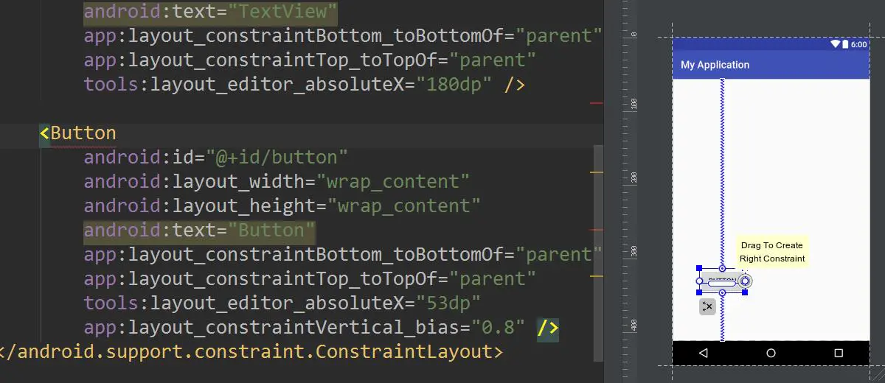

## Android布局

### ConstraintLayout完全解析

传统的Android开发当中，界面基本都是考编写XML代码完成的，虽然Android Studio也支持可视化的方式来编写界面，但是操作起来并不方便，而为了解决这个问题推出了ContraintLayout来解决这个问题。与传统编写界面的方式恰恰相反，ContraintLayout非常适合使用可视化的方式来编写界面，但是不太适合使用XML的方式来进行编写。可视化操作的背后仍然还是使用XML代码来实现的，只不过这些代码是由AS来根据我们的操作自动生成的


##### ContraintLayout有什么新的东西

- 支持控件的W/H按照比例显示，比如图片按照4：3显示
- 在相对布局中支持weight比重
- 优化 view 在 gone 后不会丢位置，以防显示错乱
- chain 链，支持指定的 view 组成横向/纵向的显示排列
- 支持view 按照辅助线 guideView 定位显示
- 支持 view 上下边距按照比例显示


ContraintLayout还有一个优点，他可以有效的解决布局嵌套过多的问题。平时编写界面，复杂的布局总会伴随着多层的嵌套，而嵌套越多，程序的性能就会越差。ContraintLayout则是使用约束的方式来指定各个空间的位置和关系的，优点类似于RelativeLayout,但远比RelativeLayout强大的多


ConstraintLayout,翻译过来,可以叫约束布局,其子view就是通过一个个属性的约束,来决定自己的位置,大小,而传统的RelativeLayout也类似,所以可以看成是RelativeLayout的一种进化版版本,属性布局用法相对RelativeLayout来说较为复杂,但是当你熟悉之后你会爱上它的.

众所周知,Android APP的布局复杂度会极大的影响程序的流畅度,传统的ViewGroup用的最多的就是RelativeLayout与LineaLayout.

一般能用RelativeLayout替换LineaLayout就替换,因为LinearLayout虽然简单,但是会加深层级.


**而有时候却不得不使用LinearLayout,在于LinearLayout有一个layout_weight属性,可以设置LinearLayout的ChildView按照一定的比例布局,这是RelativeLayout做不到的.**

**ConstraintLayout的其他的属性和用法基本与RelativeLayout一致,如果对RelativeLayout比较熟悉的童鞋很容易上手,而ConstraintLayout最大的优点便是可以添加比例的控制.**


#### 基本约束属性

前面说了, ConstraintLayout是RelativeLayout的进化版,如果RelativeLayout的子view没有设置任何基本属性,则置于左上角,ConstraintLayout同理.

ConstraintLayout基本属性的值可以是某个控件的id,也可以是"parent",简单的概括就是top,bottom,left,right,baseline.

以bottom为例子：


#### 约束属性值为id时对照表

| 约束属性                               | RelativeLayout属性   |
| -------------------------------------- | -------------------- |
| layout_constraintBaseline_toBaselineOf | layout_alignBaseline |
| layout_constraintBottom_toBottomOf     | layout_alignBottom   |
| layout_constraintBottom_toTopOf        | layout_above         |
| layout_constraintEnd_toEndOf           | layout_alignEnd      |
| layout_constraintEnd_toStartOf         | layout_toStartOf     |
| layout_constraintLeft_toLeftOf         | layout_alignLeft     |
| layout_constraintLeft_toRightOf        | layout_toRightOf     |
| layout_constraintRight_toRightOf       | layout_alignRight    |
| layout_constraintRight_toLeftOf        | layout_toLeftOf      |
| layout_constraintStart_toStartOf       | layout_alignStart    |
| layout_constraintStart_toEndOf         | layout_toStartOf     |
| layout_constraintTop_toTopOf           | layout_alignTop      |
| layout_constraintTop_toBottomOf        | layout_below         |

#### 约束属性值等于parent

当基本属性值为parent时,必须成对出现才有意义,即top与bottom,left与right,start与end成对.
 在使用RelativeLayout的时候,假设子View设置了属性,则子View会置于底部


```xml
layout_alignParentBottom="true"
```

而对约束布局的子Viuew设置,是没有任何效果的,因为parent属性必须成对出现


```xml
layout_constraintBottom_toBottomOf="parent"
```

如果设置成对属性,会发现控件在设置的方向上居中了,也达不到置于底部的效果


Paste_Image.png

这时候前面介绍的功能派上用场了


```undefined
ConstraintLayout最大的优点便是可以添加比例的控制
```

## 比例属性闪亮登场


```xml
layout_constraintHorizontal_bias="0.4"
layout_constraintVertical_bias="0.6"
```

这两个属性接受浮点型,是一个比例,数值在0-1之间,如不写这属性,默认为0.5

点击左下角切换的Design,再点击Button选中这个控件,右边栏会出现约束属性图


Paste_Image.png


简单介绍一下这个属性图

1. 箭头向里 表示控件的宽度/高度是适应内容的,弹簧状 表示控件是宽度/高度是具体数值
2. 上下两个0表示控件的上下margin是0
3. 小球50这个数值表示在垂直方向上,上下的比例是0.5:0.5

鼠标拖动小球,上下移动会发现数值,控件垂直方向上的位置都跟着改变.拖动到20,切换到代码,会发现代码新增了一个属性,此时控件的上下比例是:0.8:0.2


```xml
layout_constraintVertical_bias="0.8"
```




Paste_Image.png

假设要达到layout_alignParentBottom="true"的效果,只需要加上top,bottom约束,并设置layout_constraintVertical_bias="1.0"即可


Paste_Image.png

## 控件大小比例属性


```xml
app:layout_constraintDimensionRatio="1:2"
```

除了上述介绍的控件相对于parent位置的比例外,子view还可以控制自身的宽高比

上述例子是比把控件的宽高比设置为1:2


```swift
这个属性生效需要以下条件：left，right，top，bottom 四条边都需要约束，其中bottom的约束可以用baseline代替。 
宽/高有且只有一个是0dp.
如果都是0dp的则会不会生效,因为控件如果上下都有约束,并把高度设置为0,控件的高度会充满父控件,宽度同理,从而导致控件铺满整个父控件
```

## creator迷之属性


```xml
app:layout_constraintBaseline_creator="12"
app:layout_constraintTop_creator="12"
app:layout_constraintBottom_creator="12"
app:layout_constraintLeft_creator="12"
app:layout_constraintRight_creator="12"
```

creator接受整型属性值,但该属性在 1.0.0-alpha8 版本暂时未有任何作用,查看源码发现,ConstraintLayout只是对改属性值进行了接受,但是没有做任何处理,相信在后续版本会新增其功能


```java
else if(attr != styleable.ConstraintLayout_Layout_layout_constraintLeft_creator && attr != styleable.ConstraintLayout_Layout_layout_constraintTop_creator && attr != styleable.ConstraintLayout_Layout_layout_constraintRight_creator && attr != styleable.ConstraintLayout_Layout_layout_constraintBottom_creator && attr != styleable.ConstraintLayout_Layout_layout_constraintBaseline_creator) {
                    Log.w("ConstraintLayout", "Unknown attribute 0x" + Integer.toHexString(attr));
                }
```

## Guideline导航线


```xml
app:layout_constraintGuide_begin="50dp"
app:layout_constraintGuide_end="50dp"
app:layout_constraintGuide_percent="50"
```

介绍导航线之前,先想一下,根据上面对ConstraintLayout的介绍,要你布置一个菜单控件,菜单栏每一项均分屏幕宽度,按照以前使用LinearLayout,会把每一个子view的weight设置为1,则均分了屏幕宽度


```xml
<LinearLayout>
    <View/>
    <View/>
    <View/>
</LinearLayout>
```

而使用ConstraintLayout则会发现前面介绍的比例,是相对parent来说的,如果要均分屏幕宽度,必须借助透明的分割线来布局


```xml
<ConstraintLayout>
    <View,右边约束分割线1/>
    <分割线1,距离左边33%/>
    <View,左边约束分割线1,右边约束分割线2/>
    <分割线2,距离左边66%/>
    <View,左边约束分割线2/>
</ConstraintLayout>
```

而这个分割线其实谷歌已经帮我们写好了,就是Guideline.蓝图介绍中,6对应的就是添加导航线.切换到蓝图模式,点击6,就可以添加一个水平/垂直的导航线


Paste_Image.png

添加垂直导航线


Paste_Image.png

**注意:图中的导航线有一个向左的箭头模式,除了这个模式还有向右,百分比模式.如果导航线是水平的,还会有上下箭头.**

**点击小球即可切换模式**


Paste_Image.png

### Guideline属性对照表

| 属性                           | 箭头   |
| ------------------------------ | ------ |
| layout_constraintGuide_begin   | 左/上  |
| layout_constraintGuide_end     | 右/下  |
| layout_constraintGuide_percent | 百分比 |

### Guideline属性值

Guideline本身对于用户来说是不可见的,所以其宽高的值没有任何意义,也不起作用.


```xml
<android.support.constraint.Guideline
    android:id="@+id/guideline"
    android:layout_width="wrap_content"//无意义
    android:layout_height="511dp"//无意义
    android:orientation="vertical"//决定这是一条水平导航线还是垂直导航线
    app:layout_constraintGuide_percent="0.333"//决定导航线的位置
/>
```

此时再添加一条比例为0.666的导航线,即可三等分屏幕(点击图片可查看详细代码)


[Paste_Image.png](https://link.jianshu.com?t=https://github.com/siyehua/Adnroid-Notes/blob/master/Android/ConstraintLayout/persent.xml)


### 性能优势


ConstraintLayout 以来，我们一直不断改进该布局的稳定性，完善对布局编辑器的支持。我们还针对 ConstraintLayout 增加了一些新功能，帮助您构建不同类型的布局，例如引入链和按比例设置大小。

除了这些功能之外，使用 ConstraintLayout 还可以获得一项显著的性能优势。在本文中，我们将向您介绍如何从这些性能改进中获益。


**Android 如何绘制视图？**

为了更好地理解 ConstraintLayout 的性能，我们先回过头来看看 Android 如何绘制视图。当用户将某个 Android 视图作为焦点时，Android 框架会指示该视图进行自我绘制。这个绘制过程包括 3 个阶段：

**1. 测量**

系统自顶向下遍历视图树，以确定每个 ViewGroup 和 View 元素应当有多大。在测量 ViewGroup 的同时也会测量其子对象。

**2. 布局**

系统执行另一个自顶向下的遍历操作，每个 ViewGroup 都根据测量阶段中所确定的大小来确定其子对象的位置。

**3. 绘制**

系统再次执行一个自顶向下的遍历操作。对于视图树中的每个对象，系统会为其创建一个 Canvas 对象，以便向 GPU 发送一个绘制命令列表。这些命令包含系统在前面 2 个阶段中确定的 ViewGroup 和 View 对象的大小和位置。


**▲** 测量阶段如何遍历视图树的示例

绘制过程中的每个阶段都需要对视图树执行一次自顶向下的遍历操作。因此，视图层次结构中嵌入（或嵌套）的视图越多，设备绘制视图所需的时间和计算功耗也就越多。通过在 Android 应用布局中保持扁平的层次结构，您可以为应用创建响应快速而灵敏的界面。


#### 传统布局层次结构的开销


请牢记上述解释，下面我们来创建一个使用 LinearLayout 和 RelativeLayout 对象的传统布局层次结构。


**▲** 布局示例

假设我们想构建一个像上图那样的布局。如果您使用传统布局来构建，XML 文件会包含类似于下面这样的元素层次结构（在本例中，我们忽略属性）：

```
<RelativeLayout>
  <ImageView />
  <ImageView />
  <RelativeLayout>
    <TextView />
    <LinearLayout>
      <TextView />
      <RelativeLayout>
        <EditText />
      </RelativeLayout>
    </LinearLayout>
    <LinearLayout>
      <TextView />
      <RelativeLayout>
        <EditText />
      </RelativeLayout>
    </LinearLayout>
    <TextView />
  </RelativeLayout>
  <LinearLayout >
    <Button />
    <Button />
  </LinearLayout>
</RelativeLayout>
```

尽管一般来说，这种类型的视图层次结构都有改进的空间，但您几乎必定还需要创建一个包含一些嵌套视图的层次结构。如前所述，嵌套的层次结构会给性能造成负面影响。我们使用 Android Studio 的 Systrace 工具来看看嵌套视图对界面性能到底有何实际影响。我们通过编程方式针对每个 ViewGroup（ConstraintLayout 和 RelativeLayout）调用了测量和布局阶段并在执行测量和布局调用期间触发了 Systrace。以下命令可生成一个包含 20 秒间隔周期内发生的关键 Event 的概览文件，例如开销巨大的测量/布局阶段：

```
python $ANDROID_HOME/platform-tools/systrace/systrace.py --time=20 -o ~/trace.html gfx view res
```

有关如何使用 Systrace 的详细信息，请参阅使用 Systrace 分析界面性能指南：

https://developer.android.google.cn/studio/profile/systrace.html

Systrace 会自动突出显示此布局中的（大量）性能问题，并给出修复这些问题的建议。通过点击“Alerts”标签，您会发现，绘制此视图层次结构需要反复执行 80 次的测量和布局阶段，开销极为庞大！触发开销如此庞大的测量和布局阶段当然很不理想，如此庞大的绘制 Activity 会导致用户能够觉察到丢帧的现象。我们可以得出这样的结论：这种嵌套式层次结构和 RelativeLayout（会对其每个子对象重复测量两次）的特性导致性能低下。


**▲** 观察 Systrace 针对使用 RelativeLayout 的布局版本发出的提醒


#### **ConstraintLayout 对象的优势**

如果您使用 ConstraintLayout 来构建相同的布局，XML 文件会包含类似于下面这样的元素层次结构（再次忽略属性）：

```
<android.support.constraint.ConstraintLayout>
  <ImageView />
  <ImageView />
  <TextView />
  <EditText />
  <TextView />
  <TextView />
  <EditText />
  <Button />
  <Button />
  <TextView />
</android.support.constraint.ConstraintLayout>
```

如本例所示，现在，该布局拥有一个完全扁平的层次结构。这是因为 ConstraintLayout 允许您构建复杂的布局，而不必嵌套 View 和 ViewGroup 元素。举个例子，我们来看一下布局中间的 TextView 和 EditText：


使用 RelativeLayout 时，您需要创建一个新的 ViewGroup 来垂直对齐 EditText 和 TextView：

```
<LinearLayout
    android:id="@+id/camera_area"
    android:layout_width="match_parent"
    android:layout_height="wrap_content"
    android:orientation="horizontal"
    android:layout_below="@id/title" >

    <TextView
        android:text="@string/camera"
        android:layout_width="wrap_content"
        android:layout_height="wrap_content"
        android:layout_gravity="center_vertical"
        android:id="@+id/cameraLabel"
        android:labelFor="@+id/cameraType"
        android:layout_marginStart="16dp" />

    <RelativeLayout
        android:layout_width="match_parent"
        android:layout_height="wrap_content">

        <EditText
            android:id="@+id/cameraType"
            android:ems="10"
            android:inputType="textPersonName"
            android:text="@string/camera_value"
            android:layout_width="match_parent"
            android:layout_height="wrap_content"
            android:layout_centerVertical="true"
            android:layout_marginTop="8dp"
            android:layout_marginStart="8dp"
            android:layout_marginEnd="8dp" />
    </RelativeLayout>
</LinearLayout>
```

通过改用 ConstraintLayout，您只需添加一个从 TextView 基线到 EditText 基线之间的约束，即可实现同样的效果，而不必创建另一个 ViewGroup：


**▲** EditText 和 TextView 之间的约束

在针对我们使用 ConstraintLayout 的布局版本运行 Systrace 工具时，您会发现，同样 20 秒间隔周期内执行的测量/布局次数大大减少，开销也随之大大减少。这种性能的改进很有意义，现在，我们保持了扁平的视图层次结构！


**▲** 观察 Systrace 针对使用 ConstraintLayout 的布局版本发出的提醒

同样值得一提的是，我们构建 ConstraintLayout 版本的布局时仅仅使用了布局编辑器，而不是手工编辑 XML。而要使用 RelativeLayout 来实现同样的视觉效果，我们很可能必须手工编辑 XML。

#### **测量性能差异**

我们使用 Android 7.0（API 级别 24）中引入的 OnFrameMetricsAvailableListener 分析了 ConstraintLayout 和 RelativeLayout 这两种类型的布局所执行的每次测量和布局操作所花费的时间。通过该类，您可以收集有关应用界面渲染的逐帧时间信息。 通过调用以下代码，您可以开始记录每个帧的界面操作：

```
window.addOnFrameMetricsAvailableListener(
        frameMetricsAvailableListener, frameMetricsHandler);
```

在能够获取时间信息之后，该应用触发 frameMetricsAvailableListener() 回调。我们对测量/布局的性能感兴趣，因此，我们在检索实际帧的持续时间时调用了 FrameMetrics.LAYOUT_MEASURE_DURATION。

```
Window.OnFrameMetricsAvailableListener {
        _, frameMetrics, _ ->
        val frameMetricsCopy = FrameMetrics(frameMetrics);
        // Layout measure duration in nanoseconds
        val layoutMeasureDurationNs = 
                frameMetricsCopy.getMetric(FrameMetrics.LAYOUT_MEASURE_DURATION);
```

如需详细了解 FrameMetrics 可以检索的其他类型的持续时间信息，请参阅 FrameMetricsAPI 参考：

https://developer.android.google.cn/reference/android/view/FrameMetrics.html

#### **测量结果：ConstraintLayout 速度更快**

我们的性能比较结果表明：ConstraintLayout 在测量/布局阶段的性能比 RelativeLayout大约高 40%：


**▲** 测量/布局（单位：毫秒，100 帧的平均值）

这些结果表明：ConstraintLayout 很可能比传统布局的性能更出色。不仅如此，ConstraintLayout 还具备其他一些功能，能够帮助您构建复杂的高性能布局。

有关详情，请参阅使用 ConstraintLayout 构建快速响应的界面指南：

https://medium.com/google-developers/building-interfaces-with-constraintlayout-3958fa38a9f7

我们建议您在设计应用布局时使用 ConstraintLayout。在过去，几乎所有情形下，您都需要一个深度嵌套的布局，因此，ConstraintLayout 应当成为您优化性能和易用性的不二之选。

## 总结

ConstraintLayout完美的结合了RelativeLayout与LinearLayout的特点,减少了布局的层级,展现了其强大的功能.

除了上述介绍到的功能之外,ConstraintLayout的子view被设置为GONE后,依赖这个view的约束会自动继承这个子view的约束,从而保证布局不会错乱.而且还可以单独设置控件隐藏/显示时的外边距.

蓝图模式让view与view之间的依赖关系更加的清晰明了,还可以快速设置属性值.

有人认为拖动控件必将成为主流,而博主实际体验,当控件非常复杂的时候,非常多的约束也会让人眼花缭乱.

其实最好的方式还是用蓝图与代码结合的方式,在创建,快速设置依赖关系,以及设置属性的时候,使用蓝图模式,在细微的调整的时候,使用代码模式.