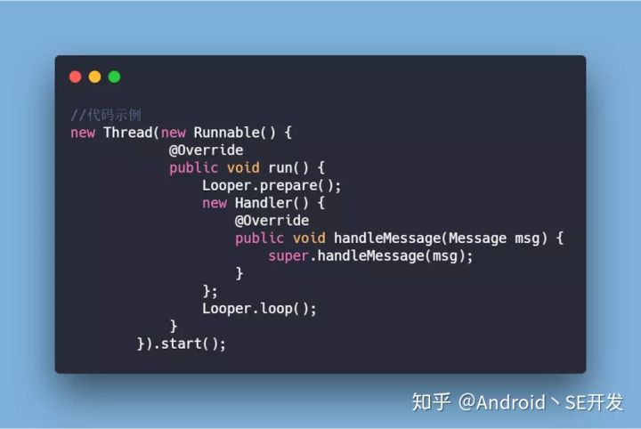

###  Handler

#### 1,Handler是什么

 Handler是AndroidSDK处理异步信息的核心机制。子线程和主线程通过Handler来进行通信。子线程可以通过Handler来通知主线程更新UI。 


#### 2，子线程一定不能更新UI吗？

并不是，Android的UI访问是没有加锁的，这样在多个线程访问UI是不安全的。所以Android中规定只能在UI线程中访问UI。

但是有没有极端的情况？使得我们在子线程中访问UI也可以使程序跑起来呢？ https://blog.csdn.net/xyh269/article/details/52728861 

- 情景一

  ViewRootImpl的创建在onResume方法回调之后，而我们一开篇是在onCreate方法中创建了子线程并访问UI，在那个时刻，ViewRootImpl是没有创建的，无法检测当前线程是否是UI线程，所以程序没有崩溃一样能跑起来，而之后修改了程序，让线程休眠了200毫秒后，程序就崩了。很明显200毫秒后ViewRootImpl已经创建了，可以执行checkThread方法检查当前线程。

  

- 情景二

   其实，在onResume以及onResume之前，开启一个子线程来更新UI，都有可能是会成功的，并且成功率相当大，失败的情况应该也会有，比较极端的情况下，UI线程一直霸占的CPU，子线程一直执行不到。 

  ```java
  
  @Override
      protected void onResume() {
          new Thread(new Runnable() {
              @Override
              public void run() {
                  textView.setText("子线程更新UI");//经测试,这里是成功的,那么onCreate,onStart就更不用说了
   
              }
          }).start();
   
          textView.setOnClickListener(new View.OnClickListener() {
              @Override
              public void onClick(View v) {
                  new Thread(new Runnable() {
                      @Override
                      public void run() {
                          textView.setText("再试试子线程更新UI");//这里就不行了
                      }
                  }).start();
              }
          });
          super.onResume();
  }
  ```

  原理：

  我们都知道，在子线程中更新UI，会抛如下异常:

  android.view.ViewRootImpl$CalledFromWrongThreadException: Only the original thread that created a view hierarchy can touch its views.

  翻译过来是:只有创建这个View层级的原始线程才能更新这些view. 也就是并不是一定非要在UI线程.

  这个异常来自ViewRootImpl的checkThread方法:

  ```java
  void checkThread() {
          if (mThread != Thread.currentThread()) {
              throw new CalledFromWrongThreadException(
                      "Only the original thread that created a view hierarchy can touch its views.");
          }
      }
  
  ```

  

  只有ViewRootImpl创建完成以后，才会检查线程，那么ViewRootImpl什么时候创建的呢？

  是在Activity的makeVisible中创建的:

  ```java
  void makeVisible() {
          if (!mWindowAdded) {
              ViewManager wm = getWindowManager();
              wm.addView(mDecor, getWindow().getAttributes());//ViewRootImpl就是在这个过程中创建的,请自行追踪源码
              mWindowAdded = true;
          }
          mDecor.setVisibility(View.VISIBLE);
      }
  
  
  
  ```

  


  那么makeVisible又是什么时候调用的呢？

  是在onResume回调之后调用的。

  这里简要介绍Activity启动流程中的一小部分：

  ActivityThread.handleLaunchActivity {ActivityThread.performLaunchActivity —> activity.attach } — >【这中间还有onCreate和onStart的回调过程】—> ActivityThread.handleResumeActivity —>ActivityThread.performResumeActivity —> activity.performResume() —> Instrumentation.callActivityOnResume 
  —> activity.onResume —> activity.makeVisible()【这一步是在ActivityThread.handleResumeActivity中调用的】

  看ActivityThread.handleResumeActivity源码,标出了重点代码行:


  ```java
       final void handleResumeActivity(IBinder token, boolean clearHide, boolean isForward, boolean reallyResume) {
          ...省略...
          ActivityClientRecord r = performResumeActivity(token, clearHide);//重点
          if (r != null) {
              final Activity a = r.activity;
       
       ...省略...
          
          // The window is now visible if it has been added, we are not
          // simply finishing, and we are not starting another activity.
          if (!r.activity.mFinished && willBeVisible
                  && r.activity.mDecor != null && !r.hideForNow) {
              
              ...省略...
              
              if (r.activity.mVisibleFromClient) {
                  r.activity.makeVisible();//重点
              }
          }
   
          ...省略...
   
      } else {
          // If an exception was thrown when trying to resume, then
          // just end this activity.
          try {
              ActivityManagerNative.getDefault()
                  .finishActivity(token, Activity.RESULT_CANCELED, null, false);
          } catch (RemoteException ex) {
          }
      }
  }
  ```

  ActivityThread.performResumeActivity中调用了activity.performResume()

  

  ```java
              
  public final ActivityClientRecord performResumeActivity(IBinder token,
              boolean clearHide) {
          ActivityClientRecord r = mActivities.get(token);
          if (localLOGV) Slog.v(TAG, "Performing resume of " + r
                  + " finished=" + r.activity.mFinished);
          if (r != null && !r.activity.mFinished) {
              if (clearHide) {
                  r.hideForNow = false;
                  r.activity.mStartedActivity = false;
              }
              try {
                  r.activity.onStateNotSaved();
                  r.activity.mFragments.noteStateNotSaved();
                  if (r.pendingIntents != null) {
                      deliverNewIntents(r, r.pendingIntents);
                      r.pendingIntents = null;
                  }
                  if (r.pendingResults != null) {
                      deliverResults(r, r.pendingResults);
                      r.pendingResults = null;
                  }
                  r.activity.performResume();//重点行            EventLog.writeEvent(LOG_AM_ON_RESUME_CALLED,
                      UserHandle.myUserId(), r.activity.getComponentName().getClassName());
   
              r.paused = false;
              r.stopped = false;
              r.state = null;
              r.persistentState = null;
          } catch (Exception e) {
              if (!mInstrumentation.onException(r.activity, e)) {
                  throw new RuntimeException(
                      "Unable to resume activity "
                      + r.intent.getComponent().toShortString()
                      + ": " + e.toString(), e);
              }
          }
      }
      return r;
  }
  ```

  activity.performResume()中通过Instrumentation.callActivityOnResume回调了Activity.onResume,
  由上可以看出Activity.makeVisible是在onResume之后调用的，进而ViewRootImpl也是在onResume之后创建，所以就会有文章开头描述的现象：

  在onResume以及onResume之前，开启一个子线程来更新UI，都有可能是会成功的，并且成功率相当大.

  当ViewRootImpl创建完成，之后更新UI，比如TextView.setText(),会调用invalidate或者requestLayout，都会调用checkThread来检查线程的。


#### 3，给我说说Handler的原理

详看消息机制

#### 4，Handler导致的内存泄露你是如何解决的？

###### 须知：

- 主线程Looper生命周期和活动的生命周期相同
- 非静态内部类，或者匿名内部类默认持有外部类的引用

###### 原因：

- Handler造成内存泄露的原因。非静态内部类，或者匿名内部类。使得Handler默认持有外部类的引用。在Activity销毁时，由于Handler可能有**未执行完/正在执行的Message**。导致Handler持有Activity的引用。进而导致GC无法回收Activity。

  

###### 可能造成的内存泄漏：

- ###### 内名内部类

  ```java
      //匿名内部类    
      Handler handler=new Handler(){
          @Override
          public void handleMessage(Message msg) {
              super.handleMessage(msg);
          }
      };
  
  ```

  

- 非静态内部类

  ```java
      //非静态内部类
      protected class AppHandler extends Handler {
  
          @Override
          public void handleMessage(Message msg) {
              switch (msg.what) {
                  // TODO: 2019/4/30  
              }
          }
      }
  
  ```

  


在java中非静态内部类和匿名内部类都会隐式持有当前类的外部引用，由于Handler是非静态内部类所以其持有当前Activity的隐式引用，如果Handler没有被释放，其所持有的外部引用也就是Activity也不可能被释放，当一个对象一句不需要再使用了，本来该被回收时，而有另外一个正在使用的对象持有它的引用从而导致它不能被回收，这导致本该被回收的对象不能被回收而停留在堆内存中，这就产生了内存泄漏(上面的例子就是这个原因)。最终也就造成了OOM


而在创建Handler之处就先判断是否有内存泄漏。如果继承Handler的是匿名内部类或者是非静态内部类或者是本地内部类，则会提示有可能出现内存泄漏。一般Handler是在Activity或者是Fragment中，使用，匿名内部类，非静态内部类，本地内部类都会支持Activity对象，当Handler的生命周期比Activity长的时候，就会导致Activity的对象无法释放，从而导致内存泄漏。

###### 解决办法：

- 通过程序逻辑来进行保护

  - Activity销毁时，清空Handler中，未执行或正在执行的Callback以及Message。

  ```java
      // 清空消息队列，移除对外部类的引用
      @Override
      protected void onDestroy() {
          super.onDestroy();
          mHandler.removeCallbacksAndMessages(null);
  
      }
  
    
      //Handler源码中removeCallbacksAndMessages()注释含义
      /**
       * Remove any pending posts of callbacks and sent messages whose
       * <var>obj</var> is <var>token</var>.  If <var>token</var> is null,
       * all callbacks and messages will be removed.
       */
      public final void removeCallbacksAndMessages(Object token) {
          mQueue.removeCallbacksAndMessages(this, token);
      }
  ```

  - 将Handler声明为静态类(静态类+弱引用)

  

  ```java
      private static class AppHandler extends Handler {
          //弱引用，在垃圾回收时，被回收
          WeakReference<Activity> activity;
  
          AppHandler(Activity activity){
              this.activity=new WeakReference<Activity>(activity);
          }
  
          public void handleMessage(Message message){
              switch (message.what){
                  //todo
              }
          }
      }
  复制代码
  ```

  ###### 其他：

  > 即使内存泄漏了。待handler中的消息处理完。下次GC时即可回收本次未回收的内存。

  

#### 5，如何使用Handler让子线程和子线程通信？

**一、子线程向主线程传值：**

这个实现比较简单，因为主线程自带Looper机制，所有我们不用创建Looper了，看一下代码吧：

首选在主线程里创建一个Handler

```java
Handler mHandler = new Handler(){
     @Override
    public void handleMessage(Message msg) {
        super.handleMessage(msg);
        switch (msg.what) {
            case 0:
            //do something,refresh UI;
            break;
            default:
            break;
        }
    }

};


```


1. 然后开启一个子线程，在子线程里直接使用Handler发送消息即可

```java
new Thread() {
    public void run() {
        Message message = new Message();
        message.obj = "子线程发送的消息Hi~Hi";
        mHandler .sendMessage(message);
     };
}.start();
```


#####  **主线程向子线程里发送消息** 

主线程向子线程发送消息的话，我们需要在子线程里初始化Looper，并在主线程里创建的Handler引用子线程的Looper（Handler中引用的是哪个线程的Looper，就在哪个线程里处理消息），下面看代码：

```java
 public class ThreadHandlerActivity extends Activity{
 //创建子线程
 class MyThread extends Thread{
 private Looper looper;//取出该子线程的Looper
 public void run() {
  
 Looper.prepare();//创建该子线程的Looper
 looper = Looper.myLooper();//取出该子线程的Looper
 Looper.loop();//只要调用了该方法才能不断循环取出消息
 }
 }
  
 private Handler mHandler;//将mHandler指定轮询的Looper
  
 protected void onCreate(Bundle savedInstanceState) {
 super.onCreate(savedInstanceState);
 setContentView(R.layout.main);
 thread = new MyThread();
 thread.start();//千万别忘记开启这个线程
 //下面是主线程发送消息
 mHandler = new Handler(thread.looper){
public void handleMessage(android.os.Message msg) {
    Log.d("当前子线程是----->",Thread.currentThread()+"");
 };
 };
 mHandler.sendEmptyMessage(1);
 }
  
 }


```

其实这样就可以达到主线程向子线程发送消息了，然而当我们运行后发现程序会Crash掉，报了一个控制针，这是因为在Handler初始化的时候，thread.looper还没有初始化，所以会报控制针，这时我们可以让主线程等待一下子线程，也可以来一个while循环来判断thread.looper是否初始化完成。不过Android本身还提供了一个方法，那就是**HandlerThread**：

```java
 protected void onCreate(Bundle savedInstanceState) {
super.onCreate(savedInstanceState);
 tv = new TextView(this);
 tv.setText("Handler实验");
 setContentView(tv);
  
 //实例化一个特殊的线程HandlerThread，必须给其指定一个名字
 HandlerThread thread = new HandlerThread("handler thread");
 thread.start();//千万不要忘记开启这个线程
 //将mHandler与thread相关联
 mHandler = new Handler(thread.getLooper()){
 public void handleMessage(android.os.Message msg) {
 Log.d("当前子线程是----->", Thread.currentThread()+"");
 };
 };
 mHandler.sendEmptyMessage(1);//发送消息
}


```


这时HandlerMessage所在的线程就是HandlerThread 的子线程。
然而HandlerThread 所创建处理的子线程里是不能重写Run（）方法的，你写了以后，会发现，HandlerMessage不执行了，这时因为HandlerMessage本身实现了Run（）方法，我们看一下内部实现：

```java
1. @Override
2. public void run() {
3. mTid = Process.myTid();
4. Looper.prepare();
5. synchronized (this) {
6. mLooper = Looper.myLooper();
7. notifyAll();
8. }
9. Process.setThreadPriority(mPriority);
10. onLooperPrepared();
11. Looper.loop();
12. mTid = -1;
13. }


```


在源代码的第4行，进行了实例化自己的Looper，如果继续追踪源代码翻看其getLooper方法你会发现，如果一个Handler在与HandlerThread进行绑定时，发现Looper为空，Handler则会一直等待直到Looper被创建出来为止，然后才继续执行后续的代码。所以我们重写了HandlerThread的run方法，肯定就不会去创建Looper对象，那么绑定的Handler就会永远处于等待状态，自然而然就不会执行到HandlerMessage信息了。这也是为什么我们要使用HandlerThread这个特殊的线程，因为使用这个，我们不必关心多线程会混乱，Looper会为空等一系列问题，只要去关心我们要实现的逻辑就行了。

##### 子线程和子线程间通过Handler通信

 其实就是在一个子线程中创建一个Handler，它的回调自然就在此子线程中，然后在另一个子线程中调用此handler来发送消息就可以了，不过记得写上Looper

- 发送消息的子线程


```java
package com.cdc.handler;
import android.os.Handler;
import android.os.Message;
import android.os.SystemClock;
//发送消息的子线程
public class Thread1 extends Thread {
    private Handler handler;
public Thread1(Handler handler){
    super.setName("Thread1");
    this.handler=handler;
}
@Override
public void run() {
    Message msg = Message.obtain();
    msg.what = 1;
    msg.obj = System.currentTimeMillis()+"";
    handler.sendMessage(msg);
    System.out.println((Thread.currentThread().getName() + "----发送了消息！" + msg.obj));
    SystemClock.sleep(1000);
}
}
```
- 接收消息的子线程

```java
package com.cdc.handler;
import android.os.Handler;
import android.os.Looper;
//接收消息的子线程
public class Thread2 extends Thread{
    private Handler handler2;
    public Handler getHandler(){//注意哦，在run执行之前，返回的是null
        return handler2;
    }
    public Thread2(){
        super.setName("Thread2");
    }
    @Override
    public void run() {
        //在子线程里面新建Handler的实例，需要先调用Looper.prepare();否则会报错:Can't create handler inside thread that has not called Looper.prepare()
        Looper.prepare();
        handler2 = new Handler(){
            public void handleMessage(android.os.Message msg) {
                //这里处理消息
                System.out.println(("收到消息了：" + Thread.currentThread().getName() + "----" + msg.obj));
            };
        };
        Looper.loop();

    }

}

```

- 调用

```java
 private Handler myHandler=null;
 private Thread2 thread1;
 private Thread1 thread2;

@OnClick(R.id.handler3)
public void handler3(){
thread1=new Thread2();
thread1.start();
myHandler=thread1.getHandler();
while(myHandler==null){
SystemClock.sleep(100);
myHandler=thread1.getHandler();
}
thread2=new Thread1(myHandler);
thread2.start();
}


```


#### 6，你能给我说说Handler的设计原理？

消息机制

#### 7，HandlerThread是什么 & 原理 & 使用场景？

##### 是什么

官方文档对它的介绍：

> HandlerThread 是一个包含 Looper 的 Thread，我们可以直接使用这个 Looper 创建 Handler

`HandlerThread,继承自Thread，本质是Thread`,它与普通Thread的差别就在于，`它有个Looper成员变量`。其内部就是通过`Thread+Looper`来实现的，**说白了HandlerThread就是Android已经封装好的一个拥有自己looper的线程，我们可以利用它执行一些耗时任务**。我们先来看看HandlerThread的使用步骤并提供给大家一个使用案例：

##### 使用步骤：

- 创建实例对象

```java
HandlerThread handlerThread = new HandlerThread("downloadImage");  
```

参数的作用主要是标记当前线程的名字，可以任意字符串。

- 启动HandlerThread线程

```java
//必须先开启线程    handlerThread.start();  复制代码
```

到此，我们就构建完一个循环线程。那么我们怎么将一个耗时的异步任务投放到HandlerThread线程中去执行呢？接下来看下面步骤：

- 构建循环消息处理机制

```java
  /**    * 该callback运行于子线程    */    class ChildCallback implements Handler.Callback {        @Override        public boolean handleMessage(Message msg) {            //在子线程中进行相应的网络请求            //通知主线程去更新UI            mUIHandler.sendMessage(msg1);            return false;        }    }  复制代码
```

构建异步handler

```java
//子线程Handler  Handler childHandler = new Handler(handlerThread.getLooper(),new ChildCallback());  复制代码
```

第3步是构建一个可以用于异步操作的handler，并将前面创建的HandlerThread的Looper对象和Callback接口类作为参数传递给当前的handler，这样当前的异步handler就拥有了HandlerThread的Looper对象，而其中的handlerMessage方法来处理耗时任务，Looper+Handler+MessageQueue+Thread异步循环机制构建完成。下面我们来看一个使用案例


源码解析

```java
public class HandlerThread extends Thread {     
    //优先级
    int mPriority;
    //线程id
    int mTid = -1;
    //线程的looper
    Looper mLooper;
  	public HandlerThread(String name) {
    	super(name);
        //默认
        mPriority = Process.THREAD_PRIORITY_DEFAULT;
    }
    //也可以指定线程的优先级，注意使用的是 android.os.Process 而不是 java.lang.Thread 的优先级！    
    public HandlerThread(String name, int priority) {  
        super(name);     
        mPriority = priority; 
    }
    // 子类需要重写的方法，在这里做一些执行前的初始化工作    
    protected void onLooperPrepared() {    } 
    //获取当前线程的 Looper   
    //如果线程不是正常运行的就返回 null    
    //如果线程启动后，Looper 还没创建，就 wait() 等待创建Looper后notify    

    public Looper getLooper() {
        if (!isAlive()) {        
            return null;      
        }   
        synchronized (this) {
              while (isAlive() && mLooper == null) {    //循环等待                
                  	try {                  
                        wait();              
                    } catch (InterruptedException e) {  
                    }          
              }      
        }       
        return mLooper;  
    }    //调用 start() 后就会执行的 run()    
    @Override  
    public void run() {   
        mTid = Process.myTid();        //帮我们创建了 Looepr        
                                 
        Looper.prepare();        
        synchronized (this) {           //Looper 已经创建，唤醒阻塞在获取 Looper 的线程          
            mLooper = Looper.myLooper();           
            notifyAll();
        } 
       Process.setThreadPriority(mPriority);        //子类可重写的方法        
        onLooperPrepared();        //开始循环      
        Looper.loop();          //调用quit后才会执行        
        mTid = -1;    }    //退出   
    public boolean quit() {        
        Looper looper = getLooper();    
        if (looper != null) {    
            looper.quit();      
            return true;     
        }     
        return false;
    }    //安全退出   
    public boolean quitSafely() { 
        Looper looper = getLooper(); 
        if (looper != null) {      
            looper.quitSafely();      
            return true; 
        }      
        return false;  
    }    
    public int getThreadId() {    
        return mTid;  
    }
}
```

可以看到，
①HandlerThread 本质还是个 Thread，创建后别忘了调用 start()。
②在 run() 方法中创建了 Looper，调用 onLooperPrepared 后开启了循环
③我们要做的就是在子类中重写 onLooperPrepared，做一些初始化工作
④在创建 HandlerThread 时可以指定优先级，注意这里的参数是 Process.XXX 而不是 Thread.XXX

##### HandlerThread 的使用场景 

我们知道，HandlerThread 所做的就是在新开的子线程中创建了 Looper，那它的使用场景就是 Thread + Looper 使用场景的结合，即：`在子线程中执行耗时的、可能有多个任务的操作`。

比如说`多个网络请求操作，或者多文件 I/O` 等等

参考链接：

- https://blog.csdn.net/javazejian/article/details/50813444
- https://blog.csdn.net/u011240877/article/details/72905631


#### 8，IdleHandler是什么？

##### 1，简介

使用当前线程的MessageQueue.addIdleHandler方法可以在消息队列中添加一个IdelHandler。

```java
        MessageQueue messageQueue = Looper.myQueue();
        messageQueue.addIdleHandler(new MessageQueue.IdleHandler() {
            @Override
            public boolean queueIdle() {
                return false;
            }
        });
```

当MessageQueue 阻塞时，即当前线程空闲时，会回调IdleHandler中的方法；

> 注：a，添加IdelHandler时，消息队列不为空，当消息处理完或者剩下消息还没到触发时间，会回调方法 b，当添加IdelHandler时，消息队列为空，则当时不会触发回调

当IdelHandler接口返回false时，表示该IdelHandler只执行一次，

```java
    Message next() {
        int pendingIdleHandlerCount = -1; // -1 only during first iteration
        int nextPollTimeoutMillis = 0;
        for (;;) {
            nativePollOnce(ptr, nextPollTimeoutMillis);
            ......
            synchronized (this) {
             ......
            for (int i = 0; i < pendingIdleHandlerCount; i++) {
                final IdleHandler idler = mPendingIdleHandlers[i];
                mPendingIdleHandlers[i] = null; // release the reference to the handler
                boolean keep = false;
                try {
                    keep = idler.queueIdle();
                } catch (Throwable t) {
                    Log.wtf(TAG, "IdleHandler threw exception", t);
                }
                if (!keep) {
                    synchronized (this) {
                        mIdleHandlers.remove(idler);
                    }
                }
            }
        }
    }
```

##### 2，常用场景

**a，延迟执行**

例如，当启动Activity时，需要延时执行一些操作，以免启动过慢，我们常常使用以下方式延迟执行任务，但是在延迟时间上却不好控制。

```java
    @Override
    protected void onCreate(Bundle savedInstanceState) {
        super.onCreate(savedInstanceState);
        setContentView(R.layout.activity_main);
        Handler handler = new Handler();
        handler.postDelayed(new Runnable() {
            @Override
            public void run() {
                //do something
            }
        },1000);
    }
```

其实，这时候使用IdelHandler 会更优雅

```java
    @Override
    protected void onCreate(Bundle savedInstanceState) {
        super.onCreate(savedInstanceState);
        setContentView(R.layout.activity_main);

        Looper.myQueue().addIdleHandler(new MessageQueue.IdleHandler() {
            @Override
            public boolean queueIdle() {
               //do something
                return false;
            }
        });
    }
```

**b，批量任务，任务密集，且只关注最终结果**

例如，在开发一个IM类型的界面时，通常情况下，每次收到一个IM消息时，都会刷新一次界面，但是当短时间内， 收到多条消息时，就会刷新多次界面，容易造成卡顿，影响性能，此时就可以使用一个工作线程监听IM消息，在通过添加IdelHandler的方式通知界面刷新，避免短时间内多次刷新界面情况的发生。


 https://zhuanlan.zhihu.com/p/78804097 

 https://www.jianshu.com/p/a1d945c4f5a6 

#### 9，一个线程能否创建多个Handler,Handler和Looper之间的对应关系？

- 一个Thread只能有一个Looper，一个MessageQueen，可以有多个Handler
- 以一个线程为基准，他们的数量级关系是： Thread(1) : Looper(1) : MessageQueue(1) : Handler(N)
- 一个线程可以创建多个Handler，但只能创建一个Looper，一个MessageQueue。Handler跟Looper之间没有对应关系
- Handler通过sendMessage发送消息时，就会将handler对象存储到message中，然后Looper在loop中通过MessageQueue的next方法取出消息后，会通过之前消息封装的handler将消息发送到指定的handler，即通过调用msg.target.dispatchMessage方法。

#### 10，为什么Android系统不建议子线程访问UI？

由于UI控件不是线程安全的，如果在多线程中并发访问可能导致UI控件处于不可预期的状态

- 那为什么系统不对UI控件的访问采用锁机制？

&emsp;缺点有两：
 ①加上锁机制会让UI访问的逻辑变得复杂
 &nbsp;

 &ensp;②锁机制会降低UI访问的效率，因为锁机制会阻塞某些线程的执行

 &nbsp;
 鉴于以上两点，最简单且高效的方法就是采用单线程模型来处理UI操作，对于开发者而言不是很麻烦，只需要使用Handler切换线程即可。

#### 11，Looper死循环为什么不会导致应用卡死？

```java
 //Looper
    public static void loop() {
        final Looper me = myLooper();
        for (;;) {
            Message msg = queue.next(); // might block
            if (msg == null) {
                // No message indicates that the message queue is quitting.
                return;
            }
            ...
        }
    }
    ....

```

 这个从上面的单线程异步消息模型，我们就可以知道，他不是阻塞线程了，而是只要有消息插入MessageQueue队列，就可以直接执行。 

- 主线程的主要方法就是消息循环，一旦退出消息循环，那么你的应用也就退出了，Looer.loop（）方法可能会引起主线程的阻塞，但只要它的消息循环没有被阻塞，能一直处理事件就不会产生ANR异常。
- 造成ANR的不是主线程阻塞，而是主线程的Looper消息处理过程发生了任务阻塞，无法响应手势操作，不能及时刷新UI。
- 阻塞与程序无响应没有必然关系，虽然主线程在没有消息可处理的时候是阻塞的，但是只要保证有消息的时候能够立刻处理，程序是不会无响应的。

#### 12，使用Handler的postDealy后消息队列有什么变化？

 如果队列中只有这个消息，那么消息不会被发送，而是计算到时唤醒的时间，先将Looper阻塞，到时间就唤醒它。但如果此时要加入新消息，该消息队列的对头跟delay时间相比更长，则插入到头部，按照触发时间进行排序，队头的时间最小、队尾的时间最大 

#### 12.可以在子线程直接new一个Handler出来吗？

不可以，因为在主线程中，Activity内部包含一个Looper对象，它会自动管理Looper，处理子线程中发送过来的消息。而对于子线程而言，没有任何对象帮助我们维护Looper对象，所以需要我们自己手动维护。所以要在子线程开启Handler要先创建Looper，并开启Looper循环




#### 13.Message对象创建的方式有哪些 & 区别？

可以通过三种方法创建：

- 直接生成实例Message m = new Message
- 通过Message m = Message.obtain
- 通过Message m = mHandler.obtainMessage()

后两者效果更好，因为Android默认的消息池中消息数量是10，而后两者是直接在消息池中取出一个Message实例，这样做就可以避免多生成Message实例。

#### 14.ANR和Handler存在什么联系吗？

Handler是线程间通讯的机制，Android中，网络访问、文件处理等耗时操作必须放到子线程中去执行，否则将会造成ANR异常。

ANR异常：Application Not Response 应用程序无响应

产生ANR异常的原因：在主线程执行了耗时操作，对Activity来说，主线程阻塞5秒将造成ANR异常，对BroadcastReceiver来说，主线程阻塞10秒将会造成ANR异常。

解决ANR异常的方法：耗时操作都在子线程中去执行

但是，Android不允许在子线程去修改UI，可我们又有在子线程去修改UI的需求，因此需要借助Handler。


#### 15.子线程的Looper和主线程的Looper有什么区别？

当我们在某个线程当中调用 `new Handler()` 的时候会使用当前线程的 Looper 创建 Handler. 当前线程的 Looper 存在于线程局部变量 ThreadLocal 中。在使用 Handler 之前我们需要先调用 `Looper.prepare()` 方法实例化当前线程的 Looper，并将其放置到当前线程的线程局部变量中（只放一次，以后会先从 TL 中获取再使用，**此时会调用 Looper 的构造方法，并在构造方法中初始化 MQ**），然后**调用 `Looper.loop()` 开启消息循环**。主线程也是一样，只是主线程的 Looper 在 ActivityThread 的 `main()` 方法中被实例化。我们可以使用 `Looper.getMainLooper()` 方法来获取主线程的 Looper，并使用它来创建 Handler，这样我们就可以在任何线程中向主线程发送消息了。

```java
    Looper.prepare(); // 内部会调用 Looper 的 new 方法实例化 Looper 并将其放进 TL
    new Handler().post(() -> /* do something */);
    Looper.loop();
```

当实例化 Looper 的时候会同时实例化一个 MessageQueue，而 MessageQueue 同时又会调用 Native 层的方法在 Native 层实例化一个 MessageQueue 还有 Looper. Java 层的 Looper 和 Native 层的 Looper 之间使用 epoll 进行通信。当调用 Looper 的 `loop()` 方法的时候会启动一个循环来对消息进行处理。Java 层的 MQ 中没有消息的时候，Native 层的 Looper 会使其进入睡眠状态，当有消息到来的时候再将其唤醒起来处理消息，以节省 CPU.


#### 16.说说Handler为什么不能进行跨进程通信？

如果仅仅从上层来看待这个问题，那是盲人摸象。这个问题需要从上往下追溯才能看清本原，重头戏也在底层，这里的底层不仅仅是Native层，还需要对Linux所有了解，才能真正理解透彻。看到前面大家的回答，我觉得有必要尽早回复一下，以免有些回答者误导更多新人。

**（1）**有人说管道是Linux IPC机制，IPC英文全称Inter-Process Communication，意思是进程间通信，而Handler是用于同一进程内的线程间通信，怎么会用到管道呢？这样的回答应该是看了一些教科书，但并没有真正理解透彻，这是不对的。**Handler底层的确是采用管道机制。**

先简单说说管道，其本质是也是文件，但又和普通的文件会有所不同：管道缓冲区大小一般为1页，即4K字节。管道分为读端和写端，读端负责从管道拿数据，当数据为空时则阻塞；写端向管道写数据，当管道缓存区满时则阻塞。

**（2）**再说说Handler是如何使用管道的
有人说Handler所涉及的MessageQueue/Message/Looper/Handler这4个类都是采用Java实现，哪来的底层采用管道的机会？这是不对的

在Looper.loop方法，会不断循环处理Message，其中消息的获取是通过


 流程就不细说了，直接去看代码或者我的博客 。

线程之间内存共享，通过Handler通信，消息池的内容并不需要从一个线程拷贝到另一个线程，
因为两线程可使用的内存时同一个区域，都有权直接访问，当然也存在线程私有区域ThreadLocal（这里不涉及）。即然不需要拷贝内存，那管道是何作用呢？

**Handler机制中管道作用**就是当一个线程A准备好Message，并放入消息池，这时需要通知另一个线程B去处理这个消息。线程A向管道的写端写入数据1（对于老的Android版本是写入字符`W`），管道有数据便会唤醒线程B去处理消息。管道主要工作是用于通知另一个线程的，这便是最核心的作用。

**（4）**有了这些关于Handler的准备，再加上[为什么 Android 要采用 Binder 作为 IPC 机制？ - Gityuan 的回答](javascript:void())，再来说说handler为何采用管道而非Binder？

handler不采用Binder，并非binder完成不了这个功能，而是太浪费CPU和内存资源了。


Handler不宜采用Binder，杀鸡焉用牛刀。

**（5）**Binder Vs Handler

Binder用于进程间通信，而Handler消息机制用于同进程的线程间通信。

 https://blog.csdn.net/xinzhou201/article/details/80691928 

#### 17.Handler的消息延时是如何实现的？

阅读之前先问大家一个问题：Handler.postDelayed()是先delay一定的时间，然后再放入messageQueue中，还是先直接放入MessageQueue中，然后在里面wait delay的时间？为什么？如果你不答不上来的话，那么此文值得你看看。

原文：

使用handler发送消息时有两种方式，`post(Runnable r)`和`post(Runnable r, long delayMillis)`都是将指定Runnable（包装成PostMessage）加入到MessageQueue中，然后Looper不断从MessageQueue中读取Message进行处理。

然而我在使用的时候就一直有一个疑问，类似Looper这种「轮询」的工作方式，如果在每次读取时判断时间，是无论如何都会有误差的。但是在测试中发现Delay的误差并没有大于我使用`System.out.println(System.currentTimeMillis())`所产生的误差，几乎可以忽略不计，那么Android是怎么做到的呢？

##### Handler.postDelayed()的调用路径

一步一步跟一下`Handler.postDelayed()`的调用路径：

1. Handler.postDelayed(Runnable r, long delayMillis)
2. Handler.sendMessageDelayed(getPostMessage(r), delayMillis)
3. Handler.sendMessageAtTime(msg, SystemClock.uptimeMillis() + delayMillis)
4. Handler.enqueueMessage(queue, msg, uptimeMillis)
5. MessageQueue.enqueueMessage(msg, uptimeMillis)

最后发现Handler没有自己处理Delay，而是交给了MessageQueue处理，我们继续跟进去看看MessageQueue又做了什么：

```java
msg.markInUse();
msg.when = when;
Message p = mMessages;
boolean needWake;
if (p == null || when == 0 || when < p.when) {
    // New head, wake up the event queue if blocked.
    msg.next = p; 
    mMessages = msg; 
    needWake = mBlocked;
} else { 
	...
}
```

MessageQueue中组织Message的结构就是一个简单的单向链表，只保存了链表头部的引用（果然只是个Queue啊）。在`enqueueMessage()`的时候把应该执行的时间（上面Hanlder调用路径的第三步延迟已经加上了现有时间，所以叫when）设置到msg里面，并没有进行处理……WTF？

继续跟进去看看Looper是怎么读取MessageQueue的，在`loop()`方法内：

```java
for (;;) {
    Message msg = queue.next();
    // might block  
    if (msg == null) { 
        // No message indicates that the message queue is quitting.  
        return;  
    }   
    ...
}
```

原来调用的是`MessageQueue.next()`，还贴心地注释了这个方法可能会阻塞，点进去看看：

```java
for (;;) {   
    if (nextPollTimeoutMillis != 0) { 
        Binder.flushPendingCommands();
    }
    nativePollOnce(ptr, nextPollTimeoutMillis);
    synchronized (this) {
        // Try to retrieve the next message.  Return if found.
        final long now = SystemClock.uptimeMillis();
        Message prevMsg = null;
        Message msg = mMessages;
        if (msg != null && msg.target == null) {
            // Stalled by a barrier.  Find the next asynchronous message in the queue.            
            do {
                prevMsg = msg; 
                msg = msg.next; 
            } while (msg != null && !msg.isAsynchronous());
        }
        if (msg != null) {
            if (now < msg.when) {
                // Next message is not ready.  Set a timeout to wake up when it is ready.                
                nextPollTimeoutMillis = (int) Math.min(msg.when - now, Integer.MAX_VALUE);            } else {
                // Got a message.
                mBlocked = false;
                if (prevMsg != null) {
                    prevMsg.next = msg.next;
                } else { 
                    mMessages = msg.next;
                }
                msg.next = null;
                if (DEBUG)
                    Log.v(TAG, "Returning message: " + msg);
                msg.markInUse();
                return msg; 
            }   
        } else {   
            // No more messages.  
            nextPollTimeoutMillis = -1;  
        }     
        ...  
    }
}
```

可以看到，在这个方法内，如果头部的这个Message是有延迟而且延迟时间没到的（now < msg.when），会计算一下时间（保存为变量nextPollTimeoutMillis），然后在循环开始的时候判断如果这个Message有延迟，就调用`nativePollOnce(ptr, nextPollTimeoutMillis)`进行阻塞。`nativePollOnce()`的作用类似与`object.wait()`，只不过是使用了Native的方法对这个线程精确时间的唤醒。

精确延时的问题到这里就算是基本解决了，不过我又产生了一个新的疑问：如果Message会阻塞MessageQueue的话，那么先postDelay10秒一个Runnable A，消息队列会一直阻塞，然后我再post一个Runnable B，B岂不是会等A执行完了再执行？正常使用时显然不是这样的，那么问题出在哪呢？

再来一步一步顺一下Looper、Handler、MessageQueue的调用执行逻辑，重新看到`MessageQueue.enqueueMessage()`的时候发现，似乎刚才遗漏了什么东西：

```java
msg.markInUse();
msg.when = when;
Message p = mMessages;
boolean needWake;
if (p == null || when == 0 || when < p.when) { 
    // New head, wake up the event queue if blocked. 
    msg.next = p;
    mMessages = msg;  
    needWake = mBlocked;
}else {
	...
}
...
// We can assume mPtr != 0 because mQuitting is false.
if (needWake) { 
	nativeWake(mPtr);
}
```

这个needWake变量和`nativeWake()`方法似乎是唤醒线程啊？继续看看mBlocked是什么：

```java
Message next() { 
	for (;;) {
    	...
        if (msg != null) {  
        	...
        } else {
        	// Got a message.            
        	mBlocked = false;
            ...
        }
        ... 
     } 
     ...  
     if (pendingIdleHandlerCount <= 0) {
         // No idle handlers to run. Loop and wait some more. 
         mBlocked = true;     
         continue;  
     }   
     ...
 }
```

就是这里了，在`next()`方法内部，如果有阻塞（没有消息了或者只有Delay的消息），会把mBlocked这个变量标记为true，在下一个Message进队时会判断这个message的位置，如果在队首就会调用`nativeWake()`方法唤醒线程！

现在整个调用流程就比较清晰了，以刚刚的问题为例：

1. `postDelay()`一个10秒钟的Runnable A、消息进队，MessageQueue调用`nativePollOnce()`阻塞，Looper阻塞；
2. 紧接着`post()`一个Runnable B、消息进队，判断现在A时间还没到、正在阻塞，把B插入消息队列的头部（A的前面），然后调用`nativeWake()`方法唤醒线程；
3. `MessageQueue.next()`方法被唤醒后，重新开始读取消息链表，第一个消息B无延时，直接返回给Looper；
4. Looper处理完这个消息再次调用`next()`方法，MessageQueue继续读取消息链表，第二个消息A还没到时间，计算一下剩余时间（假如还剩9秒）继续调用`nativePollOnce()`阻塞；
5. 直到阻塞时间到或者下一次有Message进队；

这样，基本上就能保证`Handler.postDelayed()`发布的消息能在相对精确的时间被传递给Looper进行处理而又不会阻塞队列了。


另外，这里在阅读原文的基础上添加一点思考内容：

MessageQueue会根据post delay的时间排序放入到链表中，链表头的时间小，尾部时间最大。因此能保证时间Delay最长的不会block住时间短的。当每次post message的时候会进入到MessageQueue的next()方法，会根据其delay时间和链表头的比较，如果更短则，放入链表头，并且看时间是否有delay，如果有，则block，等待时间到来唤醒执行，否则将唤醒立即执行。

所以handler.postDelay并不是先等待一定的时间再放入到MessageQueue中，而是直接进入MessageQueue，以MessageQueue的时间顺序排列和唤醒的方式结合实现的。使用后者的方式，我认为是集中式的统一管理了所有message，而如果像前者的话，有多少个delay message，则需要起多少个定时器。前者由于有了排序，而且保存的每个message的执行时间，因此只需一个定时器按顺序next即可。


#### 18.什么是消息屏障？

在Android的消息机制中，其实有三种消息: 普通消息、异步消息及消息屏障。

**消息屏障**也是一种消息，但是它的target为 null。可以通过MessageQueue中的postSyncBarrier方法发送一个消息屏障（该方法为私有，需要反射调用）。

```java
    private int postSyncBarrier(long when) {
        // Enqueue a new sync barrier token.
        // We don't need to wake the queue because the purpose of a barrier is to stall it.
        synchronized (this) {
            final int token = mNextBarrierToken++;
            final Message msg = Message.obtain();
            msg.markInUse();
            msg.when = when;
            msg.arg1 = token;
            //按照时间顺序将消息插入到消息队列中
             ......
            return token;
        }
    }
复制代码
```

*在消息循环中，如果第一条消息就是屏障消息，就往后遍历，看看有没有异步消息: 如果没有，则无限休眠，等待被唤醒 如果有，就看离这个消息被触发时间还有多久，设置一个超时时间，继续休眠*

**异步消息**和普通消息一样，只不过它被设置setAsynchronous 为true。有了这个标志位，消息机制会对它有些特别的处理，我们稍后说。

```java
    @RequiresApi(api = Build.VERSION_CODES.LOLLIPOP_MR1)
    private void createAsyncMessage(){
        Message msg = Message.obtain();
        msg.setAsynchronous(true);
    }
复制代码
```

所以**消息屏障和异步消息的作用**很明显，在设置消息屏障后，异步消息具有优先处理的权利。

这时候我们回顾将消息添加到消息队列中时，可以发现，其实并不是每一次添加消息时，都会唤醒线程。 当该消息插入到队列头时，会唤醒该线程； 当该消息没有插入到队列头，但队列头是屏障，且该消息是队列中 靠前的一个异步消息，则会唤醒线程，执行该消息；

调用MessageQueue.removeSyncBarrier 方法可以移除指定的消息屏障

```java
    public void removeSyncBarrier(int token) {
        // Remove a sync barrier token from the queue.
        // If the queue is no longer stalled by a barrier then wake it.
        synchronized (this) {
            Message prev = null;
            Message p = mMessages;
            while (p != null && (p.target != null || p.arg1 != token)) {
                prev = p;
                p = p.next;
            }
            ......
            if (needWake && !mQuitting) {
                nativeWake(mPtr);
            }
        }
    }
```


#### 19.假设主线程new了Handler A和Handler B以及Handler C,现在有个子线程，在子线程中通过Handler C发送了一条消息，那么Handler A和Handler B能接收到吗？为什么？


20，Handler的性能优化

## 五，性能优化

复杂情况下，可能会频繁调用sendMessage  往消息队列中，添加消息，导致消息积压，造成卡顿，

**1，重复消息过滤**

频繁发送同类型消息时，有可能队列中之前的消息还没有处理，又发了一条相同类型的消息，更新之前的数据，这时候，可以采用移除前一个消息的方法，优化消息队列。

```java
    private void sendTypeMsg(){
        Message msg = Message.obtain();
        msg.what = MSG_TYPE;
        handler.removeMessages(MSG_TYPE);
        handler.sendMessage(msg);
    }
```

**2，互斥消息取消**

在发送消息时，优先将消息队列中还未处理的信息已经过时的消息 移除，优化队列

**3，队列优化-复用消息**

创建消息时，优先采用之前回收的消息，避免重复创建对象，引起GC

```java
    /**
     * Return a new Message instance from the global pool. Allows us to
     * avoid allocating new objects in many cases.
     */
    public static Message obtain() {
        synchronized (sPoolSync) {
            if (sPool != null) {
                Message m = sPool;
                sPool = m.next;
                m.next = null;
                m.flags = 0; // clear in-use flag
                sPoolSize--;
                return m;
            }
        }
        return new Message();
    }
```


## 注：

### Handler的消息机制？

 https://juejin.im/post/5b67d272e51d4519962f07a4 

###  Message 消息队列对于延迟消息是如何处理的？ 

 https://juejin.im/post/5c8242f8f265da2da00edff5 