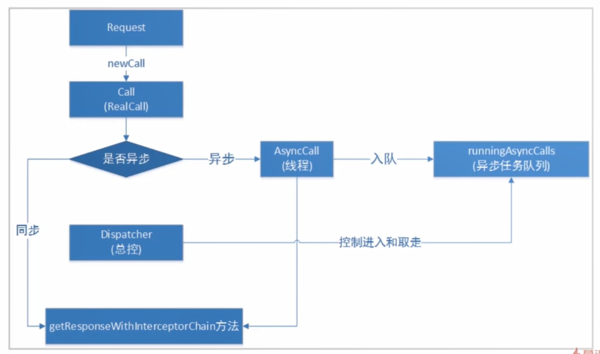
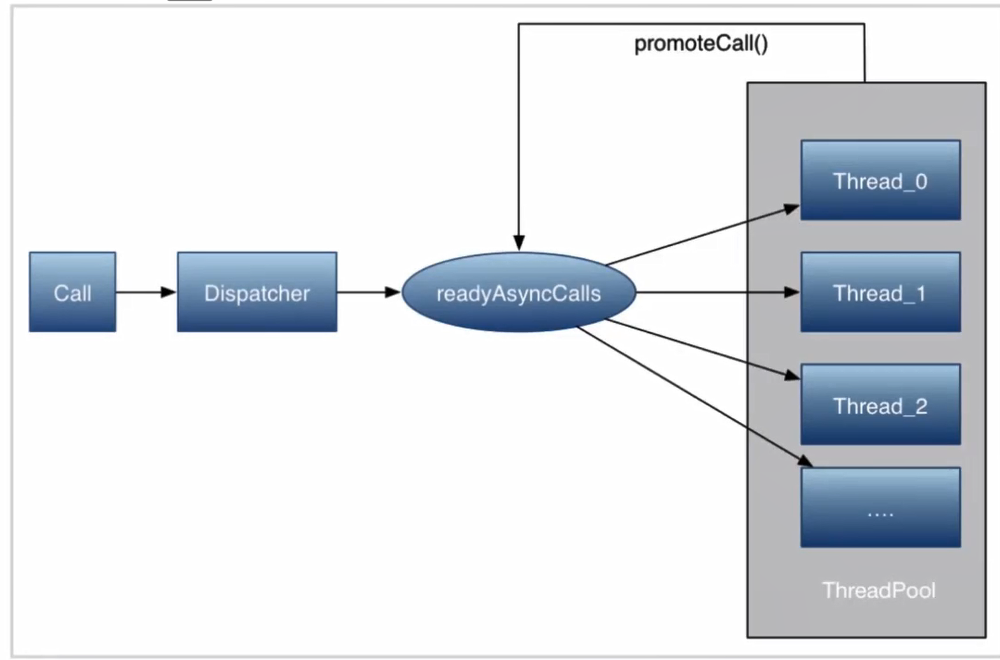
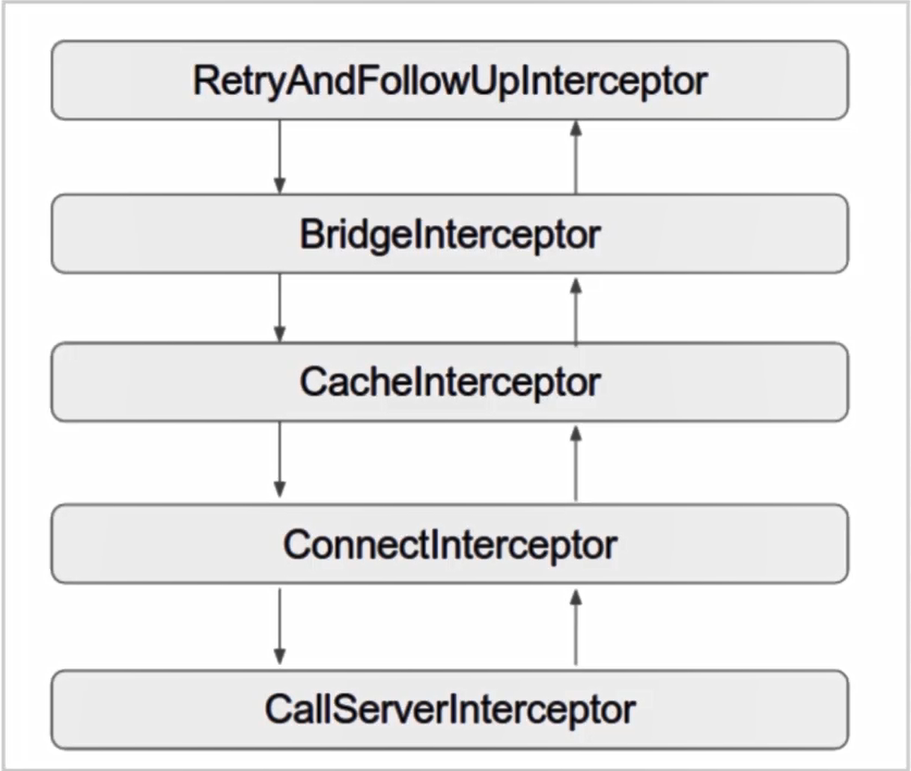

## OkHttp源码解析

### OkHttp同步方法的简单使用


#### 1，OkHttp的同步get请求：

##### Ⅰ	创建一个OkHttpClient的两种方式：

```java
//单例HTTP客户端
1,public final OkHttpClient client = new OkHttpClient();//创建OkHttpClient对象 
//创建具有自定义设置的共享实例  OkHttpClient内部类Builder()
2，public final OkHttpClient client = new OkHttpClient().Builder()
    	.addInterceptor(new HttpLoggingInterceptor())
    	.cache(new Cache(cacheDir,cacheSize))
    	.build();
实例：
	OkHttpClient clint = new OkHttpClient.Builder().readTimeout(5,Timeout.SECOND).build();
```

##### Ⅱ	OkHttpClient的简单使用：

```java
public final OkHttpClient client = new OkHttpClient();//创建OkHttpClient对象 
Request request = new Request.Builder()
    .url(url)//请求链接
    .build();//创建Request对象
Response response = client.newCall(request).execute();//获取Response对象
```

#### Ⅲ	使用总结：

- 创建一个OkHttoClient以及Request对象
- 将Rquest封装成Call对象
- 调用Call的execute()发送同步请求

)


### OkHttp异步请求的简单使用

Ⅰ	前两个步骤和同步请求一样，创建了OkHttpClient的对象和Request

Ⅱ	将Request对象封装成为Call对象

Ⅲ	调用Call的enqueue()方法

 ```java
public final OkHttpClient client = new OkHttpClient();//创建OkHttpClient对象 
Request request = new Request.Builder()
    .url(url)//请求链接
    .build();//创建Request对象
Call call = client.newCall(request);
call.enqueue(new Callback){
    @Override
    public void onFailure(Call call,IOException e){System.out.println("Fail");}
    
    @Override
    public void onResponse(Call call,Response response) throws IOException{
        System.out.println(response.body().string());
    }
}
 ```


###### 同步和异步的区别：

- **同步方法**再发送请求之后，就会进入**阻塞状态**，只到接收到新的确认信息之后 ，而**异步**就会**开启一个新的线程**来进行数据的处理
- 两者的区分还有一个是发起请求时调用的方法的区别：
  - 同步调用的是Call的execute()方法，而异步是Call.enqueue()方法


#### 注意：

- onResponse()和onFailure()方法都是在子线程中去执行的

- 当调用call的enqueue()方法的时候，会开启一个新的线程，将网络的异步请求放到新的线程中去执行。如果成功之后，会调用onResponse()方法去完成相应数据的处理。当异步请求失败或者是调用了异步请求的cancal()方法的时候就会调用onFailure()方法

  

- 创建同步报文请求Request,通过Request的newCall方法来创建实际的OkHttp请求Call,但是由于Call是一个接口，所以需要调用RealCall来进行进行判断是进行同步的execute()方法还是一个异步请求enqueue()。但是都会调用到getResponseWithIntercepterChain()(是OkHttp源码核心框架之一)， 该方法内部通过实现了一个拦截器的链。通过一次执行这个拦截器中的链的每一个方法来获取服务器的数据返回

  


可以看到OkHttpClient有两个构造方法，在构造方法中可以看出初始化一个Builder对象，根据构造方法的代码，主要设置了OkHttp的属性。比如：超时设置，拦截器，HTTPS相关等。

然后再创建一个Request对象，面熟OkHttp将要发送的请求。比如：URL，HTTP header，请求类型(GET请求或者是POST请求)等

### OkHttp的同步以及异步的源码分析以及执行流程

#### 同步：

##### OkHttpClient().Builder()：

OkHttpClient client = new OkHttpClient().Builder()；

```java
public Builder() {
    //OkHttp请求的分发器，据欸的那个请求是进行直接处理还是缓存等待
      dispatcher = new Dispatcher();
      protocols = DEFAULT_PROTOCOLS;
      connectionSpecs = DEFAULT_CONNECTION_SPECS;
      proxySelector = ProxySelector.getDefault();
      cookieJar = CookieJar.NO_COOKIES;
      socketFactory = SocketFactory.getDefault();
      hostnameVerifier = OkHostnameVerifier.INSTANCE;
      certificatePinner = CertificatePinner.DEFAULT;
      proxyAuthenticator = Authenticator.NONE;
      authenticator = Authenticator.NONE;
    /**连接池：用于存储客户端与服务器端的链接用于管理，当请求的URL是相同的时候可以复用
    *免下次再重复建立连接
    *了管理连接是否处于打开状态，那些可以用于缓存策略的设置
    **/
     connectionPool = new ConnectionPool();
      dns = Dns.SYSTEM;
      followSslRedirects = true;
      followRedirects = true;
      retryOnConnectionFailure = true;
      connectTimeout = 10_000;
      readTimeout = 10_000;
      writeTimeout = 10_000;
    }
```

##### Request()：

```
Request request = new Request.Builder()
    .url(url)//请求链接
    .build();//创建Request对象

```

请求报文信息类，使用链式调用来实现为Request指定URL，HTTP Header等信息

###### Builder:

```java
  public Builder() {
      //默认请求方式为'GET'
      this.method = "GET";
      //然后创建Headers的BUilder()对象用于保存Headers的一些头部信息
      this.headers = new Headers.Builder();
    }
```

###### build:

```java
//将之前的添加的一些头部信息，URL等信息传递给Request对象
public Request build() {
      if (url == null) throw new IllegalStateException("url == null");
      return new Request(this);
    }
```

###### Request:

```java
private Request(Builder builder) {
    this.url = builder.url;
    this.method = builder.method;
    this.headers = builder.headers.build();
    this.body = builder.body;
    this.tag = builder.tag != null ? builder.tag : this;
  }
```

##### Call:

**call是一个接口，而RealCall是Call的一个实现类。**

无论是同步还是异步信息，都是通过**client.newCall**来创建一个**call对象**的。

######  call.execute()

Response response = client.newCall(request).execute();//获取Response对象

```java
 @Override public Response execute() throws IOException {
    synchronized (this)  {
        //判断execute标志位是否为true:同一个Httpi请求只能执行一次
        //如果没有执行过就会将其设置为true,反之就会抛出一个异常
      if (executed) throw new IllegalStateException("Already Executed");
      executed = true;
    }
    try {
        /**
        * public Dispatcher dispatcher() {
        * 	return dispatcher;
        * }
        返回一个dispatcher对象
        */
        /** Used by {@code Call#execute} to signal it is in-flight. */
        /**
        * synchronized void executed(RealCall call) {
        *   runningSyncCalls.add(call);
        *  }
        */
        //同步的execute方法就是将call请求添加到同步请求队列当中
      client.dispatcher().executed(this);
      Response result = getResponseWithInterceptorChain();
      if (result == null) throw new IOException("Canceled");
      return result;
    } finally {
        //finished:会主动去清除一些同步请求
      client.dispatcher().finished(this);
    }
  }
```


###### finished:

```java
//将正在执行的请求当作参数传递进来  
private <T> void finished(Deque<T> calls, T call, boolean promoteCalls) {
    int runningCallsCount;
    Runnable idleCallback;
    synchronized (this) {
        //1,从当前队列中移除这个请求，如果不能移除的话就抛出一个异常 
      if (!calls.remove(call)) throw new AssertionError("Call wasn't in-flight!");
        //2,同步的时候在传递参数的时候promoteCalls = false，
      if (promoteCalls) promoteCalls();
        //runningCallsCount:返回了正在执行的同步请求和正在执行的异步请求的数量总和  
      runningCallsCount = runningCallsCount();
      idleCallback = this.idleCallback;
    }
     //如果此时runningCallsCount为0的时候，并且idleCallback不为空的时候
        //idleCallback：当前的请求
      if (runningCallsCount == 0 && idleCallback != null) {
      idleCallback.run();
    }
}
```


###### dispatcher概述:

维持call请求发送的一个状态，同时也维护了一个线程池用于执行网络请求，而Call请求在执行任务的时候通过dispatcher这个分发器类将Call的任务请求推到执行队列当中进行操作，如果操作完成之后，再执行等待队列中的任务

)


### OkHttp的异步以及异步的源码分析以及执行流程

 

   

##### Call.equeue:

```java
  @Override public void enqueue(Callback responseCallback) {
    synchronized (this) {
        //对execute进行判断，如果execute执行过了就会抛出异常
      if (executed) throw new IllegalStateException("Already Executed");
      executed = true;
    }
      //dispatcher:在同步的请求的时候再Builder的时候已经进行了实例化
    client.dispatcher().enqueue(new AsyncCall(responseCallback));
  }
```

###### AsyncCall:

```java
//继承了Runnable接口
final class AsyncCall extends NamedRunnable {
    private final Callback responseCallback;
    
    private AsyncCall(Callback responseCallback) {
      super("OkHttp %s", redactedUrl().toString());
      this.responseCallback = responseCallback;
    }
```

###### client.dispatcher().enqueue():

```java
synchronized void enqueue(AsyncCall call) {
    //正在运行请求是否小于最大值64，正在运行的主机个数时候小于5
    if (runningAsyncCalls.size() < maxRequests && runningCallsForHost(call) < maxRequestsPerHost) {
        //如果满足以上请求就会将call对象添加到正在执行的请求队列当中
      runningAsyncCalls.add(call);
        //通过线程池执行这个call
      executorService().execute(call);
    } else {
        //反之就会将其添加到就绪队列当中
      readyAsyncCalls.add(call);
    }
  }
```

###### 注意：runningAsyncCalls && readyAsyncCalls

runningAsyncCalls：是一个队列，代表着正在运行的任务，主要任务就是判断并发请求的数量

readyAsyncCalls：代表着缓存等待的请求队列

###### enqueue方法总结：

##### executorService:

```java
//synchronized:保证executorService删除一个单例
public synchronized ExecutorService executorService() {
    if (executorService == null) {
        // Integer.MAX_VALUE:即便在线程池中设置线程个数的最大值为Integer的最大值也不会造成影响
       		 //因为之前已经规定了线程的最大个数为64
        //
      executorService = new ThreadPoolExecutor(0, Integer.MAX_VALUE, 60, TimeUnit.SECONDS,
          new SynchronousQueue<Runnable>(), Util.threadFactory("OkHttp Dispatcher", false));
    }
    return executorService;
  }
```

###### 注意：

当线程创建好了之后，就可以调用现成的Run方法，此时就会调用Async的run方法，但是由于Async中没有run方法，只是调用了RealCall中的execute() 

```java
@Override protected void execute() {
      boolean signalledCallback = false;
      try {
          //getResponseWithInterceptorChain：拦截器返回一个response对象
        Response response = getResponseWithInterceptorChain();
          //retryAndFollowUpInterceptor:重定向与重试拦截器
          //判断这个拦截器是否被取消了
        if (retryAndFollowUpInterceptor.isCanceled()) {
            //
          signalledCallback = true;
            //表示
          responseCallback.onFailure(RealCall.this, new IOException("Canceled"));
        } else {
          signalledCallback = true;
            //
          responseCallback.onResponse(RealCall.this, response);
        }
      } catch (IOException e) {
        if (signalledCallback) {
          // Do not signal the callback twice!
          Platform.get().log(INFO, "Callback failure for " + toLoggableString(), e);
        } else {
          responseCallback.onFailure(RealCall.this, e);
        }
      } finally {
        client.dispatcher().finished(this);
      }
    }
  }
```

###### 异步请求中的finished:

```java
//将正在执行的请求当作参数传递进来  
private <T> void finished(Deque<T> calls, T call, boolean promoteCalls) {
    int runningCallsCount;
    Runnable idleCallback;
    synchronized (this) {
        //1,从当前队列中移除这个请求，如果不能移除的话就抛出一个异常 
      if (!calls.remove(call)) throw new AssertionError("Call wasn't in-flight!");
        //2,异步请求的时候
        //promoteCalls：调整整个异步请求队列
        //由于所用的队列是一个非线程安全的队列所以会调用synchronized关键字将这个给锁住
      if (promoteCalls) promoteCalls();
        //runningCallsCount:返回了正在执行的同步请求和正在执行的异步请求的数量总和  
      runningCallsCount = runningCallsCount();
      idleCallback = this.idleCallback;
    }
     //如果此时runningCallsCount为0的时候，并且idleCallback不为空的时候
        //idleCallback：当前的请求
      if (runningCallsCount == 0 && idleCallback != null) {
      idleCallback.run();
    }
}
```


#### getResponseWithInterceptorChain：

**该方法内部通过实现了一个拦截器的链。通过一次执行这个拦截器中的链的每一个方法来获取服务器的数据返回**

### OkHttp的任务调度

#### dispatcher:

​			**用于维护请求的状态，并维护一个线程池，用于执行请求。**

#### 异步请求需要两个队列：

##### Dispatcher(生产者)

##### ExecuteService(消费者池)

##### Deque<readyAsyncCalls> 缓存

##### Deque<runningAsyncCalls> 正在运行的任务

### OkHttp的拦截器

#### 官网解释：

拦截器是OkHttp中提供一种强大的机制，它可以实现网络监听，请求以及响应重写，请求失败重试等功能。

但是不区分同步还是异步的请求。


### 

### OkHttp的高效之处：

在dispatcher内部维护了一个线程池，可以更加高效的用于执行异步请求


)

##### 拦截器：

###### RetryAndFollowUpInterceptor:重定向和失败后重新请求拦截器

进行初始化的工作，并且创建一个Strimxxxx对象用于传递给后面的拦截器

###### BridgeInterceptor:网桥拦截器,用于client与Server之间的桥梁

###### CacheInterceptor:缓存处理拦截器

###### ConnectInterceptor:Socket层的握手链接

###### CallServerInterceptor：client和Server之前的读写操作