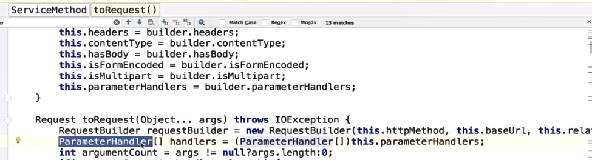

##  Retrofit

### 简介：

)

是一个封装Http请求的框架，主要 用于Android和java，而Retrofit会将每一个Http的请求变成一个Java的接口，故而使用起来非常方便，又因为是一个网络请求框架的封装，其主要原因是由于其内核是OkHttp实现的，如图：

)

Application Layer层通过Retrofit层封装请求参数，头部以及URL等配置信息，之后通过OkHttp层完成后续的请求信息，在服务器端将请求结果返回给OkHttp之后再返回给Retrofit层，在返回给Application Layer层。从而使得Retrofit专注于接口的封装工作，OkHttp专注于网络请求的封装过程，从而提高工作效率。


)


Retrofit：作为上层的网络框架，其主要作用是封装底层网络框架，**主要工作是各种数据的适配以及转化工作**。涉及到很多的设计模式，故而可以与很多其他的框架进行无缝衔接。


### Retrofit的使用方法：

#### 官方使用：

```java
public interface GitHubService{
	//@GET:表示是一个网络get请求
    //GET括号中的参数:表示的是请求路径
    //{user}:这部分是动态变化的而不是固定的，是由ListRepos()方法传递过来的
    @GET("users/{user}/repos")
    //@Path:设置URL地址的默认值
    //此处表示的是：表示若第二个参数传递的是空值时，会将path中的参数作为URL地址的默认值并传递到其中
    //返回一个Call，封装整个Http请求
	Call<List<Repo>> listRepos(@Path("user")String user);
}
```


#### 七个步骤：

- **添加Retrofit，OKHttp3依赖，并且增加网络权限**

- **创建一个用于接收服务器返回数据类型** 

  ```java
  public class MyResponse{
  	String name;
  	int age;
  	String color;
  	String address;
  }
  ```

  

- **创建一个用于描述网络请求的接口**

  ```java
  public interface MyInterface{
  	@GET(".../...")
  	Call<List<MyResponse>> getCall();
  }
  ```

  Retrofit将每一个Http请求封装为一个Java接口，并且采用**注解**的方式描述网络请求参数和配置整个的网络请求参数

  注解：实际上内部是采用的动态代理模式将整个接口的注解翻译成为了一个个Http请求，最后在执行Http

  接口中的方法的参数都必须要使用注解的方式否则就会报错

  

- **通过Retrofit.Builder()模式创建一个Retrofit对象**

  )

  

  - baseUrl()：与之前接口中的URL默认值构成一个完整的URL地址

  - addConverterFactory()：**设置数据解析器；**

    创建一个ConverterFactory(是将我们返回的Response对象转化成一个Java对象，并将其可以显示在UI上 )

    

  - 调用build()方法完成对象的创建，在调用该方法之前也可以完成其他参数的配置

-  **通过Retrofit对象调用他的create()方法来创建service对象实例,并将其字节码传递进去**

  ```java
  GitHubService service = retrofit.create(GitHubService.class);
  ```

  

- **通过service来调用接口中的listRepos()方法，返回一个Call对象，最终由OkHttp来进行网络请求**

  ```java
  Call repos = (Call)srevice.listRepos("XXXX");
  repos.enqueue(new Callback(){
      @Override
      public void onFailure(Call call,IOException e){
      }
          @Override
      public void onReponse(Call call,Response response) throws IOException{
      }
  });
  ```

)**


通过动态代理将一个个接口的注解翻译成为Http请求，在通过线程池来执行一个个的请求

)


### 动态代理

代理设计模式：为其他对象提供一种代理，用以控制对这个对象的访问

> 类似于代购，只关注与结果

#### 静态代理


)

三个角色：

- **抽象对象：**

  声明了其他两个类的共同所要继承的接口，就能够在可以使用目标对象的地方使用代理对象来进行替代，体现了代理的意义

  

- **目标对象（RealObject）：**

  定义了代理对象所代表的目标对象

- **代理对象（ProxyObject）：**

  持有了RealObject对象的引用，从而在任意时候来操作RealObject对象，又由于两者有共同的接口，所以可以很方便的在任意时候替换掉目标对象

  

)


)


静态代理：可以在代理对象调用目标对象之前或者之后添加所需要的逻辑，

总结：

)

代理对象将客户端的调用委派给了目标对象，而在调用目标对象之前和之后，都可以执行某些特定的操作。

**应用场景：**

对已有的方法进行改进时，可以通过代理类，调用原来的方法对产生的结果进行控制。使用代理模式可以将功能划分的更加清晰，从而有利于后期维护。


#### 动态代理：

定义：代理类在程序运行时创建的代理方式

 代理类并不是根据Java代码定义的，而是在程序运行的过程中根据在Java代码的配置动态生成的

相比于：可以很方便的对带迭代函数进行统一处理，而不用很频繁的修改每一个代理类函数

优势：无侵入式的可以扩展代码（在不修改原代码的情况下增强一些方法或者功能）


###### 动态代理写法：

###### JDK动态代理：

**是使用Java内部反射机制实现的，故而在生成类的过程中比较高效**

实现效果：在不改变原本的代码的情况下，通过调用方法的前后插入想要实现的逻辑，JDK动态代理是能为接口实现代理：****

需要客户端写辅助一些接口来自己操作的


**代理类和被代理类都要实现的接口执行的操作：**

)


**被代理类：**

)

**代理类：**

)

InvocationHandler:每一个动态代理都要实现的接口

可以理解成代理对象调用程序的时候所一定要实现的接口，当通过代理对象调用方法的时候，这个方法就会将其指派到调用处的InvocationHandler这个接口的invoke()方法上

)

invoke三个参数：

var1:真实对象的代理

method：所真实代理对象所具有的方法

Object数组：所代理的某个真实对象的所有参数的


在使用动态代理的时候，会使用到反射中的proxy()方法中的newProxyInstance()方法，而该方法会根据传递进去的class字节码的对象生成相对应的实例：代理类；此时每当代理类执行方法的时候就会执行InvocationHanlder.invoke方法，而InvocationHandler又是newInstance()中的变量，从而将两者相关联起来。


InvocationHandler：

每个代理类的对象都会关联一个表示内部处理逻辑的InvocationHandler接口，当使用者调用了代理对象所代理的接口中的方法的时候这个调用的信息就会传递到InvocationHandler.invoke()方法中

而在invoke()方法中，可以通过其中传递的参数来获取参数

invoke()方法的返回值会返回给使用者


客户端类：主要用于测试


Proxy源码: 


 上述；


newProxyInstance:创建所需要的代理参数

- 将动态生成的字节码文件加载到JVM虚拟机当中

- Class类数组：为代理对象实现了接口

- 当代理对象调用方法的时候将其关联到invocationHandler方法中，并且调用invoke()方法获取参数

  

InvocationHandler：

- 每个代理类的对象都会关联一个表示内部处理逻辑的InvocationHandler接口的实现
- invoke()方法的参数中可以获取参数
- invoke()方法的返回值被返回给使用者


总结：

- 运行期：代理类与相关接口不发生直接联系的情况下在运行时实现动态关联
- InvocationHandler接口和Proxy类
- 静态代理与动态代理区别
  - 动态代理：动态生成，已经实现了代理类的相关接口

###### CGLIB：可以直接修改字节码


### 源码分析

 

使用大量的设计模式将网络请求的功能模块进行完全的解耦，使得网络请求工作变得更加清晰，简单以及流畅


#### 网络通信8步骤：

##### 创建Retrofit实例


使用构建者模式创建Retrofit对象，


- ServiceMethod:网络请求接口中对他的方法进行注解之后要通过解析，解析之后的对象就是ServiceMethod，与注解中的get,post是成对出现，一一对应的
- ServiceMethodCache:用于缓存的，缓存一些网络请求的相关配置，方法，数据转换器，网络请求适配器等等等等
- callFactory:请求网络OkHttp的工厂，用于生产OkHttpClient
- baseUrl:网络请求的基地址，与get请求之后的相对地址拼接起来构成一个完整的网络请求的Url地址
- convertFactories:数据转化器工厂集合；对请求网络之后返回的response进行转换成用户可以使用的java对象。所以数据转化器工厂集合的作用就是生产数据转化器的convert
- adapterFactories：将call对象转换成其他的类型（支持RXJav等的平台），放置网络请求适配器工厂的，工厂的作用就是放置CallAdapter的
- callbackExecutor：用于执行回调的，在安卓中默认使用的是主线程的Executor，而Retrofit的网络请求最终都是使用的是Handler进行调配，处理子线程与主线程之间的切换
- validateEagerly：标志位；是否需要立即解析接口中的方法

###### Retrofit.Builder():通过构建者模式进行类成员变量的初始化


 


- platform：Retrofit适配的平台：Android，java8，IOS等
- callFactory：请求网络的OkHttp工厂，默认情况下Retrofit使用的是OkHttp进行网络请求
- baseUrl：网络请求的基地址
- convertFactories:数据转化器工厂集合；对请求网络之后返回的response进行转换成用户可以使用的java对象。所以数据转化器工厂集合的作用就是生产数据转化器的convert，默认情况下使用的是GsonConvertFactory
- adapterFactories：将call对象转换成其他的类型（支持RXJav等的平台），放置网络请求适配器工厂的，工厂的作用就是放置CallAdapter的
- callbackExecutor：用于执行异步回调的，在安卓中默认使用的是主线程的Executor，而Retrofit的网络请求最终都是使用的是Handler进行调配，处理子线程与主线程之间的切换
- validateEagerly：标志位；是否需要立即解析接口中的方法


```java
public Builder(){
    //返回的是一个platform类型
	this(Platform.get());
}
```


Platform():

PLATFORM是一个单例；

- class.forName(是一个静态方法)去查找指定的类，并且返回一个安卓对象(使用的是安卓平台)


- defaultCallbackExecotor()：线程间的切换：从子线程切换到主线程，同时也可以在主线程中执行回调方法

- MainThreadExecutor()：绑定主线程，故而可以再主线程进行切换

  Builder()：

  

  Platform：

  ```java
  /*
  Builder()
  */
  
  Buidler(Platform platform){
      //适配器工厂以及数据转化器工厂初始化
  	this.convertFactories = new ArrayList();
  	this.adapterFactories = new ArrayList();
      //将之间得到的平台信息赋值给Builder()中的platform
  	this.platform = platform;
  	//BuiltInConverters()：内置转化器工厂，默认的转化器工厂，若在初始化的时候没指定转化器的haul，Retrofit会默认使用内部的转换器工作
      this.convertFactories.add(new BuiltInConverters());
  	
  }
  ```

  

  Buidler.baseUrl():对String类型的URL进行转化

  

  

  Builder.addConverterFactory():设置数据解析器

  

  

  

  如何实现将集合添加在ConvertFactory中：

  

  

  create(new Gson()):

  ```java
  //创建含有Gson实例的GsonConverterFactory对象，并且添加到数据转化器工厂
  public static GsonConvertFactory create(Gson gson){
  	return new GsonConverterFactory(gson);
  }
  
  //GsonConverterFactory(gson)
  private GsonConverterFactory(Gson gson){
      if(gson == null){
          throw new NullPointerException("gson == null");
      }else{
          this.gson = gson;
      }
  }
  ```

  

  

  

  Buidler.addCallAdapterFactory():

  

  

  

  

  - **Schedule：RXJava中的调度器**
  - 返回一个含有schedule对象的RxJavaCallAdapterFactory对象

  

  Builder.build():完场整个Retrofit对象的创建

  

  

  

   

  
  
  ###### 通过动态代理生成网络请求对象


- 通过网络请求适配器将网络请求对象进行平台适配（Android，Java8以及IOS）

- 通过**网络请求执行器**发送网络请求

- 通过数据转换器解析数据

- 通过回调执行器切换线程

- 用户在主线程处理返回结果

  


#### RxjavaCallAdapterFactory内部构造与工作原理


##### CallAdapter:将Call这个泛型对象转换成java对象，能够通过这个java对象来完成后续操作(UI显示)


此处的Call对OkHttp中的Call对象进行封装，所以其底层实际使用的是OkHttp进行网络请求


- Type responseType()：返回Http解析之后的类型，次数的Type类型并非是接口返回的类型，而是接口返回类型中泛型参数类型的实参，即下面的List集合对象

  

- <R> T adapter(Call<R> var1)：此处的T指的是需要转换成接口的返回类型，所以会传递一个OkHttp Call对象的实例

- Factory{}：在常见retrfit的时候需要继承Factory这个抽象类，并将这个继承的对象在构造的时候添加到其中


- get()：根据接口的返回类型来获取需要的callAdapter

  

  根据从rawType()中获取的原始数据类型，从而判断是否是RxJava执行的类型。并且最终会返回一个callAdapter具体实现对象且调用Adapter()方法进行最终Call请求的转换

  

- adapter()：进行最终的call请求的转化

- getRawType()：获取原始类型

  

#### 网络请求接口实例解析：


- validateServiceInterface()：对字节码进行异常判断
- validdataEagerly()：是否需要提前解析该接口
  - eagerlyValidMethods()：


- Platform.get()：获取当前平台

- service,getDeclaredmethods:通过反射获取传递的接口对象的方法

- for循环：接口中的方法进行遍历

- loadServiceMethod():

  ```java
  ServiceMethod loadServiceMethod(Method method){
      Map var3 = this.serviceMethodCache;
      //serviceMethod: 通过动态代理将接口转化成为一个个Http网络请求，而ServiceMethod()方法就是对应于接口的方法并将其做好封装
      synchronized(this.serviceMethodCache){
          //先从serviceMethodCache中根据method获取相应的ServiceMethod对象
          ServiceMethod result = (ServiceMethod)this.serviceMethodCache.get(method);
          //如果缓存池中没有的话自己构建
          //如果缓存池中没有的话自己构建ServiceMethod对象，再将method作为key传到ServiceMethodcache当中进行缓存
          if(result == null){
              //完成ServiceMethod对象的创建并且通过builder内部类实现初始化操作
              result = (new retrofit2.ServiceMethod.Builder(this,method)).build();
          }
          //返回一个ServiceMethod对象
          return result;
      }
  }
  ```


- methodAnnotations:网络请求方法接口中的注解
- parameterTypes:获取网络接口方法中参数的类型
- parameterAnnotationsArray:获取网络请求方法接口中的内容

在create()方法中使用的是动态代理来解析接口中的方法，参数，注解等，然后执行invocationHandler中的invoke执行具体操作


builder():


##### ServiceMethod对象解析

###### invoke()


```java
//loadServiceMethod:加载ServiceMethod
//serviceMethod:讲接口中的方法封装成为ServiceMethod之后是的Retrofit进行网络请求的加载
ServiceMethod serviceMethod = Retrofit.this.loadServiceMethod(method);
OkHttppCall okHttpCall = new OkHttpCall(serviceMethod,args);
return serviceMethod.callAdapter(okhttpCall);
```


- converter:数据转化
- relativeUrl:相对地址
- headers：网络请求头
- parameteHandler：


##### 同步/异步请求

同步：OkhttpCall.execute()

 ```java
call.execute();
 ```


- 
- 
- 
- 
- 


异步：OkHttpCall.enqueue():会用到回调


区别：

异步请求会将回调方法交给回调执行器executor，从而指定不同的线程完成工作


### 设计模式：

#### 构建者模式：

用来创建Retrofit对象：将复杂对象的创建与表示相分离，隐藏该对象创建时的复杂程度，用户只需要通过链式调用来完成初始化即可

好处：

- 当构建Retrofit对象的时候，如果不使用构建者模式的话，势必要使用构造器来创建对象，但是在根据不同的使用场景需要构建不同内容的对象，一旦参数过多，会增加用户的使用难度，
- 根据不同的应用场景配置不同的


#### 工厂模式

addCallAdapterFactory():

- 继承抽象的工厂方法

静态工厂模式：

platform->findPaltform()


#### 外观模式：高内聚，低耦合，对外提供一个统一的接口

**通过调用外部高层接口使得外部与子系统的通信更加容易**

AS：run方法生成apk


#### 策略模式：


将每一个可以完成任务的方法称为一个策略，使用在不同的应用场景及需求。

- strategy：
- concreteStrategy：

##### **CallAdapter：抽象的strategy**

具体的strategy是具体的CallAdapter实现类：RxJavaCallAdapter


工厂模式：强调生产不同的对象

策略模式：不同对象的策略方法的具体实现


#### 适配器模式：CallAdapter

讲一个接口转化为客户端能够使用的类型，使得原本不兼容的类可以在一起工作


CallAdapter：将Retrofit封装的OkHttpCall与主线程Executor两个实例对象适配成一个新的实例，从而达到可以再主线程与子线程之间切换的功能

由于OkHttpCall只负责网络请求的工作，但是Retrofit有是可以适用于多个平台的，所以为了OkHttpCall对象能够在不同平台上的正常使用，此处采用适配器模式将其封装成为一个实际应用场景所需要的实例

实现步骤：

- 通过addCallAdapterFactory()添加需要适配的平台，并通过这个平台创建所需要的是Retrofit对象


#### 动态代理/观察者模式

观察者模式：一对多（一个被观察者对应多个观察者）

多个观察者之间可以没有关联，增加科扩展性


被观察者：RealCall

观察者：Callback

根据call的所做出的的反应做出具体的逻辑操作