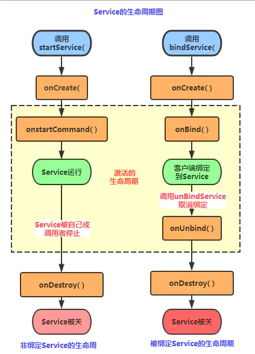
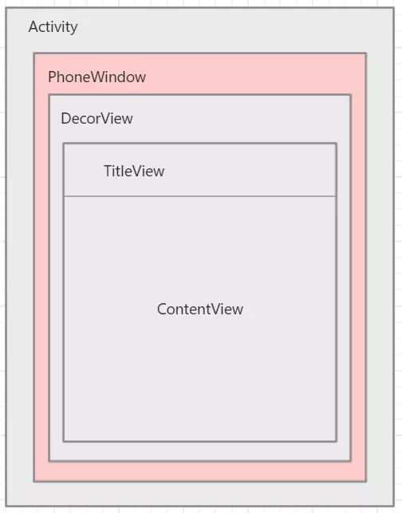
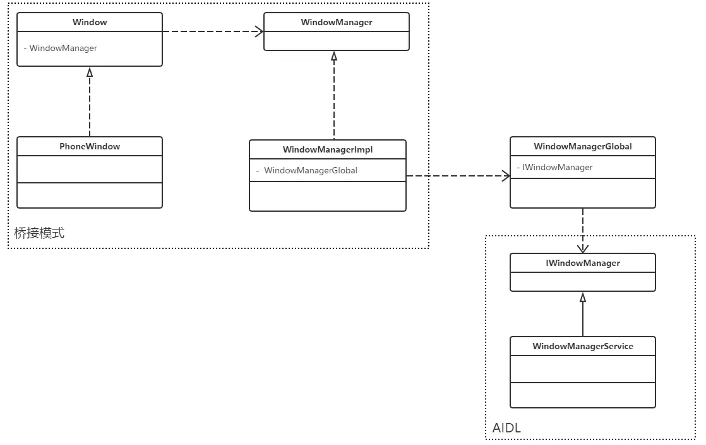
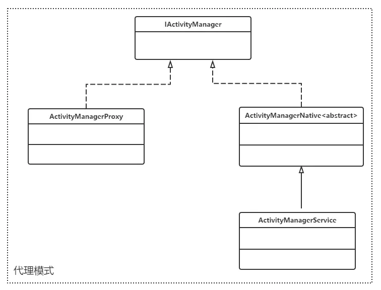

[toc]

## Service

#### 1.什么是Service?

是Android系統提供的四大組件之一，他的地位和Activity并列，，只不過沒有Activity的使用頻率那么高。**Service是一種運行在后台的一种服务。一般情况下，很少和用户进行交互，最大的特点是没有可视化界面**

主要应用场景：**后台运行**以及**跨进程访问**

- 是一个运行程序的组件

- 没有图形化界面

- 通常来处理一些耗时较长的操作

- 可以使用Service来更新Content Provider，发送Intent以及启动系统的通知等

- 但是Service不是一个单独的进程，不是一个线程

  

**注：**Service可以在后台执行长时间运行操作而不提供用户界面，除非系统必须回收内存资源，否则系统不会停止或销毁服务。服务可由其他应用组件启动，而且即使用户切换到其他应用，服务仍将在后台继续运行。 此外，组件可以绑定到服务，以与之进行交互，甚至是执行进程间通信 (IPC)需要注意的是，Service是在主线程里执行操作的，可能会因为执行耗时操作而导致ANR。


#### 2.说说Service的生命周期以及其三种方式。




其中左图显示了使用 startService() 所创建的服务的生命周期，右图显示了使用 bindService() 所创建的服务的生命周期。通过图中的生命周期方法，我们可以监控Service的整体执行过程，包括创建，运行，销毁，关于Service不同状态下的方法回调在前面的分析中已描述得很清楚，这里就不重复了，下面给出官网对生命周期的原文描述：

> 服务的整个生命周期**从调用 onCreate() 开始起，到 onDestroy() 返回时结束**。与 Activity 类似，服务也在 onCreate() 中完成初始设置，并在 onDestroy() 中释放所有剩余资源。例如，音乐播放服务可以在 onCreate() 中创建用于播放音乐的线程，然后在 onDestroy() 中停止该线程。
>   无论服务是通过 startService() 还是 bindService() 创建，都会为所有服务调用 onCreate() 和 onDestroy() 方法。
>   服务的有效生命周期从调用 onStartCommand() 或 onBind() 方法开始。每种方法均有 Intent 对象，该对象分别传递到 startService() 或 bindService()。
>   对于启动服务，有效生命周期与整个生命周期同时结束（即便是在 onStartCommand() 返回之后，服务仍然处于活动状态）。对于绑定服务，有效生命周期在 onUnbind() 返回时结束。

##### 相关生命周期详情

- onCreate()：**首次创建服务时，系统将调用此方法来执行一次性设置程序**（在调用 onStartCommand() 或onBind() 之前）。如果服务已在运行，则不会调用此方法，该方法只调用一次
- onDestory()：当服务不再使用且将被销毁时，系统将调用此方法。服务应该实现此方法来清理所有资源，如线程、注册的侦听器、接收器等，这是服务接收的最后一个调用。
- onStartCommand(intent,flag,startId)： **当另一个组件（如 Activity）通过调用 startService() 请求启动服务时，系统将调用此方法。一旦执行此方法，服务即会启动并可在后台无限期运行。 如果自己实现此方法，则需要在服务工作完成后，通过调用 stopSelf() 或 stopService() 来停止服务**。（在绑定状态下，无需实现此方法。）

- IBinder onBind(intent)：**当另一个组件想通过调用 bindService() 与服务绑定（例如执行 RPC）时，系统将调用此方法。在此方法的实现中，必须返回 一个IBinder 接口的实现类，供客户端用来与服务进行通信。无论是启动状态还是绑定状态，此方法必须重写，但在启动状态的情况下直接返回 null。**

- onUnbind(intent)：**当该Service上绑定的所有客户端都断开时会回调该方法**！

  


#### 下面介绍三种不同情况下Service的生命周期情况。

##### 1.startService / stopService

生命周期顺序：**onCreate->onStartCommand->onDestroy**

如果一个**Service被某个Activity 调用 Context.startService方法启**动，那么不管是否有Activity使用bindService绑定或unbindService解除绑定到该Service，该Service都在后台运行，直到被调用stopService，或自身的stopSelf方法。当然如果系统资源不足，android系统也可能结束服务，还有一种方法可以关闭服务，在设置中，通过应用->找到自己应用->停止。

**注意点：**

①第一次 startService 会触发 onCreate 和 onStartCommand，以后在服务运行过程中，每次 startService 都只会触发 onStartCommand

②不论 startService 多少次，stopService 一次就会停止服务

##### 2.bindService / unbindService

生命周期顺序：onCreate->onBind->onUnBind->onDestroy

如果一个Service在某个Activity中被调用bindService方法启动，不论bindService被调用几次，Service的onCreate方法只会执行一次，同时onStartCommand方法始终不会调用。

当建立连接后，Service会一直运行，除非调用unbindService来接触绑定、断开连接或调用该Service的Context不存在了（如Activity被Finish——**即通过bindService启动的Service的生命周期依附于启动它的Context**），系统在这时会自动停止该Service。

**注意点：**

第一次 bindService 会触发 onCreate 和 onBind，以后在服务运行过程中，每次 bindService 都不会触发任何回调

##### 3.混合型（上面两种方式的交互）

当一个Service在被启动(startService)的同时又被绑定(bindService)，该Service将会一直在后台运行，并且不管调用几次，**onCreate方法始终只会调用一次**，onStartCommand的调用次数与startService调用的次数一致（使用bindService方法不会调用onStartCommand）。同时，**调用unBindService将不会停止Service，必须调用stopService或Service自身的stopSelf来停止服务。**

### 在什么情况下使用 startService 或 bindService 或 同时使用startService 和 bindService？

①**如果你只是想要启动一个后台服务长期进行某项任务那么使用 startService 便可以了**。

②**如果你想要与正在运行的 Service 取得联系，那么有两种方法，一种是使用 broadcast ，另外是使用 bindService ，前者的缺点是如果交流较为频繁，容易造成性能上的问题，并且 BroadcastReceiver 本身执行代码的时间是很短的（也许执行到一半，后面的代码便不会执行），而后者则没有这些问题，因此我们肯定选择使用 bindService（这个时候你便同时在使用 startService 和 bindService 了，这在 Activity 中更新 Service 的某些运行状态是相当有用的）**。

③**如果你的服务只是公开一个远程接口，供连接上的客服端（android 的 Service 是C/S架构）远程调用执行方法。这个时候你可以不让服务一开始就运行，而只用 bindService** ，这样在第一次 bindService 的时候才会创建服务的实例运行它，这会节约很多系统资源，特别是如果你的服务是Remote Service，那么该效果会越明显（当然在 Service 创建的时候会花去一定时间，你应当注意到这点）。这部分主要应用是AIDL

**Service三种方式：**

- **启动状态**：当组件通过**startService()** 启动服务时，服务就处于启动状态。一旦处于“启动状态”，**服务即可在后台无限期运行，即使启动服务的组件已经被销毁了也不受影响，除非手动调用才能停止服务，已启动的服务通常是执行单一操作，而且不会将结果返回给调用方。**

- **绑定状态**：	**当应用组件通过调用 bindService() 绑定到服务时，服务即处于“绑定”状态。绑定服务提供了一个客户端-服务器接口，允许组件与服务进行交互、发送请求、获取结果，甚至是利用进程间通信 (IPC) 跨进程执行这些操作**。仅当与另一个应用组件绑定时，绑定服务才会运行。 多个组件可以同时绑定到该服务，但全部取消绑定后，该服务即会被销毁。

- **启动且绑定**：服务既可以是启动服务，也允许绑定。此时需要同时实现以下回调方法：**onStartCommand()**和**onBind()**。系统及不会在所有客户端都取消绑定时销毁服务。为此，必须通过调用**stopSelf()**或是**stopService()**显式停止服务


无论引用时处于七的那个状态还是绑定状态，或者处于启动且绑定状态，任何应用组件均可像使用Activity那样通过调用Intent来使用服务(即使此服务来自另一个应用)，也可以通过清单文件将服务声明为私有服务，阻止其他应用访问

要使用服务，必须继承Service类(或者是Service类的现有子类)，在子类中重写某些回调方法，以处理服务生命周期的某些关键方面并提供一种机制将组件绑定到服务


**仅当内存过低必须回收系统资源以供前台Activity使用时，系统才会强制停止服务。如果将服务绑定到前台Activity，则他不太可能会终止，如果将服务声明在前台运行，则他几乎永远不会终止**。如果服务是启动服务，则必须将其设计为能够妥善处理系统对他的重启。如果系统停止服务，那么一旦资源变得再次可用，系统便会重启服务(者还取决于onStartCommand()的返回值)


#### 3.三种启动方式

- StartService()启动Service
- BindService()启动Service
- PS:还有一种，就是启动Service后，绑定Service！

##### 4.1 StartService启动Service

**首先我们自定义一个Service,重写相关的方法,用户在logcat上打印验证:**

TestService1.java

```java
public class TestService1 extends Service {
    private final String TAG = "TestService1";

//    必须要实现的方法
    @Override
    public IBinder onBind(Intent intent) {
        Log.i(TAG, "onBind方法被调用！");
        return null;
    }

//    service 被创建时调用
    @Override
    public void onCreate() {
        Log.i(TAG, "onCreate 方法被调用！");
        super.onCreate();
    }

//    service被启动时调用
    @Override
    public int onStartCommand(Intent intent, int flags, int startId) {
        Log.i(TAG, "onStartCommand 方法被调用！");
        return super.onStartCommand(intent, flags, startId);
    }

//    service被关闭之前回调
    @Override
    public void onDestroy() {
        Log.i(TAG, "onDestroy 方法被调用！");
        super.onDestroy();
    }
}
```

AndroidManifest.xml完成Service注册


```xml
   <!--注册一个Service 组件，同时配置一个action -->
        <service android:name=".TestService1">
            <intent-filter>
                <action android:name="cn.demo_for_service.TEST_SERVICE1"/>
            </intent-filter>
        </service>
```

再接着是简单的布局文件,两个按钮,再最后是MainActivity的编写,在按钮的点击事件中分别 调用startService( )和stopService( )!


```java
public class MainActivity extends AppCompatActivity {

    private Button btn_start, btn_stop;

    @Override
    protected void onCreate(Bundle savedInstanceState) {
        super.onCreate(savedInstanceState);
        setContentView(R.layout.activity_main);

        btn_start = findViewById(R.id.btn_start);
        btn_stop = findViewById(R.id.btn_stop);

//        创建启动Service 的Intent，以及Intent属性
        final Intent intent = new Intent();
        intent.setAction("cn.demo_for_service.TEST_SERVICE1");
        intent.setPackage("cn.demo_for_service");

        btn_start.setOnClickListener(new View.OnClickListener() {
            @Override
            public void onClick(View v) {
                startService(intent);
            }
        });

        btn_stop.setOnClickListener(new View.OnClickListener() {
            @Override
            public void onClick(View v) {
                stopService(intent);
            }
        });
    }
}
```

**运行结果**

点击开始


```undefined
2019-06-24 15:38:21.527 6822-6822/cn.demo_for_service I/TestService1: onCreate 方法被调用！
2019-06-24 15:38:21.529 6822-6822/cn.demo_for_service I/TestService1: onStartCommand 方法被调用！
```

多点两下


```java
2019-06-24 15:38:21.527 6822-6822/cn.demo_for_service I/TestService1: onCreate 方法被调用！
2019-06-24 15:38:21.529 6822-6822/cn.demo_for_service I/TestService1: onStartCommand 方法被调用！
2019-06-24 15:41:02.687 6822-6822/cn.demo_for_service I/TestService1: onStartCommand 方法被调用！
2019-06-24 15:41:03.647 6822-6822/cn.demo_for_service I/TestService1: onStartCommand 方法被调用！
2019-06-24 15:41:07.869 6822-6822/cn.demo_for_service I/TestService1: onStartCommand 方法被调用！
```

最后点停止


```undefined
2019-06-24 15:38:21.527 6822-6822/cn.demo_for_service I/TestService1: onCreate 方法被调用！
2019-06-24 15:38:21.529 6822-6822/cn.demo_for_service I/TestService1: onStartCommand 方法被调用！
2019-06-24 15:41:02.687 6822-6822/cn.demo_for_service I/TestService1: onStartCommand 方法被调用！
2019-06-24 15:41:03.647 6822-6822/cn.demo_for_service I/TestService1: onStartCommand 方法被调用！
2019-06-24 15:41:07.869 6822-6822/cn.demo_for_service I/TestService1: onStartCommand 方法被调用！
2019-06-24 15:41:47.515 6822-6822/cn.demo_for_service I/TestService1: onDestroy 方法被调用！
```

**结果分析：**

- ①首次启动会创建一个Service实例,依次调用onCreate()和onStartCommand()方法,此时Service 进入运行状态,如果再次调用StartService启动Service,将不会再创建新的Service对象, 系统会直接复用前面创建的Service对象,调用它的onStartCommand()方法！
- ②但这样的Service与它的调用者无必然的联系,就是说当调用者结束了自己的生命周期, 但是只要不调用stopService,那么Service还是会继续运行的!
- ③无论启动了多少次Service,只需调用一次StopService即可停掉Service

##### 4.2 验证BindService启动Service的顺序:

我们先要来了解一些东西先: 首先是第一个大图下面给出的Context的bindService方法：

- ServiceConnection对象:监听访问者与Service间的连接情况,如果成功连接,回调 onServiceConnected(),如果异常终止或者其他原因终止导致Service与访问者断开 连接则回调onServiceDisconnected方法,调用unBindService()不会调用该方法!
- onServiceConnected方法中有一个IBinder对象,该对象即可实现与被绑定Service 之间的通信!我们再开发Service类时,默认需要实现IBinder onBind()方法,该方法返回的 IBinder对象会传到ServiceConnection对象中的onServiceConnected的参数,我们就可以 在这里通过这个IBinder与Service进行通信 !

接下来就是写代码验证了,这里的话我们定义一个用来计时的Service, 然后来演示BindService的用法以及方法调用流程!代码比较简单。

TestService2.java:


```java
public class TestService2 extends Service {
    private final String TAG = "TestService2";
    private int count;
    private boolean quit;

    //定义Binder方法所返回的对象
    private MyBinder binder = new MyBinder();

    public class MyBinder extends Binder {
        public int getCount() {
            return count;
        }
    }

    //必须实现的方法，绑定Service 时回调该方法
    @Override
    public IBinder onBind(Intent intent) {
        Log.i(TAG, "onBind 方法被调用！");
        return binder;
    }

    //Service被创建时回调
    @Override
    public void onCreate() {
        super.onCreate();
        Log.i(TAG, "onCreate 方法被调用！ ");
        new Thread() {
            @Override
            public void run() {
                super.run();
                while (!quit) {
                    try {
                        Thread.sleep(1000);
                    } catch (InterruptedException e) {
                        e.printStackTrace();
                    }
                    count++;
                }
            }
        }.start();
    }

    //Service 断开时回调
    @Override
    public boolean onUnbind(Intent intent) {
        Log.i(TAG, "onUnbind 方法被调用！");
        return true;
    }

    //Service 被关闭前回调
    @Override
    public void onDestroy() {
        Log.i(TAG, "onDestroy 方法被调用！");
        super.onDestroy();
        this.quit = true;
    }

    @Override
    public void onRebind(Intent intent) {
        Log.i(TAG, "onRebind 方法被调用！");
        super.onRebind(intent);
    }
}
```

在AndroidManifest.xml中对Service组件进行注册:


```xml
   <service android:name=".TestService2">
            <intent-filter>
                <action android:name="cn.demo_for_service.TEST_SERVICE2"/>
            </intent-filter>
   </service>
```

MainActivity.java:


```java
public class MainActivity extends Activity {  
  
    private Button btnbind;  
    private Button btncancel;  
    private Button btnstatus;  
      
    //保持所启动的Service的IBinder对象,同时定义一个ServiceConnection对象  
    TestService2.MyBinder binder;  
    private ServiceConnection conn = new ServiceConnection() {  
          
        //Activity与Service断开连接时回调该方法  
        @Override  
        public void onServiceDisconnected(ComponentName name) {  
            System.out.println("------Service DisConnected-------");  
        }  
          
        //Activity与Service连接成功时回调该方法  
        @Override  
        public void onServiceConnected(ComponentName name, IBinder service) {  
            System.out.println("------Service Connected-------");  
            binder = (TestService2.MyBinder) service;  
        }  
    };  
      
    @Override  
    protected void onCreate(Bundle savedInstanceState) {  
        super.onCreate(savedInstanceState);  
        setContentView(R.layout.activity_main);  
        btnbind = (Button) findViewById(R.id.btnbind);  
        btncancel = (Button) findViewById(R.id.btncancel);  
        btnstatus  = (Button) findViewById(R.id.btnstatus);  
        final Intent intent = new Intent();  
        intent.setAction("com.jay.example.service.TEST_SERVICE2");  
        btnbind.setOnClickListener(new OnClickListener() {            
            @Override  
            public void onClick(View v) {  
                //绑定service  
                bindService(intent, conn, Service.BIND_AUTO_CREATE);                  
            }  
        });  
          
        btncancel.setOnClickListener(new OnClickListener() {  
            @Override  
            public void onClick(View v) {  
                //解除service绑定  
                unbindService(conn);                  
            }  
        });  
          
        btnstatus.setOnClickListener(new OnClickListener() {  
            @Override  
            public void onClick(View v) {  
                Toast.makeText(getApplicationContext(), "Service的count的值为:"  
                        + binder.getCount(), Toast.LENGTH_SHORT).show();  
            }  
        });  
    }  
}  
```

绑定服务


```undefined
2019-06-24 15:52:52.469 7194-7194/cn.demo_for_service I/TestService2: onCreate 方法被调用！ 
2019-06-24 15:52:52.470 7194-7194/cn.demo_for_service I/TestService2: onBind 方法被调用！
2019-06-24 15:52:52.476 7194-7194/cn.demo_for_service I/TestService2: ------Service Connected-------
```

再次点击绑定服务：没有任何变化


```undefined
2019-06-24 15:52:52.469 7194-7194/cn.demo_for_service I/TestService2: onCreate 方法被调用！ 
2019-06-24 15:52:52.470 7194-7194/cn.demo_for_service I/TestService2: onBind 方法被调用！
2019-06-24 15:52:52.476 7194-7194/cn.demo_for_service I/TestService2: ------Service Connected-------
```

获取当前Service状态


```undefined
2019-06-24 15:52:52.469 7194-7194/cn.demo_for_service I/TestService2: onCreate 方法被调用！ 
2019-06-24 15:52:52.470 7194-7194/cn.demo_for_service I/TestService2: onBind 方法被调用！
2019-06-24 15:52:52.476 7194-7194/cn.demo_for_service I/TestService2: ------Service Connected-------
2019-06-24 15:53:55.185 7194-7194/cn.demo_for_service I/TestService2: binder.getCount() 值 为：  62
```

解除绑定


```undefined
2019-06-24 15:52:52.469 7194-7194/cn.demo_for_service I/TestService2: onCreate 方法被调用！ 
2019-06-24 15:52:52.470 7194-7194/cn.demo_for_service I/TestService2: onBind 方法被调用！
2019-06-24 15:52:52.476 7194-7194/cn.demo_for_service I/TestService2: ------Service Connected-------
2019-06-24 15:53:55.185 7194-7194/cn.demo_for_service I/TestService2: binder.getCount() 值 为：  62
2019-06-24 15:54:53.246 7194-7194/cn.demo_for_service I/TestService2: onUnbind 方法被调用！
2019-06-24 15:54:53.247 7194-7194/cn.demo_for_service I/TestService2: onDestroy 方法被调用！
```

如果我们再绑定后直接关掉Activity的话会报错, 然后会自动调用onUnbind和onDestory方法！


```ruby
I/TestService2: onCreate 方法被调用！ 
I/TestService2: onBind 方法被调用！
I/TestService2: ------Service Connected-------
D/EGL_emulation: eglMakeCurrent: 0x9ba850c0: ver 3 0 (tinfo 0x9ba831c0)
E/ActivityThread: Activity cn.demo_for_service.MainActivity2 has leaked ServiceConnection cn.demo_for_service.MainActivity2$1@892022a that was originally bound here
    android.app.ServiceConnectionLeaked: Activity cn.demo_for_service.MainActivity2 has leaked ServiceConnection cn.demo_for_service.MainActivity2$1@892022a that was originally bound here
        at android.app.LoadedApk$ServiceDispatcher.<init>(LoadedApk.java:1514)
        at android.app.LoadedApk.getServiceDispatcher(LoadedApk.java:1406)
        at android.app.ContextImpl.bindServiceCommon(ContextImpl.java:1589)
        at android.app.ContextImpl.bindService(ContextImpl.java:1541)
        at android.content.ContextWrapper.bindService(ContextWrapper.java:678)
        at cn.demo_for_service.MainActivity2$2.onClick(MainActivity2.java:56)
        at android.view.View.performClick(View.java:6256)
        at android.view.View$PerformClick.run(View.java:24701)
        at android.os.Handler.handleCallback(Handler.java:789)
        at android.os.Handler.dispatchMessage(Handler.java:98)
        at android.os.Looper.loop(Looper.java:164)
        at android.app.ActivityThread.main(ActivityThread.java:6541)
        at java.lang.reflect.Method.invoke(Native Method)
        at com.android.internal.os.Zygote$MethodAndArgsCaller.run(Zygote.java:240)
        at com.android.internal.os.ZygoteInit.main(ZygoteInit.java:767)
I/TestService2: onUnbind 方法被调用！
I/TestService2: onDestroy 方法被调用！
```

**总结：**
 **Step 1:**在自定义的Service中继承Binder,实现自己的IBinder对象
 **Step 2:**通过onBind( )方法返回自己的IBinder对象
 **Step 3:**在绑定该Service的类中定义一个ServiceConnection对象,重写两个方法, onServiceConnected和onDisconnected！然后直接读取IBinder传递过来的参数即可!

**注意事项**
 使用BindService绑定Service,依次调用onCreate(),onBind()方法, 我们可以在onBind()方法中返回自定义的IBinder对象;再接着调用的是 ServiceConnection的onServiceConnected()方法该方法中可以获得 IBinder对象,从而进行相关操作;当Service解除绑定后会自动调用 onUnbind和onDestroyed方法,当然绑定多客户端情况需要解除所有 的绑定才会调用onDestoryed方法进行销毁！

**结果分析：**

- ①当首次使用bindService绑定一个Service时,系统会实例化一个Service实例,并调用其onCreate()和onBind()方法,然后调用者就可以通过IBinder和Service进行交互了,此后如果再次使用bindService绑定Service,系统不会创建新的Sevice实例,也不会再调用onBind()方法,只会直接把IBinder对象传递给其他后来增加的客户端!
- ②如果我们解除与服务的绑定,只需调用unbindService(),此时onUnbind和onDestory方法将会被调用!这是一个客户端的情况,假如是多个客户端绑定同一个Service的话,情况如下 当一个客户完成和service之间的互动后，它调用 unbindService() 方法来解除绑定。当所有的客户端都和service解除绑定后，系统会销毁service。（除非service也被startService()方法开启）
- ③另外,和上面那张情况不同,bindService模式下的Service是与调用者相互关联的,可以理解为 "一条绳子上的蚂蚱",要死一起死,在bindService后,一旦调用者销毁,那么Service也立即终止!
   通过BindService调用Service时调用的Context的bindService的解析 **bindService**(Intent Service,ServiceConnection conn,int flags)
   **service:**通过该intent指定要启动的Service
   **conn:**ServiceConnection对象,用户监听访问者与Service间的连接情况, 连接成功回调该对象中的onServiceConnected(ComponentName,IBinder)方法; 如果Service所在的宿主由于异常终止或者其他原因终止,导致Service与访问者间断开 连接时调用onServiceDisconnected(CompanentName)方法,主动通过unBindService() 方法断开并不会调用上述方法!
   **flags:指定绑定时是否自动创建Service**(如果Service还未创建), 参数可以是0(不自动创建),BIND_AUTO_CREATE(自动创建)


#### 4.Service和Thread的区别？(校招&实习)

- 两者概念的迥异

1. **Thread 是程序执行的最小单元，它是分配CPU的基本单位，android系统中UI线程也是线程的一种，当然Thread还可以用于执行一些耗时异步的操作。**
2. **Service是Android的一种机制，服务是运行在主线程上的，它是由系统进程托管。它与其他组件之间的通信类似于client和server，是一种轻量级的IPC通信，这种通信的载体是binder，它是在linux层交换信息的一种IPC，而所谓的Service后台任务只不过是指没有UI的组件罢了。**

**注：**

**Service 是运行在主进程的 main 线程上的**。如：onCreate，onStart 这些函数在被系统调用的时候都是在主进程的 main 线程上运行的。如果是Remote Service，那么对应的 Service 则是运行在独立进程的 main 线程上。
 那么为什么我们不直接用Thread而要用Service呢？其实这跟 android 的系统机制有关，我们先拿Thread 来说。**Thread 的运行是独立于 Activity 的，也就是说当一个 Activity 被 finish 之后，如果你没有主动停止 Thread 或者 Thread 里的 run 方法没有执行完毕的话，Thread 也会一直执行。因此这里会出现一个问题：当 Activity 被 finish 之后，你不再持有该 Thread 的引用。另一方面，你没有办法在不同的 Activity 中对同一 Thread 进行控制。**

- 两者的执行任务迥异

1. 在android系统中，**线程一般指的是工作线程(即后台线程)，而主线程是一种特殊的工作线程，它负责将事件分派给相应的用户界面小工具，如绘图事件及事件响应，因此为了保证应用 UI 的响应能力主线程上不可执行耗时操作。如果执行的操作不能很快完成，则应确保它们在单独的工作线程执行**。
2. **Service 则是android系统中的组件，一般情况下它运行于主线程中，因此在Service中是不可以执行耗时操作的，否则系统会报ANR异常，之所以称Service为后台服务，大部分原因是它本身没有UI，用户无法感知(当然也可以利用某些手段让用户知道)，但如果需要让Service执行耗时任务，可在Service中开启单独线程去执行。**

1，**Android中，Thread只是一个用来执行后台任务的工具类，可以再Activity以及Service中被创建**

2，**Service组件主要的两个作用：后台以及跨进程访问。Service可以再Android系统后台独立运行，但是线程不可以**

3，**Service类是可以供其他的应用来调用这个Service的而Thread只是在本类中使用，如果本类关闭那么这个Thread也就下岗了而Service不会**

4，**如归需要执行比较耗时的复杂操作，必须在Service中创建一个Thread来执行任务。Service的优先级高于后台挂起的Activity，当然也高于Activity所创建的Thread，因此，系统可能在内存不足的时候优先杀死后台的Activity或者Thread，而不会请以杀死Service组件，及时被迫杀死Service，也会在资源可用湿重启被杀死的Service**

5**，对于Thread而言，是用来开启一个分线程的类，做一个长时间的工作；而Thread 类的run()方法在分线程中执行；应用退出，Thread也不会停止；再起启动应用 的时候，不能再红纸之前的Thread对象**

- 两者使用场景

1. **当要执行耗时的网络或者数据库查询以及其他阻塞UI线程或密集使用CPU的任务时，都应该使用工作线程(Thread)，这样才能保证UI线程不被占用而影响用户体验。**
2. **在应用程序中，如果需要长时间的在后台运行，而且不需要交互的情况下，使用服务。比如播放音乐，通过Service+Notification方式在后台执行同时在通知栏显示着。**

- **两者的最佳使用方式**

在大部分情况下，Thread和Service都会结合着使用，比如下载文件，一般会通过Service在后台执行+Notification在通知栏显示+Thread异步下载，再如应用程序会维持一个Service来从网络中获取推送服务。在Android官方看来也是如此，所以官网提供了一个Thread与Service的结合来方便我们执行后台耗时任务，它就是IntentService，(如果想更深入了解IntentService，可以看博主的另一篇文章：Android 多线程之IntentService 完全详解)，当然 IntentService并不适用于所有的场景，但它的优点是使用方便、代码简洁，不需要我们创建Service实例并同时也创建线程，某些场景下还是非常赞的！由于IntentService是单个worker thread，所以任务需要排队，因此不适合大多数的多任务情况。

- 两者的真正关系

- 两者没有半毛钱关系。

#### 5.Android 5.0以上的隐式启动问题及其解决方案。

既然有隐式启动，那么就会有显示启动，那就先来了解一下什么是隐式启动和显示启动。

- 显示启动
   直接上代码一目了然，不解释了。


```java
//显示启动
Intent intent = new Intent(this,ForegroundService.class);
startService(intent);
```

- 隐式启动
   需要设置一个Action，我们可以把Action的名字设置成Service的全路径名字，在这种情况下android:exported默认为true。


```dart
final Intent serviceIntent=new Intent(); 
serviceIntent.setAction("com.android.ForegroundService");
startService(serviceIntent);
```

- **存在的意义**
   如果在同一个应用中，两者都可以用。在不同应用时，只能用隐式启动。
- Android 5.0**以上的隐式启动问题**
    Android 5.0之后google出于安全的角度禁止了隐式声明Intent来启动Service。如果使用隐式启动Service，会出没有指明Intent的错误，如下：


```bash
E/AndroidRuntime: FATAL EXCEPTION: main
    Process: cn.demo_for_service, PID: 32300
    java.lang.IllegalArgumentException: Service Intent must be explicit: Intent { act=cn.demo_for_service.TEST_SERVICE1 }
        at android.app.ContextImpl.validateServiceIntent(ContextImpl.java:1784)
        at android.app.ContextImpl.startServiceCommon(ContextImpl.java:1825)
        at android.app.ContextImpl.startService(ContextImpl.java:1797)
        at android.content.ContextWrapper.startService(ContextWrapper.java:664)
        at cn.demo_for_service.MainActivity$1.onClick(MainActivity.java:29)
        at android.view.View.performClick(View.java:6652)
        at android.view.View.performClickInternal(View.java:6624)
        at android.view.View.access$3100(View.java:787)
        at android.view.View$PerformClick.run(View.java:26213)
        at android.os.Handler.handleCallback(Handler.java:891)
        at android.os.Handler.dispatchMessage(Handler.java:102)
        at android.os.Looper.loop(Looper.java:207)
        at android.app.ActivityThread.main(ActivityThread.java:7470)
        at java.lang.reflect.Method.invoke(Native Method)
        at com.android.internal.os.RuntimeInit$MethodAndArgsCaller.run(RuntimeInit.java:524)
        at com.android.internal.os.ZygoteInit.main(ZygoteInit.java:958)
```

主要原因我们可以从源码中找到，这里看看Android 4.4的ContextImpl源码中的validateServiceIntent(Intent service),可知如果启动service的intent的component和package都为空并且版本大于KITKAT的时候只是报出一个警报,告诉开发者隐式声明intent去启动Service是不安全的.


```csharp
    private void validateServiceIntent(Intent service) {
        if (service.getComponent() == null && service.getPackage() == null) {
            if (true || getApplicationInfo().targetSdkVersion >= Build.VERSION_CODES.KITKAT) {
                Log.w(TAG, "Implicit intents with startService are not safe: " + service
                        + " " + Debug.getCallers(2, 3));
                //IllegalArgumentException ex = new IllegalArgumentException(
                //        "Service Intent must be explicit: " + service);
                //Log.e(TAG, "This will become an error", ex);
                //throw ex;
            }
        }
    }
```

而在android5.0之后呢？我们这里看的是android6.0的源码如下（sublime text查android各个版本源码就是爽呀！！）：


```csharp
 private void validateServiceIntent(Intent service) {
        if (service.getComponent() == null && service.getPackage() == null) {
            if (getApplicationInfo().targetSdkVersion >= Build.VERSION_CODES.LOLLIPOP) {
                IllegalArgumentException ex = new IllegalArgumentException(
                        "Service Intent must be explicit: " + service);
                throw ex;
            } else {
                Log.w(TAG, "Implicit intents with startService are not safe: " + service
                        + " " + Debug.getCallers(2, 3));
            }
        }
    }
```

从源码可以看出如果启动service的intent的component和package都为空并且版本大于LOLLIPOP(5.0)的时候,直接抛出异常，该异常与之前隐式启动所报的异常时一致的。那么该如何解决呢？

**解决方式**

设置Action和packageName

```dart
final Intent serviceIntent=new Intent(); serviceIntent.setAction("com.android.ForegroundService");
serviceIntent.setPackage(getPackageName());//设置应用的包名
```

将隐式启动转换为显示启动

```dart
public static Intent getExplicitIntent(Context context, Intent implicitIntent) {
    // Retrieve all services that can match the given intent
     PackageManager pm = context.getPackageManager();
     List<ResolveInfo> resolveInfo = pm.queryIntentServices(implicitIntent, 0);
     // Make sure only one match was found
     if (resolveInfo == null || resolveInfo.size() != 1) {
         return null;
     }
     // Get component info and create ComponentName
     ResolveInfo serviceInfo = resolveInfo.get(0);
     String packageName = serviceInfo.serviceInfo.packageName;
     String className = serviceInfo.serviceInfo.name;
     ComponentName component = new ComponentName(packageName, className);
     // Create a new intent. Use the old one for extras and such reuse
     Intent explicitIntent = new Intent(implicitIntent);
     // Set the component to be explicit
     explicitIntent.setComponent(component);
     return explicitIntent;
    }
```

调用方式如下：

```dart
Intent mIntent=new Intent();//辅助Intent
mIntent.setAction("com.android.ForegroundService");
final Intent serviceIntent=new Intent(getExplicitIntent(this,mIntent));
startService(serviceIntent);
```

#### 6.给我说说Service保活方案

保活Service可从两方面考虑：

**一.改变Service自身的方法**

**1.提高Service的优先级**

在AndroidManifest.xml文件中对于intent-filter可以通过android:priority = "1000"这个属性设置最高优先级，1000是最高值，如果数字越小则优先级越低，同时适用于广播。

```java
            android:name="com.dbjtech.acbxt.waiqin.UploadService"
            android:enabled="true" >
            <intent-filter android:priority="1000" >
                <action android:name="com.dbjtech.myservice" />
            </intent-filter>
        </service>

```

**2.在Service即将销毁的时候重新启动**

可以直接在onDestroy()里startService

```java
    @Override
    public void onDestroy() {
 
         Intent sevice = new Intent(this, MainService.class);
         this.startService(sevice);
 
        super.onDestroy();
    }
```

**也可以用service +broadcast 方式启动：**

onDestroy方法里重启service,当service走ondestory的时候，发送一个自定义的广播，当收到广播的时候，重新启动service；

```java 
        <receiver android:name="com.dbjtech.acbxt.waiqin.BootReceiver" >
            <intent-filter>
                <action android:name="android.intent.action.BOOT_COMPLETED" />
                <action android:name="android.intent.action.USER_PRESENT" />
                <action android:name="com.dbjtech.waiqin.destroy" />//这个就是自定义的action
            </intent-filter>
        </receiver>
```

在onDestroy时：

```java
    @Override
    public void onDestroy() {
        stopForeground(true);
        Intent intent = new Intent("com.dbjtech.waiqin.destroy");
        sendBroadcast(intent);
        super.onDestroy();
    }
```

在BootReceiver里

```java
public class BootReceiver extends BroadcastReceiver {
 
    @Override
    public void onReceive(Context context, Intent intent) {
        if (intent.getAction().equals("com.dbjtech.waiqin.destroy")) {
            //TODO
            //在这里写重新启动service的相关操作
                startUploadService(context);
        }
 
    }
 
}
```

**3.onStartCommand方法，返回START_STICKY**

```java
    @Override
    public int onStartCommand(Intent intent, int flags, int startId) {
        flags = START_STICKY;
        return super.onStartCommand(intent, flags, startId);
    }
```

`4.**提升service进程优先级**
在onStartCommand方法内添加如下代码：

```java
         Notification notification = new Notification(R.drawable.ic_launcher,
         getString(R.string.app_name), System.currentTimeMillis());
        
         PendingIntent pendingintent = PendingIntent.getActivity(this, 0,
         new Intent(this, AppMain.class), 0);
         notification.setLatestEventInfo(this, "uploadservice", "请保持程序在后台运行",
         pendingintent);
        startForeground(0x111, notification);
```

**二.利用系统特性的方法**

```
1.监听系统特殊事件
```

通过系统的一些广播，比如：手机重启、界面唤醒、应用状态改变等等监听并捕获到，然后判断我们的Service是否还存活，别忘记加权限啊。

```java
        <receiver android:name="com.dbjtech.acbxt.waiqin.BootReceiver" >
            <intent-filter>
                <action android:name="android.intent.action.BOOT_COMPLETED" />
                <action android:name="android.intent.action.USER_PRESENT" />
                <action android:name="android.intent.action.PACKAGE_RESTARTED" />
                <action android:name="com.dbjtech.waiqin.destroy" />
            </intent-filter>
        </receiver>
```

BroadcastReceiver中：

```java
    @Override
    public void onReceive(Context context, Intent intent) {
        if (Intent.ACTION_BOOT_COMPLETED.equals(intent.getAction())) {
            System.out.println("手机开机了....");
            startUploadService(context);
        }
        if (Intent.ACTION_USER_PRESENT.equals(intent.getAction())) {
                startUploadService(context);
        }
    }
```

2.特殊手机监听特殊推送，例如小米手机注册小米推送

#### 7.IntentService是什么 & 原理 & 使用场景 & 和Service的区别。

IntentService 是Service 的子类，它使用工作线程逐一处理所有启动请求，果您不要求服务同时处理多个请求，这是最好的选择。 您只需实现 onHandIntent方法即可，该方法会接收每个启动请求的 Intent，使您能够执行后台工作。

为什么使用IntentService

**Android中的Service是用于后台服务的，当应用程序被挂到后台的时候，问了保证应用某些组件仍然可以工作而引入了Service这个概念，那么这里面要强调的是Service不是独立的进程，也不是独立的线程，它是依赖于应用程序的主线程的**，也就是说，在更多时候不建议在Service中编写耗时的逻辑和操作，否则会引起ANR。

**那么我们当我们编写的耗时逻辑，不得不被service来管理的时候，就需要引入IntentService，IntentService是继承Service的，那么它包含了Service的全部特性，当然也包含service的生命周期，那么与service不同的是，IntentService在执行onCreate操作的时候，内部开了一个线程，去你执行你的耗时操作**。
Service中提供了一个方法：

   public int onStartCommand(Intent intent, int flags, int startId) {
        onStart(intent, startId);
        return mStartCompatibility ? START_STICKY_COMPATIBILITY : START_STICKY;
    }

这个方法的具体含义是，当你的需要这个service启动的时候，或者调用这个servcie的时候，那么这个方法首先是要被回调的。

同时IntentService中提供了这么一个方法：

protected abstract void onHandleIntent(Intent intent);
这是一个抽象方法，也就是说具体的实现需要被延伸到子类。

子类的声明：

public class ChargeService extends IntentService 
上面提到过IntentService是继承Service的，那么这个子类也肯定继承service，那么onHandleIntent()方法是什么时候被调用的呢？让我们具体看IntentService的内部实现：

    private final class ServiceHandler extends Handler {
        public ServiceHandler(Looper looper) {
            super(looper);
        }
     
        @Override
        public void handleMessage(Message msg) {
            onHandleIntent((Intent)msg.obj);
            stopSelf(msg.arg1);
        }
    }
     
    /**
     * Creates an IntentService.  Invoked by your subclass's constructor.
     *
     * @param name Used to name the worker thread, important only for debugging.
     */
    public IntentService(String name) {
        super();
        mName = name;
    }
     
    /**
     * Sets intent redelivery preferences.  Usually called from the constructor
     * with your preferred semantics.
     *
     * <p>If enabled is true,
     * {@link #onStartCommand(Intent, int, int)} will return
     * {@link Service#START_REDELIVER_INTENT}, so if this process dies before
     * {@link #onHandleIntent(Intent)} returns, the process will be restarted
     * and the intent redelivered.  If multiple Intents have been sent, only
     * the most recent one is guaranteed to be redelivered.
     *
     * <p>If enabled is false (the default),
     * {@link #onStartCommand(Intent, int, int)} will return
     * {@link Service#START_NOT_STICKY}, and if the process dies, the Intent
     * dies along with it.
     */
    public void setIntentRedelivery(boolean enabled) {
        mRedelivery = enabled;
    }
     
    @Override
    public void onCreate() {
        // TODO: It would be nice to have an option to hold a partial wakelock
        // during processing, and to have a static startService(Context, Intent)
        // method that would launch the service & hand off a wakelock.
     
        super.onCreate();
        HandlerThread thread = new HandlerThread("IntentService[" + mName + "]");
        thread.start();
     
        mServiceLooper = thread.getLooper();
        mServiceHandler = new ServiceHandler(mServiceLooper);
    }
     
    @Override
    public void onStart(Intent intent, int startId) {
        Message msg = mServiceHandler.obtainMessage();
        msg.arg1 = startId;
        msg.obj = intent;
        mServiceHandler.sendMessage(msg);
    }

在这里我们可以清楚的看到其实IntentService在执行onCreate的方法的时候，其实开了一个线程HandlerThread,并获得了当前线程队列管理的looper，并且在onStart的时候，把消息置入了消息队列，

```java
@Override
public void handleMessage(Message msg) {
     onHandleIntent((Intent)msg.obj);
     stopSelf(msg.arg1);
}
```

在消息被handler接受并且回调的时候，执行了onHandlerIntent方法，该方法的实现是子类去做的。

结论：

IntentService是通过Handler looper message的方式实现了一个多线程的操作，同时耗时操作也可以被这个线程管理和执行，同时不会产生ANR的情况。


**与Service的区别**

 （1）**IntentService是继承自Service的**

**（2）1.Service不是一个单独的进程 ，它和应用程序在同一个进程中。**

​    **2.Service不是一个线程，所以我们应该避免在Service里面进行耗时的操作**

**（3）IntentService相对于Service来说，有几个非常有用的优点**

  IntentService使用队列的方式将请求的Intent加入队列，然后开启一个worker thread(线程)来处理队列中的Intent，对于异步的startService请求，IntentService会处理完成一个之后再处理第二个，每一个请求都会在一个单独的worker thread中处理，不会阻塞应用程序的主线程，这里就给我们提供了一个思路，如果有耗时的操作与其在Service里面开启新线程还不如使用IntentService来处理耗时操作。

因为最大部分的service不需要同时处理多个请求(处理多个请求是一个比较危险的多线程的场景),这样在在这种情况下呢，最好使用IntentService类如果你实现你的服务。
 **使用intentService与service有什么不同呢**
 （1）直接 创建一个默认的工作线程,该线程执行所有的intent传递给onStartCommand()区别于应用程序的主线程。
 （2）直接创建一个工作队列,将一个意图传递给你onHandleIntent()的实现,所以我们就永远不必担心多线程。
 （3）当请求完成后自己会调用stopSelf()，所以你就不用调用该方法了。
 （4）提供的默认实现onBind()返回null，所以也不需要重写这个方法。so easy啊
 （5）提供了一个默认实现onStartCommand(),将意图工作队列,然后发送到你onHandleIntent()实现。真是太方便了
  我们需要做的就是实现onHandlerIntent()方法，还有一点就是经常被遗忘的，构造函数是必需的,而且必须调用超IntentService(字符串) ，因为工作线程的构造函数必须使用一个名称。

#### 8.创建一个独立进程的Service应该怎样做？

按运行地点分类

  

#### 9.Service和Activity之间如何通信？

详见Activity篇

#### 10.说说你了解的系统Service


**什么是SystemService**
**我们在Android开发过程中经常会用到各种各样的系统管理服务**，如**进行窗口相关的操作会用到窗口管理服务WindowManager，进行电源相关的操作会用到电源管理服务PowerManager，还有很多其他的系统管理服务，如通知管理服务NotifacationManager、振动管理服务Vibrator、电池管理服务BatteryManager…… 这些Manager提供了很多对系统层的控制接口**。对于App开发者，只需要了解这些接口的使用方式就可以方便的进行系统控制，获得系统各个服务的信息，而不需要了解这些接口的具体实现方式。而对于Framework开发者，则需要了解这些Manager服务的常用实现模式，维护这些Manager的接口，扩展这些接口，或者实现新的Manager。

**一个简单的SystemService**

我们从一个简单的系统服务Vibrator服务来看一下一个系统服务是怎样建立的。
Vibrator服务提供的控制手机振动的接口，应用可以调用Vibrator的接口来让手机产生振动，达到提醒用户的目的。
从Android的官方文档中可以看到Vibrator只是一个抽象类，只有4个抽象接口：

abstract void cancel() 取消振动
abstract boolean hasVibrator() 是否有振动功能
abstract void vibrate(long[] pattern, int repeat) 按节奏重复振动
abstract void vibrate(long milliseconds) 持续振动
应用中使用振动服务的方法也很简单，如让手机持续振动500毫秒：

```java
Vibrator mVibrator = (Vibrator) getSystemService(Context.VIBRATOR_SERVICE);
mVibrator.vibrate(500);

```


Vibrator使用起来很简单，我们再来看一下实现起来是不是也简单。
从文档中可以看到Vibrator只是定义在android.os 包里的一个抽象类，在源码里的位置即frameworks/base/core/java/android/os/Vibrator.java，那么应用中实际使用的是哪个实例呢？应用中使用的Vibrator实例是通过Context的一个方法getSystemService(Context.VIBRATOR_SERVICE)获得的，而Context的实现一般都在ContextImpl中，那我们就看一下ContextImpl是怎么实现getSystemService的：
frameworks/base/core/java/android/app/ContextImpl.java

```java
@Override
public Object getSystemService(String name) {
    return SystemServiceRegistry.getSystemService(this, name);
}
```

frameworks/base/core/java/android/app/SystemServiceRegistry.java
(SystemServiceRegistry是 Android 6.0之后才有的，Android 6.0 之前的代码没有该类，下面的代码是直接写在ContextImpl里的)

```java
 public static Object getSystemService(ContextImpl ctx, String name) {
    ServiceFetcher<?> fetcher = SYSTEM_SERVICE_FETCHERS.get(name);
    return fetcher != null ? fetcher.getService(ctx) : null;
}
```

SYSTEM_SERVICE_MAP是一个HashMap，通过我们服务的名字name字符串，从这个HashMap里取出一个ServiceFetcher，再return这个ServiceFetcher的getService()。ServiceFetcher是什么？它的getService()又是什么？既然他是从SYSTEM_SERVICE_MAP这个HashMap里get出来的，那就找一找这个HashMap都put了什么。
通过搜索SystemServiceRegistry可以找到如下代码：

```java
private static <T> void registerService(String serviceName, Class<T> serviceClass,
        ServiceFetcher<T> serviceFetcher) {
	SYSTEM_SERVICE_NAMES.put(serviceClass, serviceName);
    SYSTEM_SERVICE_FETCHERS.put(serviceName, serviceFetcher);
}
```


这里往SYSTEM_SERVICE_MAP里put了一对String与ServiceFetcher组成的key/value对，registerService()又是从哪里调用的？继续搜索可以发现很多类似下面的代码：


```java
static {
    registerService(Context.ACCESSIBILITY_SERVICE, AccessibilityManager.class,
            new CachedServiceFetcher<AccessibilityManager>() {
        @Override
        public AccessibilityManager createService(ContextImpl ctx) {
            return AccessibilityManager.getInstance(ctx);
        }});
...
registerService(Context.VIBRATOR_SERVICE, Vibrator.class,
        new CachedServiceFetcher<Vibrator>() {
    @Override
    public Vibrator createService(ContextImpl ctx) {
        return new SystemVibrator(ctx);
    }});
...
}
```


SystemServiceRegistry的static代码块里通过registerService注册了很多的系统服务，其中就包括我们正在调查的VIBRATOR_SERVICE，通过结合上面的分析代码可以可以知道getSystemService(Context.VIBRATOR_SERVICE)得到的是一个SystemVibrator的实例，通过查看SystemVibrator的代码也可以发现SystemVibrator确实是继承自Vibrator：

```java
public class SystemVibrator extends Vibrator {
    ...
}
```


我们再从SystemVibrator看一下系统的振动控制是怎么实现的。以hasVibrator()为例，这个是查询当前系统是否能够振动，在SystemVibrator中它的实现如下：

```java
public boolean hasVibrator() {
    ...
    try {
        return mService.hasVibrator();
    } catch (RemoteException e) {
    }
    ...
}
```


这里直接调用了一个mService.hasVibrator()。mService是什么？哪来的？搜索一下可以发现：

```java
private final IVibratorService mService;
public SystemVibrator() {
    ...
    mService = IVibratorService.Stub.asInterface(
            ServiceManager.getService("vibrator"));
}
```


mService 是一个IVibratorService，我们先不去管IVibratorService.Stub.asInterface是怎么回事，先看一下IVibratorService是什么。搜索一下代码发现这并不是一个java文件，而是一个aidl文件：
frameworks/base/core/java/android/os/IVibratorService.aidl
AIDL (Android Interface Definition Language) 是Android中的接口定义文件，为系统提供了一种简单跨进程通信方法。
IVibratorService 中定义了几个接口，SystemVibrator中使用的也是这几个接口，包括我们刚才使用的hasVibrator()

```java
interface IVibratorService
{
    boolean hasVibrator();
    void vibrate(...);
    void vibratePattern(...);
    void cancelVibrate(IBinder token);
}
```


这里又只是接口定义，接口实现在哪呢？通过在frameworks/base目录下进行grep搜索，或者在AndroidXRef搜索，可以发现IVibratorService接口的实现在frameworks/base/services/java/com/android/server/VibratorService.java

```java
public class VibratorService extends IVibratorService.Stub
```


可以看到 VibratorService实现了IVibratorService定义的所有接口，并通过JNI调用到native层，进行更底层的实现。更底层的实现不是这篇文档讨论的内容，我们需要分析的是VibratorService怎么成为系统服务的。那么VibratorService是怎么注册为系统服务的呢？在SystemServer里面：

```java
VibratorService vibrator = null;
...
//实例化VibratorService并添加到ServiceManager
traceBeginAndSlog("StartVibratorService");
vibrator = new VibratorService(context);
ServiceManager.addService("vibrator", vibrator);
Trace.traceEnd(Trace.TRACE_TAG_SYSTEM_SERVER);
...
//通知服务系统启动完成
Trace.traceBegin(Trace.TRACE_TAG_SYSTEM_SERVER, "MakeVibratorServiceReady");
try {
    vibrator.systemReady();
} catch (Throwable e) {
    reportWtf("making Vibrator Service ready", e);
}
Trace.traceEnd(Trace.TRACE_TAG_SYSTEM_SERVER);
```


这样在SystemVibrator里就可以通过下面的代码连接到VibratorService，与底层的系统服务进行通信了：

```java
IVibratorService.Stub.asInterface(ServiceManager.getService("vibrator"));

```


mService相当于IVibratorService在应用层的一个代理，所有的实现还是在SystemServer的VibratorService里。
看代码时可以发现registerService是在static代码块里静态调用的，所以getSystemServcr获得的各个Manager也都是单例的。

System Service实现流程
从上面的分析，我们可以总结出Vibrator服务的整个实现流程：

定义一个抽象类Vibrator，定义了应用中可以访问的一些抽象方法
frameworks/base/core/java/android/os/Vibrator.java
定义具体的类SystemVibrator继承Vibrator，实现抽象方法
frameworks/base/core/java/android/os/SystemVibrator.java
定义一个AIDL接口文件IVibratorService，定义系统服务接口
frameworks/base/core/java/android/os/IVibratorService.aidl
定义服务VibratorService，实现IVibratorService定义的接口
frameworks/base/services/java/com/android/server/VibratorService.java

```java
public class VibratorService extends IVibratorService.Stub
```

将VibratorServicey添加到系统服务


```java
frameworks/base/services/java/com/android/server/SystemServer.java
    VibratorService vibrator = null;
...
//实例化VibratorService并添加到ServiceManager
Slog.i(TAG, "Vibrator Service");
vibrator = new VibratorService(context);
ServiceManager.addService("vibrator", vibrator);
...
//通知服务系统启动完成
try {
    vibrator.systemReady();
} catch (Throwable e) {
    reportWtf("making Vibrator Service ready", e);
}
```


在SystemVibrator中通过IVibratorService的代理连接到VibratorService，这样SystemVibrator的接口实现里就可以调用IVibratorService的接口：

```java
frameworks/base/core/java/android/os/SystemVibrator.java

private final IVibratorService mService;
...
public SystemVibrator() {
    ...
    mService = IVibratorService.Stub.asInterface(
            ServiceManager.getService("vibrator"));
    ...
    public boolean hasVibrator() {
        ...
        try {
            return mService.hasVibrator();
        } catch (RemoteException e) {
        }
        ...
    }
}
```

在Context里定义一个代表Vibrator服务的字符串
frameworks/base/core/java/android/content/Context.java

```java
public static final String VIBRATOR_SERVICE = "vibrator";
```


在ContextImpl里添加SystemVibrator的实例化过程
frameworks/base/core/java/android/app/ContextImpl.java

```java
registerService(VIBRATOR_SERVICE, new ServiceFetcher() {
public Object createService(ContextImpl ctx) {
    return new SystemVibrator(ctx);
}}); 
```


在应用中使用Vibrator的接口

```java
Vibrator mVibrator = (Vibrator) getSystemService(Context.VIBRATOR_SERVICE);
mVibrator.vibrate(500);
```

为保证编译正常，还需要将AIDL文件添加到编译配置里

frameworks/base/Android.mk

```java
LOCAL_SRC_FILES += \
...
core/java/android/os/IVibratorService.aidl \
```

System Service 新加接口
如果我们需要实现一个新的系统服务，就可以按照上面的步骤在系统中扩展出一个新的服务，并给应用层提供出使用接口。如果想在Vibrator里添加一个新的接口，需要下面3步：

在IVibratorService添加接口；
在VibratorService添加接口的实现；
在Vibrator及SystemVibrator里扩展新的接口；
这样应用中就可以使用Vibrator的新接口了。

应用层与 System Service 通信
上面的实现我们看到的只是从应用层通过服务代理，调用系统服务的接口，如果我们想反过来，将系统服务的状态通知给应用层，该怎么做呢？

方法一：使用Broadcast
我们知道使用Broadcast广播可以实现跨进程的消息传递，一些系统服务也使用了这种方法。如电池管理服务BatteryManagerService，收到底层上报的电池状态变化信息时，就将当前的电池状态封装在一个Intent里，action为android.intent.action.BATTERY_CHANGED。应用只要注册一个对应的BroadcastReceiver就可以收到BatterManagerService发送的电池状态信息。

方法二：使用AIDL
从上面我们可以知道，通过AIDL定义一套接口，由系统服务端实现这些接口，应用端使用一个相应的代理就可以访问系统服务的接口，那反过来让应用端实现AIDL接口，系统服务端使用代理调用应用端的接口可不可以呢？答案是YES。那么接下来的问题是怎么让系统服务得到这个代理。我们再来看一个LocationManager的例子。
LocationManager是系统的定位服务，应用通过LocationManager可以获得设备当前的地理位置信息。下面是LocationManager的使用代码片段：

```java
//获得定位服务
LocationManager locationManager = 
        (LocationManager) getSystemService(Context.LOCATION_SERVICE);

//定义定位监听器
LocationListener locationListener = new LocationListener() {
    public void onLocationChanged(Location location) {
        //监听到位置信息
    }
    ...
};

//注册监听器
locationManager.requestLocationUpdates(LocationManager.NETWORK_PROVIDER, 
        0, 0, locationListener);
```


从上面的代码可以看到，我们创建了一个位置监听器LocationListener，并将这个监听器在LocationManager里进行了注册。当系统定位到系统的位置后，就会回调监听器的onLocationChanged()，将位置信息通知给监听器。LocationListener就是一个系统服务调用应用层接口的例子，我们就研究一下LocationListener的实现方式。
我们先从LocationManager怎么注册LocationListener开始研究：
frameworks/base/location/java/android/location/LocationManager.java

```java
private final ILocationManager mService;
...
private void requestLocationUpdates(LocationRequest request, 
        LocationListener listener, Looper looper, PendingIntent intent) {
    ...
    // wrap the listener class
    ListenerTransport transport = wrapListener(listener, looper);
    try {
        mService.requestLocationUpdates(request, transport, 
                intent, packageName);
   } catch (RemoteException e) {
       Log.e(TAG, "RemoteException", e);
   }
}
```


可以看到LocationListener被重新封装成了一个ListenerTransport，然后传递给了ILocationManager ，从前面的分析可以猜测到这个ILocationManager应该就是LocationManagerService的一个代理。那么ListenerTransport又是什么呢？搜索LocationManager.java可以找到：

```java
private class ListenerTransport extends ILocationListener.Stub {
    ...
    @Override
    public void onLocationChanged(Location location) {
        ...
    }
}
```


原来是ILocationListener.Stub的一个继承实现，那么ILocationListener应该就是一个AIDL接口定义：

```java
frameworks/base/location/java/android/location/ILocationListener.aidl

oneway interface ILocationListener
{
    void onLocationChanged(in Location location);
    ...
}
```


而在LocationManagerService里只要调用ILocationListener的方法就可以将消息传递给应用层的监听：

```java
mListener.onLocationChanged(new Location(location));
```


**实现 System Service 的注意事项**
注意防止阻塞
应用层访问系统服务提供的接口时会有两种情况：

一种是应用调用端需要等待服务实现端处理完成，返回处理结果，这样如果服务端发生阻塞，那么应用端也会发生阻塞，因此在实现服务端的实现时要注意不要发生阻塞。
另一种是调用端不需要等待服务端返回结果，调用完成后直接返回void，这样服务端发生阻塞不会影响到应用端，这样的单向的接口在AIDL里定义时需要添加oneway关键字，如：
oneway void statusBarVisibilityChanged(int visibility);
1
对于需要在服务端调用，在应用端实现的接口，考虑到系统的稳定性以及安全性，一般都会设计成上面的第二种，即AIDL里所有的接口都是单向的，如上面的ILocationListener

```java
oneway interface ILocationListener

```

注意多线程访问
每个系统服务在系统进程中只有一个实例，而且应用中系统服务的代理也是单例的，而且应用端的访问，在系统进程都是使用独立的线程进行响应，所以访问同一个系统服务的接口时必然会出现多个线程或者多个进程同时访问的情况。为保证系统服务的线程安全，需要对系统服务的进程进行多线程访问的保护，目前主要有两种实现线程安全的方法：

一种是通过同步锁机制，锁住一个对象实例（一般是这个服务对象本身），这样这个服务同一时间只能响应一个访问请求，如LocationManagerService里：

```java
public boolean callStatusChangedLocked(...) {
    ...
    synchronized (this) {
    ...
    }
}
```


另一种方法就是使用Handler机制，这种服务一般会创建一个单独的线程，当有应用端访问请求到来时会向服务线程的Handler里发送一个Message，利用单线程顺序执行的特性，保证所有的访问都按顺序进行处理，但这种方法只适合单向的访问，不适合需要返回的双向访问。
ServiceManager原理
从上面流程的分析我们可以看到，所有的系统服务最终都是由ServiceManager来管理的，那么ServiceManager是怎么管理这些系统服务的呢？还是先看上面的VibratorService的实现：

VibratorService通过addService()将自己注册到ServiceManager里，SystemVibrator通过getService()获得一个服务代理，并与服务进行通信交互，那么ServiceManager又是什么？它是怎么管理服务的注册与代理的呢？我们先从addService()与getService()开始，分析一下ServiceManager:


    frameworks/base/core/java/android/os/ServiceManager.java
    
    public final class ServiceManager {
        public static void addService(String name, IBinder service) {
            ...
            getIServiceManager().addService(name, service, false);
        }
        
    public static IBinder getService(String name) {
        ...
        return getIServiceManager().getService(name);
    }
    }

addService()和getService()都是直接调用了getIServiceManager()的方法，getIServiceManager()返回的又是什么呢？

```java
private static IServiceManager getIServiceManager() {
    if (sServiceManager != null) {
        return sServiceManager;
    }
    // Find the service manager
    sServiceManager = ServiceManagerNative.asInterface(BinderInternal.getContextObject());
    return sServiceManager;
}
```


这里是创建了一个IServiceManager类型的单实例，具体的实例又是通过ServiceManagerNative创建的:

```java
ServiceManagerNative.asInterface(BinderInternal.getContextObject());
```


先来看BinderInternal.getContextObject()
frameworks/base/core/java/com/android/internal/os/BinderInternal.java

```java
public static final native IBinder getContextObject();
```

getContextObject()是在native层实现的
frameworks/base/core/jni/android_util_Binder.cpp

```java
static jobject android_os_BinderInternal_getContextObject(JNIEnv* env, 
        jobject clazz)
{
    sp<IBinder> b = ProcessState::self()->getContextObject(NULL);
    return javaObjectForIBinder(env, b);
}
```


后面的实现过程逻辑比较复杂，这里就不详细分析了，只是说明一下大致流程，感兴趣的可以自己详细研究一下binder的实现机制。
ProcessState从名字可以看出这应该是一个保存进程状态的类，最好应该用单实例的对象保存，所以ProcessState::self()得到的也就是ProcessState的一个单实例对象，它的getContextObject()会继续调用getStrongProxyForHandle(int32_t handle)返回一个IBinder
frameworks/native/libs/binder/ProcessState.cpp

```java
sp<IBinder> ProcessState::getContextObject(const sp<IBinder>& caller)
{
    return getStrongProxyForHandle(0);
}
```


在getStrongProxyForHandle()中会根据传入的参数handle创建一个BpBinder，这个BpBinder会保存在一个数组mHandleToObject中，下次再用同样的handle请求时不会再重新创建。由于我们传入的handle=0，这里创建的BpBinder也就相当于第0号BpBinder。
之后的javaObjectForIBinder()会将C++的BpBinder对象封装成Java的BinderProxy对象并返回。所以BinderInternal.getContextObject()得到的是一个BinderProxy对象，并关联了native层的第0号BpBinder。

```java
ServiceManagerNative.asInterface(BinderInternal.getContextObject());

```


相当于

```java
ServiceManagerNative.asInterface(new BinderProxy());
```


ServiceManagerNative.asInterface()又做了些什么呢？
frameworks/base/core/java/android/os/ServiceManagerNative.java

```java
static public IServiceManager asInterface(IBinder obj)
{
    ...    
    return new ServiceManagerProxy(obj);
}
```


这里会将BinderProxy再封装成一个ServiceManagerProxy()，所以getIServiceManager()得到的其实是一个ServiceManagerProxy，但是底层指向的是一个BpBinder(0)。
ServiceManagerProxy、BinderProxy以及BpBinder都是代理模式中的proxy端，真正的实现应该在对应的native端。我们接着看。
addService()和getService()在代理端的实现应该是在ServiceManagerProxy()里：

```java
public IBinder getService(String name) throws RemoteException {
    Parcel data = Parcel.obtain();
    Parcel reply = Parcel.obtain();
    data.writeInterfaceToken(IServiceManager.descriptor);
    data.writeString(name);
    mRemote.transact(GET_SERVICE_TRANSACTION, data, reply, 0);
    IBinder binder = reply.readStrongBinder();
    reply.recycle();
    data.recycle();
    return binder;
}
...
public void addService(String name, IBinder service, boolean allowIsolated)
        throws RemoteException {
    Parcel data = Parcel.obtain();
    Parcel reply = Parcel.obtain();
    data.writeInterfaceToken(IServiceManager.descriptor);
    data.writeString(name);
    data.writeStrongBinder(service);
    data.writeInt(allowIsolated ? 1 : 0);
    mRemote.transact(ADD_SERVICE_TRANSACTION, data, reply, 0);
    reply.recycle();
    data.recycle();
}
```


从上面两个方法的实现可以看到，首先是创建了两个可序列化的Parcel data、reply，传入的参数被放到了data里，data、reply又一起传给了mRemote.transact()，之后又从reply里读取结果。addService()的实现里还通过data.writeStrongBinder(service)写入了一个IBinder的实例。同时注意到getService()和addService()里面调用mRemote.transact()传递的第一个参数分别为GET_SERVICE_TRANSACTION 和 ADD_SERVICE_TRANSACTION ，我们可以在IServiceManager里看到这是两个int值，分别为1和3
frameworks/base/core/java/android/os/IServiceManager.java

```java
int GET_SERVICE_TRANSACTION = IBinder.FIRST_CALL_TRANSACTION;  //值为1
int CHECK_SERVICE_TRANSACTION = IBinder.FIRST_CALL_TRANSACTION+1;
int ADD_SERVICE_TRANSACTION = IBinder.FIRST_CALL_TRANSACTION+2;
```


mRemote就是BinderProxy，真正的实现是C++里的BpBinder
frameworks/native/libs/binder/BpBinder.cpp


```java
status_t BpBinder::transact(
        uint32_t code, const Parcel& data, Parcel* reply, uint32_t flags)
{
    // Once a binder has died, it will never come back to life.
    if (mAlive) {
        status_t status = IPCThreadState::self()->transact(
            mHandle, code, data, reply, flags);
        if (status == DEAD_OBJECT) mAlive = 0;
        return status;
    }
return DEAD_OBJECT;
}
```


IPCThreadState里的transact会将proxy端的请求通过binder机制写入到一块共享内存里，然后会有一个native端从共享内存里读出请求，并执行相应的操作。那么这个native端在哪里呢？是不是ServiceManagerNative呢？但是ServiceManagerNative只是一个抽象类，我们并没有找到继承自它的子类。实际上ServiceManagerNative只是架构方面的一个抽象定义，并没有真正的一个实现，真正实现ServiceManager 的native端功能的是在native层的service_manager.c中。
servicemanager是底层的一个独立进程，主要的实现代码就在service_manager.c中。
frameworks/native/cmds/servicemanager/binder.h

```java
enum {
    /* Must match definitions in IBinder.h and IServiceManager.h */
    PING_TRANSACTION  = B_PACK_CHARS('_','P','N','G'),
    SVC_MGR_GET_SERVICE = 1,
    SVC_MGR_CHECK_SERVICE,
    SVC_MGR_ADD_SERVICE,
    SVC_MGR_LIST_SERVICES,
};
```


frameworks/native/cmds/servicemanager/service_manager.c


    #include "binder.h"
    ...
    int svcmgr_handler(struct binder_state *bs,
                       struct binder_transaction_data *txn,
                       struct binder_io *msg,
                       struct binder_io *reply)
    {
        ...
        switch(txn->code) {
        case SVC_MGR_GET_SERVICE:
        case SVC_MGR_CHECK_SERVICE:
            s = bio_get_string16(msg, &len);
            if (s == NULL) {
                return -1;
            }
            handle = do_find_service(s, len, txn->sender_euid, txn->sender_pid);
            if (!handle)
                break;
            bio_put_ref(reply, handle);
            return 0;
    case SVC_MGR_ADD_SERVICE:
        s = bio_get_string16(msg, &len);
        if (s == NULL) {
            return -1;
        }
        handle = bio_get_ref(msg);
        allow_isolated = bio_get_uint32(msg) ? 1 : 0;
        if (do_add_service(bs, s, len, handle, txn->sender_euid,
            allow_isolated, txn->sender_pid))
            return -1;
        break;
        ...
    }
    }

service_manager.c的svcmgr_handler函数就是监听代理端请求命令的txn->code就是mRemote.transact()里传过来的第一个参数。SVC_MGR_GET_SERVICE和SVC_MGR_ADD_SERVICE是在头文件binder.h里定义的，它们的值与IServiceManager.java里定义的一致，也是1和3。
我们先看SVC_MGR_ADD_SERVICE的响应：

首先通过s = bio_get_string16(msg, &len)获得了service的名称，
然后通过handle = bio_get_ref(msg)获得了一个handle，这个handle就是我们之前通过writeStrongBinder写入的IBinder，
最后通过do_add_service()添加注册service
do_add_service()的实现如下：


```java
int do_add_service(struct binder_state *bs,
                   const uint16_t *s, size_t len,
                   uint32_t handle, uid_t uid, int allow_isolated,
                   pid_t spid)
{
    struct svcinfo *si;
    si = find_svc(s, len);
    if (si) {
        if (si->handle) {
            ALOGE("add_service('%s',%x) uid=%d - ALREADY REGISTERED, OVERRIDE\n",
                 str8(s, len), handle, uid);
            svcinfo_death(bs, si);
        }
        si->handle = handle;
    } else {
        si = malloc(sizeof(*si) + (len + 1) * sizeof(uint16_t));
        si->handle = handle;
        si->len = len;
        memcpy(si->name, s, (len + 1) * sizeof(uint16_t));
        si->name[len] = '\0';
        si->death.func = (void*) svcinfo_death;
        si->death.ptr = si;
        si->allow_isolated = allow_isolated;
        si->next = svclist;
        svclist = si;
    }
    ...
}

struct svcinfo *find_svc(const uint16_t *s16, size_t len)
{
    struct svcinfo *si;
for (si = svclist; si; si = si->next) {
    if ((len == si->len) &&
        !memcmp(s16, si->name, len * sizeof(uint16_t))) {
        return si;
    }
}
return NULL;
}
```


首先声明了一个struct svcinfo *si
通过find_svc(s, len)查找一下同样名称的service之前是不是注册过，防止重复注册。find_svc()的实现里可以看到是通过遍历一个svclist链表来查重的，svclist链表就是用来保存所有注册过的service的
如果确认没有重复注册service，就重新构造一个svcinfo添加到svclist链表的头部。
我们再看SVC_MGR_GET_SERVICE的响应，主要是通过do_find_service()查找到对应的service，并通过bio_put_ref(reply, handle)将查找到的handle返回。do_find_service()的实现主要也是通过find_svc()去svclist链表中查找

```java
uint32_t do_find_service(const uint16_t *s, size_t len, uid_t uid, pid_t spid)
{
    struct svcinfo *si = find_svc(s, len);
    ...
    return si->handle;
}
```


通过上面的流程梳理我们最终了解到：

每个System Service通过调用ServiceManager.addService()将自己的名字以及IBinder引用保存到servicemanager进程的一个链表里
每个使用该System Service的进程通过调用ServiceManager.getService()从servicemanager进程获得该System Service对应的IBinder，就可以与该System Service进行通信了。

Android中的framework层主要是由WMS，AMS还有View所构成的， **这三个模块穿插交互在整个framework中，掌握了它们之间的关系和每一个逻辑步骤，你对framework的了解至少有百分之五十”。这是《Android源码与设计模式》的原话** 


下面先简单对AMS与WMS作个简单的介绍，以解我之前的疑惑。

**Activity与WIndow：**

- Activity只负责生命周期和事件处理
- Window只控制视图
- 一个Activity包含一个Window，如果Activity没有Window，那就相当于Service

**AMS与WMS：**

- AMS统一调度所有应用程序的Activity
- WMS控制所有Window的显示与隐藏以及要显示的位置

在视图层次中，Activity在WIndow之上，如下图，直接截取自我的另一篇博客：



Android应用程序窗口模型

下面进入到对WMS的介绍。


#### 11，WMS&AMS

##### WMS

###### 基础了解

WindowManagerService服务的实现是相当复杂的，毕竟它要管理的整个系统所有窗口的UI，而在任何一个系统中，窗口管理子系统都是极其复杂的。

###### 作用

- 为所有窗口分配Surface。客户端向WMS添加一个窗口的过程，其实就是WMS为其分配一块Suiface的过程，一块块Surface在WMS的管理下有序的排布在屏幕上。Window的本质就是Surface。
- 管理Surface的显示顺序、尺寸、位置
- 管理窗口动画
- 输入系统相关：WMS是派发系统按键和触摸消息的最佳人选，当接收到一个触摸事件，它需要寻找一个最合适的窗口来处理消息，而WMS是窗口的管理者，系统中所有的窗口状态和信息都在其掌握之中，完成这一工作不在话下。

###### 什么是Window

“Window”表明它是和窗口相关的，“窗口”是一个抽象的概念，从用户的角度来讲，它是一个“界面”；从SurfaceFlinger的角度来看，它是一个Layer，承载着和界面有关的数据和属性；从WMS角度来看，它是一个WIndowState，用于管理和界面有关的状态。

在《深入理解Android内核设计思想》一书中看到一个比喻非常好，整个界面就像由N个演员参与的话剧：SurfaceFling是摄像机，它只负责客观的捕捉当前的画面，然后真实的呈现给观众；WMS就是导演，它要负责话剧的舞台效果、演员站位；ViewRoot就是各个演员的长相和表情，取决于它们各自的条件与努力。可见，WMS与SurfaceFling的一个重要区别就是——后者只做与“显示”相关的事情，而WMS要处理对输入事件的派发。

Android支持的窗口类型很多，统一可以分为三大类，另外各个种类下还细分为若干子类型，且都在`WindowManager.java`中有定义。

- **Application Window**
- **SystemWindow**
- **Sub Window**

###### 类间关系

上面那些都是对WMS相关功能的介绍，对WMS有个感性的认识，现在开始进入相关类。

###### 使用的设计模式

- **桥接模式**

关于桥接模式这里就不再讲解，参考《Android源码设计模式》第24章。

###### UML



##### 代码逻辑

###### 启动流程

………………
 ………………
 ………………

###### 工作流程

- **[窗口大小和位置（X轴和Y轴）的计算过程](https://link.jianshu.com?t=http://blog.csdn.net/luoshengyang/article/details/8479101)**
- **[窗口的组织方式](https://link.jianshu.com?t=http://blog.csdn.net/luoshengyang/article/details/8498908)**
- **[输入法窗口的调整过程](https://link.jianshu.com?t=http://blog.csdn.net/luoshengyang/article/details/8526644)**
- **[壁纸窗口的调整过程](https://link.jianshu.com?t=http://blog.csdn.net/luoshengyang/article/details/8550820)**
- **[窗口Z轴位置的计算和调整过程](https://link.jianshu.com?t=http://blog.csdn.net/luoshengyang/article/details/8570428)**
- **[Activity窗口的启动窗口的显示过程](https://link.jianshu.com?t=http://blog.csdn.net/luoshengyang/article/details/8577789)**
- **[Activity窗口的切换过程](https://link.jianshu.com?t=http://blog.csdn.net/luoshengyang/article/details/8596449)**
- **[Activity窗口的动画显示过程](https://link.jianshu.com?t=http://blog.csdn.net/luoshengyang/article/details/8611754)**

###### 解惑

Q：WMS是系统服务，有SystemServer负责启动，启动时机相对较晚，那么在WMS运行之前，终端显示屏就一团黑？

A：在WMS启动之前，系统只需显示开机动画，它们都有特殊的方式来向屏幕输出图像，比如直接通过OpenGL ES与SurfaceFling的配合来完成。这也从侧面告诉我们，要想在Android上显示UI，并不一定要通过WMS。

- 


#### 11.谈谈你对ActivityManagerService的理解

##### 基础了解

###### 作用

- 统一调度所有应用程序的Activity的生命周期
- 启动或杀死应用程序的进程
- 启动并调度Service的生命周期
- 注册BroadcastReceiver，并接收和分发Broadcast
- 启动并发布ContentProvider
- 调度task
- 处理应用程序的Crash
- 查询系统当前运行状态

##### 类间关系

###### 设计模式

- **代理模式**

关于代理模式这里就不再讲解，参考《Android源码设计模式》第18章。

**WMS与AMS设计模式的不同的思考…………**

###### UML（类间关系）



从类图可以看出，`ActivityManagerProxy`和`ActivityManagerNative`都实现了`IActivityManager`，`ActivityManagerProxy`就是代理部分，`ActivityManagerNative`就是实现部分，但`ActivityManagerNative`是个抽象类，并不处理过多的具体逻辑，大部分具体逻辑是由`ActivityManagerService`承担，这就是为什么我们说真实部分应该为`ActivityManagerService`。

##### 代码逻辑

###### 启动流程

-  **第一阶段：**启动`ActivityManagerService`。
-  **第二阶段：**调用`setSystemProcess`。
-  **第三阶段：**调用`installSystemProviders`方法。
-  **第四阶段：**调用`systemReady`方法。

这里只给出了非常粗糙的整体流程，也没有深入的去了解，是因为觉得目前还用不着去理解这些内容，工作时用不到，而且即使现在明白了，如果不用，很快也会忘记。

如果想深入了解，可以参考《Android的设计与实现》，讲的挺好的，思路非常清晰。

###### 工作流程

AMS的工作流程，其实就是Activity的启动和调度的过程，所有的启动方式，最终都是通过Binder机制的Client端，调用Server端的AMS的`startActivityXXX()`系列方法。所以可见，工作流程又包括Client端和Server端两个。

###### Client端流程

- Launcher主线程捕获`onClick()`点击事件后，调用`Launcher.startActivitySafely()`方法。`Launcher.startActivitySafely()`内部调用了Launcher.startActivity()方法，`Launcher.startActivity()`内部调用了Launcher的父类Activity的`startActivity()`方法。
-  `Activity.startActivity()`调用`Activity.startActivityForResult()`方法，传入该方法的requestCode参数若为-1，则表示Activity启动成功后，不需要执行`Launcher.onActivityResult()`方法处理返回结果。
- 启动Activity需要与系统ActivityManagerService交互，必须纳入Instrumentation的监控，因此需要将启动请求转交instrumentation，即调用`Instrumentation.execStartActivity()`方法。
-  `Instrumentation.execStartActivity()`首先通过ActivityMonitor检查启动请求，然后调用`ActivityManagerNative.getDefault()`得到ActivityManagerProxy代理对象，进而调用该代理对象的`startActivity()`方法。
- ActivityManagerProxy是ActivityManagerService的代理对象，因此其内部存储的是BinderProxy，调用`ActivityManagerProxy.startActivity()`实质是调用`BinderProxy.transact()`向Binder驱动发送START_ACTIVITY_TRANSACTION命令。Binder驱动将处理逻辑从Launcher所在进程切换到ActivityManagerService所在进程。

###### Server端流程

启动Activity的请求从Client端传递给Server端后，便进入了启动应用的七个阶段，这里也是整理出具体流程，细节可以参考《Android的设计与实现》第十一章内容。

**1）预启动**

- ActivityManagerService.startActivity()
- ActivityStack.startActivityMayWait()
- ActivityStack.startActivityLocked()
- ActivityStack.startActivityUncheckedLocked()
- ActivityStack.startActivityLocked()（重载）
- ActivityStack.resumeTopActivityLocked()

**2）暂停**

- ActivityStack.startPausingLocked()
- ApplicationThreadProxy.schedulePauseActivity()
- ActivityThread.handlePauseActivity()
- ActivityThread.performPauseActivity()
- ActivityManagerProxy.activityPaused()
- completePausedLocked()

**3）启动应用程序进程**

- 第二次进入ActivityStack.resumeTopActivityLocked()
- ActivityStack.startSpecificActivityLocked()
- startProcessLocked()
- startProcessLocked()（重载）
- Process.start()

**4）加载应用程序Activity**

- ActivityThread.main()
- ActivityThread.attach()
- ActivityManagerService.attachApplication()
- ApplicationThread.bindApplication()
- ActivityThread.handleBindApplication()

**5）显示Activity**

- ActivityStack.realStartActivityLocked()
- ApplicationThread.scheduleLaunchActivity()
- ActivityThead.handleLaunchActivity()
- ActivityThread.performLaunchActivity()
- ActivityThread.handleResumeActivity()
- ActivityThread.performResumeActivity()
- Activity.performResume()
- ActivityStack.completeResumeLocked()

**6）Activity Idle状态的处理**

**7）停止源Activity**

- ActivityStack.stopActivityLocked()
- ApplicationThreadProxy.scheduleStopActivity()
- ActivityThread.handleStopActivity()
- ActivityThread.performStopActivityInner()


#### 12.在Activtiy中创建一个Thread和在一个Service中创建一个Thread的区别？

**详见问题**


#### 13，Service在清单中的声明：&nbsp;
&emsp;尽管Service分为启动和绑定两种状态，和其他组件一样，想要使用Service，就必须在清单文件中对其进行声明。声明方式是添加<service>元素作为<application>元素的子元素但无论哪种具体的Service启动类型，都是通过继承Service基类自定义的，也都需要在AndroidMinifest.xml中声明，了解这两种状态之前，需要先在AndroidMinifest.xml中先声明一下.

```
<application
    android:allowBackup="true"
    android:icon="@mipmap/ic_launcher"
    android:label="@string/app_name"
    android:supportsRtl="true"
    android:theme="@style/AppTheme">
    <service android:name=".MyService/>
</application>
>
```
① Android:exported:代表服务是否能被其他应用隐式的调用，其Service默认值是由无intent-filter决定的。如果有，则为true，反之则为false。在false的状态的之后，即使有intent-fileter，也无法匹配，即无法被其他应用隐式调用。

②Android:name:对应的服务名称

③Android:enabled:判断是否可以被系统实例化，一般默认值为true。因为父标签也有enabled的属性，所以当两个的值均为true的时候，服务才会被激活，否则不会被激活。

④Android:permission：权限声明

⑤Android:process：是否需要在单独的进程中进行，“:remote"时表示在单独的进程中进行的。“：”表示要在当前的进程名称前面加上当前进程的包名。“remote"和":remote"意思不同，前者的进程名称为"remote"，后者表示的是App-packgeName:remote。

⑥Android:isolatedProcess:默认值为true.

为了确保应用的安全性，最好是中使用显示Intent启动或绑定Service,且不要为服务声明Intent过滤器。启动那个服务存在一定的不确定性，而如果对这种不确定性的考量非常有必要，则可谓服务提供Intetn过滤器并从Intent中排除行营的组件名称，但随后必须使用setPackage()


| 属性            | 说明                                                         |
| --------------- | ------------------------------------------------------------ |
| description     | 对服务进行描述，属性值应为对字符串资源的引用，以便进行本地化 |
| directBootAware | 设置是否可以在用户解锁设备之前运行，默认值为“false”          |
| enabled         | 设置是否可以由系统来实例化服务。< application >元素有自己的enabled属性，适用于包括服务在内的所有应用程序组件。要启用服务，< application >和< service >属性必须都为“true”（默认情况下都为true）。如果其中一个是“false”，则服务被禁用 |
|                 |                                                              |

#### 14，四、Service的几种典型使用实例

##### 1.不可交互的后台服务

不可交互的后台服务即是普通的Service，通过startService()方式开启。Service的生命周期很简单，分别为onCreate、onStartCommand、onDestroy这三个。

**创建服务类：**

```java
public class BackService extends Service {
    private Thread mThread;

    @Override
    public void onCreate() {
        super.onCreate();

    }

    @Nullable
    @Override
    public IBinder onBind(Intent intent) {
        System.out.println("onBind");
        return null;
    }

    @Override
    public int onStartCommand(Intent intent, int flags, int startId) {
        //执行耗时操作

        mThread = new Thread() {
            @Override
            public void run() {
                try {
                    while (true) {
                        //等待停止线程
                        if (this.isInterrupted()) {
                            throw new InterruptedException();
                        }
                        //耗时操作。
                        System.out.println("执行耗时操作");
                    }
                } catch (InterruptedException e) {
                    e.printStackTrace();
                }
            }
        };
        mThread.start();
        return super.onStartCommand(intent, flags, startId);
    }

    @Override
    public void onDestroy() {
        super.onDestroy();
        //停止线程
        mThread.interrupt();
    }
}
```

**配置服务：**

```js
<service android:name=".BackService"></service>
```

如果想配置成远程服务，加如下代码：

```bash
android:process="remote"
```

配置好Service类，只需要在前台，调用startService()方法，就会启动耗时操作。

**注意：**

①不运行在一个独立的进程中，它同样执行在UI线程中，因此，在Service中创建了子线程来完成耗时操作。

②当Service关闭后，如果在onDestory()方法中不关闭线程，你会发现我们的子线程进行的耗时操作是一直存在的，此时关闭该子线程的方法需要直接关闭该应用程序。因此，**在onDestory()方法中要进行必要的清理工作。**

##### 2.可交互的后台服务

可交互的后台服务是指前台页面可以调用后台服务的方法，通过bindService()方式开启。Service的生命周期很简单，分别为onCreate、onBind、onUnBind、onDestroy这四个。
可交互的后台服务实现步骤是和不可交互的后台服务实现步骤是一样的，区别在于启动的方式和获得Service的代理对象。

**创建服务类**
和普通Service不同在于这里返回一个代理对象，返回给前台进行获取，即前台可以获取该代理对象执行后台服务的方法

```java
public class BackService extends Service {

    @Override
    public void onCreate() {
        super.onCreate();

    }

    @Nullable
    @Override
    public IBinder onBind(Intent intent) {
        //返回MyBinder对象
        return new MyBinder();
    }
    //需要返回给前台的Binder类
    class MyBinder extends Binder {
        public void showTip(){
            System.out.println("我是来此服务的提示");
        }
    }
    @Override
    public void onDestroy() {
        super.onDestroy();

    }
}
```

**前台调用**
通过以下方式绑定服务：

```text
bindService(mIntent,con,BIND_AUTO_CREATE);
```

其中第二个参数：

```java
private ServiceConnection con = new ServiceConnection() {
        @Override
        public void onServiceConnected(ComponentName name, IBinder service) {
            BackService.MyBinder myBinder = (BackService.MyBinder) service;
            myBinder.showTip();
        }

        @Override
        public void onServiceDisconnected(ComponentName name) {

        }
    };
```

当建立绑定后，onServiceConnected中的service便是Service类中onBind的返回值。如此便可以调用后台服务类的方法，实现交互。

当调用unbindService()停止服务，同时要在onDestory()方法中做好清理工作。

**注意：通过bindService启动的Service的生命周期依附于启动它的Context。因此当前台调用bindService的Context销毁后，那么服务会自动停止。**

##### 3.混合型后台服务

将上面两种启动方式结合起来就是混合性交互的后台服务了，即可以单独运行后台服务，也可以运行后台服务中提供的方法，其完整的生命周期是：onCreate->onStartCommand->onBind->onUnBind->onDestroy

##### 4.前台服务

所谓前台服务只不是通过一定的方式将服务所在的进程级别提升了。前台服务会一直有一个正在运行的图标在系统的状态栏显示，非常类似于通知的效果。

由于后台服务优先级相对比较低，当系统出现内存不足的情况下，它就有可能会被回收掉，所以前台服务就是来弥补这个缺点的，它可以一直保持运行状态而不被系统回收。

**创建服务类**
前台服务创建很简单，其实就在Service的基础上创建一个Notification，然后使用Service的startForeground()方法即可启动为前台服务。

```java
public class ForeService extends Service{
    @Nullable
    @Override
    public IBinder onBind(Intent intent) {
        return null;
    }

    @Override
    public void onCreate() {
        super.onCreate();
        beginForeService();
    }

    private void beginForeService() {
        //创建通知
        Notification.Builder mBuilder = new Notification.Builder(this)
                .setSmallIcon(R.mipmap.ic_launcher)
                .setContentText("2017-2-27")
                .setContentText("您有一条未读短信...");
        //创建点跳转的Intent(这个跳转是跳转到通知详情页)
        Intent intent = new Intent(this,NotificationShow.class);
        //创建通知详情页的栈
        TaskStackBuilder stackBulider = TaskStackBuilder.create(this);
        //为其添加父栈 当从通知详情页回退时，将退到添加的父栈中
        stackBulider.addParentStack(NotificationShow.class);
        PendingIntent pendingIntent = stackBulider.getPendingIntent(0,PendingIntent.FLAG_UPDATE_CURRENT);
        //设置跳转Intent到通知中
        mBuilder.setContentIntent(pendingIntent);
        //获取通知服务
        NotificationManager nm = (NotificationManager) getSystemService(Context.NOTIFICATION_SERVICE);
        //构建通知
        Notification notification = mBuilder.build();
        //显示通知
        nm.notify(0,notification);
        //启动前台服务
        startForeground(0,notification);
    }
}
```

**启动前台服务**

```cpp
startService(new Intent(this, ForeService.class));
```

关于TaskStackBuilder 这一段，可能不是看的很明白，下面详细介绍。

##### TaskStackBuilder在Notification通知栏中的使用

首先是用一般的PendingIntent来进行跳转

```cpp
mBuilder = new NotificationCompat.Builder(this).setContent(view)  
        .setSmallIcon(R.drawable.icon).setTicker("新资讯")  
        .setWhen(System.currentTimeMillis())  
        .setOngoing(false)  
        .setAutoCancel(true);  
Intent intent = new Intent(this, NotificationShow.class);  
 PendingIntent pendingIntent = PendingIntent.getActivity(this, 0,  
 intent, PendingIntent.FLAG_UPDATE_CURRENT);  
mBuilder.setContentIntent(pendingIntent);
```

这里是直接用PendingIntent来跳转到NotificationShow。

在运行效果上来看，首先发送了一条Notification到通知栏上，然后这时，退出程序，即MainActivity已经不存在了，回到home主菜单，看到Notification仍然存在，当然，我们还没有点击或者cancel它，现在去点击Notification，跳转到NotificationShow界面，然后我们按下Back键，发现直接回到home菜单了。现在大多数android应用都是在通知栏中如果有Notification通知的话，点击它，然后会直接跳转到对应的应用程序的某个界面，这时如果回退，即按下Back键，会返回到该应用程序的主界面，而不是系统的home菜单。所以用上面这种PendingIntent的做法达不到目的。这里我们使用TaskStackBuilder来做。

```cpp
mBuilder = new NotificationCompat.Builder(this).setContent(view)  
                .setSmallIcon(R.drawable.icon).setTicker("新资讯")  
                .setWhen(System.currentTimeMillis())  
                .setOngoing(false)  
                .setAutoCancel(true);  
        Intent intent = new Intent(this, NotificationShow.class);  
        TaskStackBuilder stackBuilder = TaskStackBuilder.create(this);  
        stackBuilder.addParentStack(NotificationShow.class);  
        stackBuilder.addNextIntent(intent);  
        PendingIntent pendingIntent = stackBuilder.getPendingIntent(0,  
                PendingIntent.FLAG_UPDATE_CURRENT);  
//       PendingIntent pendingIntent = PendingIntent.getActivity(this, 0,  
//       intent, PendingIntent.FLAG_UPDATE_CURRENT);  
        mBuilder.setContentIntent(pendingIntent);
```

显示用TaskStackBuilder.create(this)创建一个stackBuilder实例，接下来addParentStack();

关于这个方法，我们查一下官方API文档：

> Add the activity parent chain as specified by the parentActivityName attribute of the activity (or activity-alias) element in the application's manifest to the task stack builder

这句话意思是：为跳转后的activity添加一个父activity，在activity中的manifest中添加parentActivityName即可。

那么我们就在manifest文件中添加这个属性

```js
<activity  
    android:name="com.lvr.service.NotificationShow"  
    android:parentActivityName=".MainActivity" >  
</activity>
```

这里我让它的parentActivity为MainActivity，也就是说在NotificationShow这个界面点击回退时，会跳转到MainActivity这个界面，而不是像上面一样直接回到了home菜单。

**注意：通过 stopForeground()方法可以取消通知，即将前台服务降为后台服务。此时服务依然没有停止。通过stopService()可以把前台服务停止。**

以上是关于Service的内容。


#### 4，绑定Service:

 &emsp;&emsp;绑定Service是服务的另一种变形，在Service处于绑定状态时，其代表着客户端-服务器接口中的服务器。当其他组件（如Activity）绑定到服务时（有时需要从Activity组件中调用Service方法，此时Activity以绑定的方式挂靠到Service后，就可以方便的方法到Service中指定的方法）。组件（如Activity）可以向Service发送请求，或者时调用Service中的方法，此时绑定的服务会接受信息并响应，甚至可以绑定服务进行进程间的通信（即IPC）。与启动服务不同的是，绑定服务时，只会在为其他组件服务时才会处于活动状态，不会无限期的在后台运行，即宿主在解除绑定时，绑定服务就会被销毁。在提供绑定服务时，必须提供一个IBinder接口，的实现类，该类用以提供客户端用来与服务进行交互的接口，有三种方法：
> -  扩展Binder类：
> 	如果服务是提供给自有应用专用的，并且Service与客户端相同的进程中运行，则应通过扩展Binder类并从onBind()方法返回一个实例来创建接口，客户端接收到binder之后，可以直接访问Binder方法以及实现Service中可用的公共方法。如果服务是自有应用的后台工作线程。则优先采用采用此方法。不采用该方式创建接口的唯一原因是，服务被其他应用或者线程调用。
> - 使用Messenger:
> 	Messenger作为信使，可以在不同的进程中传递Message对象，在Messenger中存放需要传递的数据，然后再进程间传递，如果需要服务跨进程服务，工作，则可以使用Messenger为服务创建一个新的接口。客户端就会利用Messenger向服务发出命令，同时客户端也会通过自有的Messager回传消息
> 	。这就是执行进程间通信的最简单的方式。Messenger会在单一线程中创建包含所有请求的队列，也就是说Messenger会以串行方式处理客户的信息，不必担心线程安全的设计。
> - 使用AIDL:
> 	Messenger通过串行方式处理客户发来的信息的，所以如果有大量的信息发送过来的话，服务也会是一个一个的处理的，Messenger底层实现就是通过AIDL(Android接口定义语言)，Android已经封装成了一个透明的Messenger。所以如果想要同时处理多个请求，就需要运用到AIDL语言。此时服务必须具备多线程处理能力，并且采用多线程安全设计。

##### 4.1  扩展Binder类：
&nbsp;

如果服务仅供本地应用使用，不需要跨进程服务，则可以实现BInder类，让客户端通过该类直接访问服务中的公共方法。
&nbsp;

步骤：
- 创建BInderService服务端，继承自Service类。并在Service类中创建一个Ibinder接口的实例对象，并且提供公共方法给客户调用。
- 从onBind()回调方法返回此Binder实例。
- 在客户端，从onServiceConnected()方法接收Binder实例，并且使用实现的方法调用绑定的服务。
 > 此方式只有在服务和客户端处于统一进程中，在会有效。如对于需要Activity绑定到在后台播放音乐的自由服务的音乐应用，此方式非常有效。另一方面之所以要求服务与客户端在同一进程，是为了方便客户端转换返回的对象和正确的调用其API。两者必须处于同一进程的另外一个原因是该方式不支持任何跨进程编组。

##### 4.2  使用Messenge

&nbsp;

&emsp;&emsp;使用Messenger实现按不同进程（远程进程）间的通信。通过Messenger服务提供通信接口，通过此方式，则无需使用AIDL就可以实现IPC(进程间通信)。
&nbsp;

Messenger使用的主要步骤：
- 实现一个Handler，使其接收来自客户端每一个调用的回调。
- 使用Handler用于创建Messenger对象。（对于Handler的引用）
- Messenge创建了一个IBinder，服务通过onBind()使其返回客户端。
- 客户端使用IBinder将Messenger(引用服务的Handler)实例化，然后通过Messenger将Messneger对象发送给服务
- 服务在其Handler中（在hanglerMessenge()方法中）接收每一个Messenger
	

&nbsp;

##### 4.3关于绑定需要注意的点：
&nbsp;
 - 多个客户端可以同时来年接到一个服务，不过只有在第一个客户绑定时，系统才会调用onBind()方法检索IBinder。系统随后无需再次调用onBind()，便可将同一IBinder传递给任何其他绑定的客户端。当最后一个服务与客户解除绑定时，系统会将服务销毁（除非startService()方法也启动了服务）
 -	通常情况下，应该在客户端生命周期的引入和退出时刻设置绑定和取消绑定操作，以便控制绑定状态下的Service,一般有两种方法：	
> - 如果只需要在Activity可见的时候与服务交互，则应在onStart()期间取消绑定。	
> - 如果希望Activity在后台停止状态下仍然可以接收响应，则可在onCreate(）期间绑定，在onDestroy()期间取消绑定。需要注意的是，这意味着Activity在其整个运行过程中(甚至包括后台运行期间)都需要使用服务。Activity在其整个运行过程中，都需要使用服务，因此如果服务为与其他进程内，那么当提高该进程的权重时，系统很可能会终止该进程。
 - 通常情况下(注意)，切勿在Activity的onResume()和onPause()期间取消和绑定服务。因为每次生命周期转化都会发生这些回调，这样反复解除和绑定是不合理的。如果应用内的多个Activity绑定到同一个服务，并且其中的两个Activity发生了转化，则如果当前Activity在下一次绑定（恢复期间）之前取消绑定（暂停期间），系统很有可能会销毁并重建服务，因此服务不应该绑定在上述的Activity的两个方法期间。
 - 我们应该始终捕获 DeadObjectException DeadObjectException 异常，该异常是在连接中断时引发的，表示调用的对象已死亡，也就是Service对象已销毁，这是远程方法引发的唯一异常，DeadObjectException继承自RemoteException，因此我们也可以捕获RemoteException异常。
 - 应用组件（客户端）可通过调用 bindService() 绑定到服务,Android 系统随后调用服务的 onBind() 方法，该方法返回用于与服务交互的 IBinder，而该绑定是异步执行的。


#### 5.关于启动服务与绑定服务间的转换问题

通过前面对两种服务状态的分析，相信大家已对Service的两种状态有了比较清晰的了解，那么现在我们就来分析一下当启动状态和绑定状态同时存在时，又会是怎么的场景？
  虽然服务的状态有启动和绑定两种，但实际上一个服务可以同时是这两种状态，也就是说，它既可以是启动服务（以无限期运行），也可以是绑定服务。有点需要注意的是Android系统仅会为一个Service创建一个实例对象，所以不管是启动服务还是绑定服务，操作的是同一个Service实例，而且由于绑定服务或者启动服务执行顺序问题将会出现以下两种情况：

- 先绑定服务后启动服务

如果当前Service实例先以绑定状态运行，然后再以启动状态运行，那么绑定服务将会转为启动服务运行，这时如果之前绑定的宿主（Activity）被销毁了，也不会影响服务的运行，服务还是会一直运行下去，指定收到调用停止服务或者内存不足时才会销毁该服务。

- 先启动服务后绑定服务

如果当前Service实例先以启动状态运行，然后再以绑定状态运行，当前启动服务并不会转为绑定服务，但是还是会与宿主绑定，只是即使宿主解除绑定后，服务依然按启动服务的生命周期在后台运行，直到有Context调用了stopService()或是服务本身调用了stopSelf()方法抑或内存不足时才会销毁服务。

以上两种情况显示出启动服务的优先级确实比绑定服务高一些。不过无论Service是处于启动状态还是绑定状态，或处于启动并且绑定状态，我们都可以像使用Activity那样通过调用 Intent 来使用服务(即使此服务来自另一应用)。 当然，我们也可以通过清单文件将服务声明为私有服务，阻止其他应用访问。最后这里有点需要特殊说明一下的，由于服务在其托管进程的主线程中运行（UI线程），它既不创建自己的线程，也不在单独的进程中运行（除非另行指定）。 这意味着，如果服务将执行任何耗时事件或阻止性操作（例如 MP3 播放或联网）时，则应在服务内创建新线程来完成这项工作，简而言之，耗时操作应该另起线程执行。只有通过使用单独的线程，才可以降低发生“应用无响应”(ANR) 错误的风险，这样应用的主线程才能专注于用户与 Activity 之间的交互， 以达到更好的用户体验。

#### 6.前台服务以及通知发送

前台服务被认为是用户主动意识到的一种服务，因此在内存不足时，系统也不会考虑将其终止。 前台服务必须为状态栏提供通知，状态栏位于“正在进行”标题下方，这意味着除非服务停止或从前台删除，否则不能清除通知。例如将从服务播放音乐的音乐播放器设置为在前台运行，这是因为用户明确意识到其操作。 状态栏中的通知可能表示正在播放的歌曲，并允许用户启动 Activity 来与音乐播放器进行交互。如果需要设置服务运行于前台， 我们该如何才能实现呢？Android官方给我们提供了两个方法，分别是startForeground()和stopForeground()，这两个方式解析如下：

- startForeground(int id, Notification notification)
   该方法的作用是把当前服务设置为前台服务，其中id参数代表唯一标识通知的整型数，需要注意的是提供给 startForeground() 的整型 ID 不得为 0，而notification是一个状态栏的通知。
- stopForeground(boolean removeNotification)
   该方法是用来从前台删除服务，此方法传入一个布尔值，指示是否也删除状态栏通知，true为删除。 注意该方法并不会停止服务。 但是，如果在服务正在前台运行时将其停止，则通知也会被删除。

下面我们结合一个简单案例来使用以上两个方法，ForegroundService代码如下：


```java
package cn.demo_for_service;

import android.app.Notification;
import android.app.NotificationChannel;
import android.app.NotificationManager;
import android.app.Service;
import android.content.Context;
import android.content.Intent;
import android.graphics.BitmapFactory;
import android.os.IBinder;
import android.support.v4.app.NotificationCompat;

/**
 * FileName: ForegroundService
 * Author: nanzong
 * Date: 2019-06-25 14:57
 * Description:
 * History:
 */
public class ForegroundService extends Service {

    /**
     * id不可设置为0,否则不能设置为前台service
     */
    private static final int NOTIFICATION_DOWNLOAD_PROGRESS_ID = 0x0001;

    private boolean isRemove=false;//是否需要移除

    /**
     * Notification
     */
    public void createNotification(){


        NotificationChannel channel = new NotificationChannel("xxx", "xxx", NotificationManager.IMPORTANCE_LOW);

        NotificationManager manager = (NotificationManager) getSystemService(Context.NOTIFICATION_SERVICE);
        if (manager == null)
            return;
        manager.createNotificationChannel(channel);

        Notification notification = new NotificationCompat.Builder(this, "xxx")
                .setAutoCancel(true)
                .setCategory(Notification.CATEGORY_SERVICE)
                .setOngoing(true)
                .setPriority(NotificationManager.IMPORTANCE_LOW)
                .build();

        startForeground(NOTIFICATION_DOWNLOAD_PROGRESS_ID,notification);

    }


    @Override
    public int onStartCommand(Intent intent, int flags, int startId) {
        int i=intent.getExtras().getInt("cmd");
        if(i==0){
            if(!isRemove) {
                createNotification();
            }
            isRemove=true;
        }else {
            //移除前台服务
            if (isRemove) {
                stopForeground(true);
            }
            isRemove=false;
        }

        return super.onStartCommand(intent, flags, startId);
    }

    @Override
    public void onDestroy() {
        //移除前台服务
        if (isRemove) {
            stopForeground(true);
        }
        isRemove=false;
        super.onDestroy();
    }

    @Override
    public IBinder onBind(Intent intent) {
        return null;
    }
}
```

在ForegroundService类中，创建了一个notification的通知，并通过启动Service时传递过来的参数判断是启动前台服务还是关闭前台服务，最后在onDestroy方法被调用时，也应该移除前台服务。以下是ForegroundActivity的实现：


```java
public class ForegroundActivity extends AppCompatActivity {

    @Override
    protected void onCreate(Bundle savedInstanceState) {
        super.onCreate(savedInstanceState);
        setContentView(R.layout.activity_foreground);

        Button btnStart = (Button) findViewById(R.id.startForeground);
        Button btnStop = (Button) findViewById(R.id.stopForeground);
        final Intent intent = new Intent(this, ForegroundService.class);


        btnStart.setOnClickListener(new View.OnClickListener() {
            @Override
            public void onClick(View v) {
                intent.putExtra("cmd", 0);//0,开启前台服务,1,关闭前台服务
                startService(intent);
            }
        });


        btnStop.setOnClickListener(new View.OnClickListener() {
            @Override
            public void onClick(View v) {
                intent.putExtra("cmd", 1);//0,开启前台服务,1,关闭前台服务
                startService(intent);
            }
        });
    }

}
```

ok~，以上便是有关于Service前台服务的内容，接下来再聊聊服务与线程的区别

