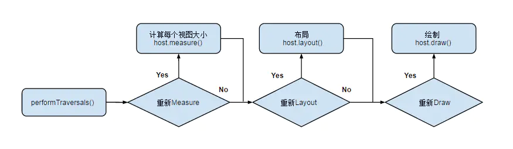
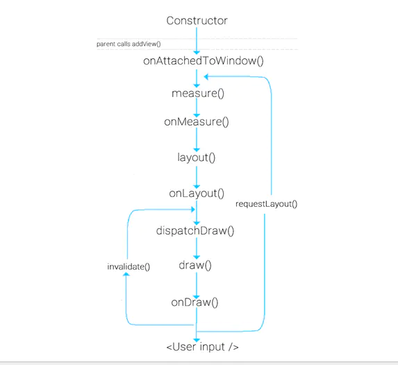
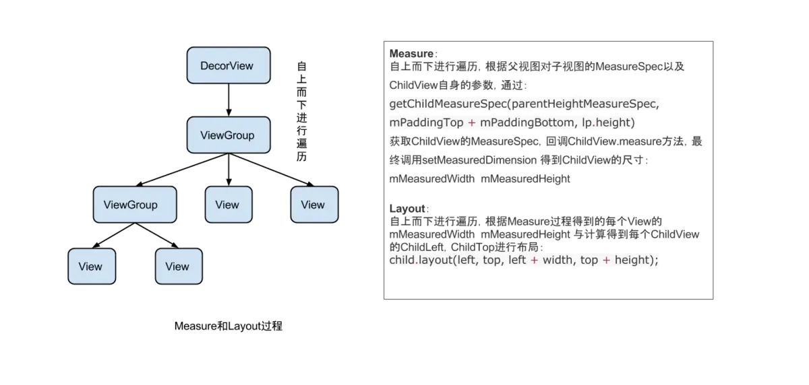
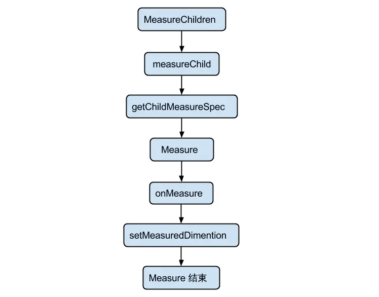
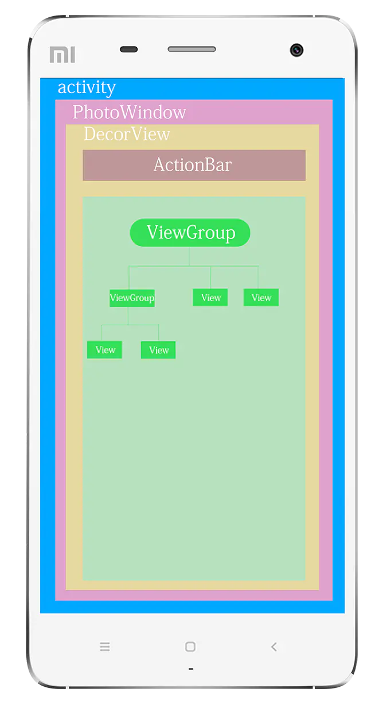
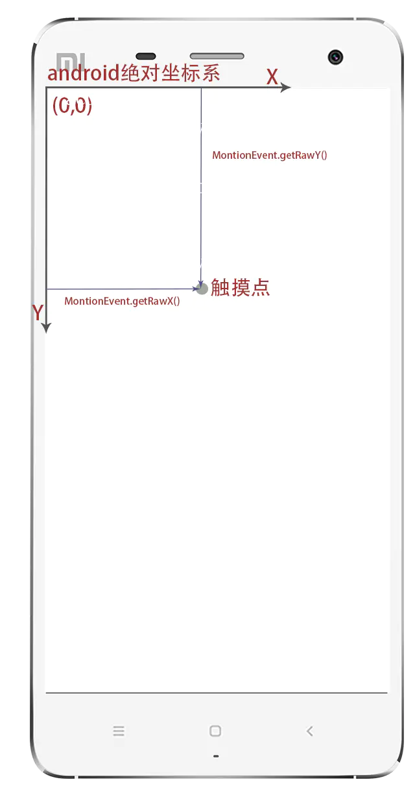
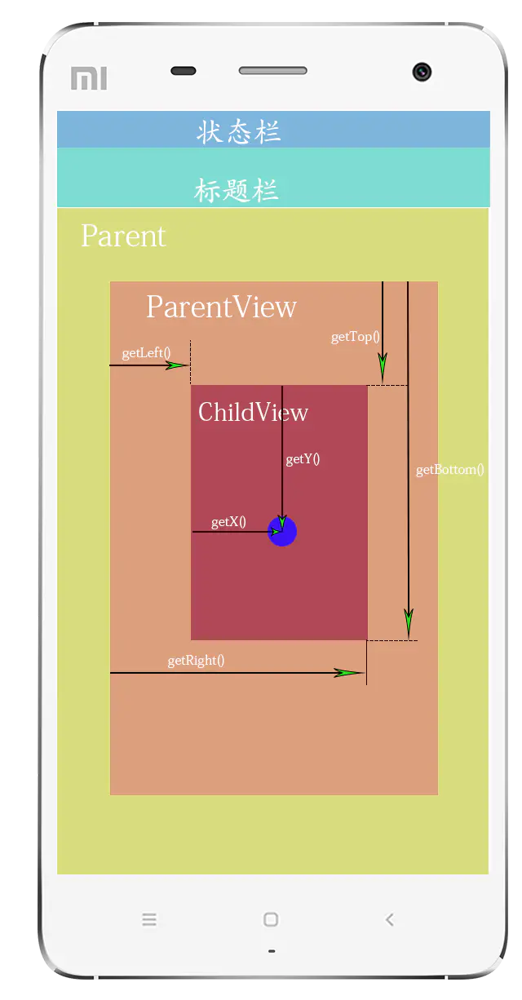

# View绘制

## ViewPager

#### 1.什么是ViewPager?说说它的那些适配器


**ViewPager的简介和作用**

官方描述： 页面允许左右滑动的布局管理器，而不同页面带有不同的数据。 


 ViewPager是android扩展包v4包中的类，这个类可以让用户左右切换当前的view
 1）ViewPager类直接继承了ViewGroup类，所有它是一个容器类，可以在其中添加其他的view类。
 2）类似于ListView，有自己的适配器，用来填充数据
 3）ViewPager经常和Fragment一起使用，并且提供了专门的FragmentPagerAdapter和FragmentStatePagerAdapter类供Fragment中的ViewPager使用。

**2.ViewPager的适配器**
 简介中提到了PagerAdapter，和ListView等控件使用一样,需要ViewPager设置PagerAdapter来完成页面和数据的绑定，这个PagerAdapter是一个基类适配器，我们经常用它来实现app引导图，它的子类有FragmentPagerAdapter和FragmentStatePagerAdapter,这两个子类适配器用于和Fragment一起使用，在安卓应用中它们就像listview一样出现的频繁。

实现一个最基本的PagerAdapter,**《必须实现四个方法》**，在代码里有注释

```java
public class AdapterViewpager extends PagerAdapter {
    private List<View> mViewList;

    public AdapterViewpager(List<View> mViewList) {
        this.mViewList = mViewList;
    }

    @Override
    public int getCount() {//必须实现
        //获取当前窗体界面数，也就是数据的个数
        return mViewList.size();
    }

    @Override
    public boolean isViewFromObject(View view, Object object) {//必须实现
        //这个方法用于判断是否由对象生成界面，官方建议直接返回 return view == object;。
        return view == object;
    }

    @Override
    public Object instantiateItem(ViewGroup container, int position) {//必须实现，实例化
        // 要显示的页面或需要缓存的页面，会调用这个方法进行布局的初始化。
        container.addView(mViewList.get(position));
        return mViewList.get(position);
    }

    @Override
    public void destroyItem(ViewGroup container, int position, Object object) {//必须实现，销毁
        //如果页面不是当前显示的页面也不是要缓存的页面，会调用这个方法，将页面销毁。
        container.removeView(mViewList.get(position));
    }
}
```

实现一个最基本的FragmentPagerAdapter

```java
public class AdapterFragment extends FragmentPagerAdapter {
    private List<Fragment> mFragments;

    public AdapterFragment(FragmentManager fm, List<Fragment> mFragments) {
        super(fm);
        this.mFragments = mFragments;
    }

    @Override
    public Fragment getItem(int position) {//必须实现
        return mFragments.get(position);
    }

    @Override
    public int getCount() {//必须实现
        return mFragments.size();
    }

    @Override
    public CharSequence getPageTitle(int position) {//选择性实现
        return mFragments.get(position).getClass().getSimpleName();
    }
}
```

FragmentStatePagerAdapter的实现和FragmentPagerAdapter的实现一样就不在写了

3个适配器的基本实现讲完了是不是很简单，那他们的**区别是什么**呢？
 PagerAdapter是基类适配器是一个通用的ViewPager适配器，相比PagerAdapter，FragmentPagerAdapter和FragmentStatePagerAdapter更专注于每一页是Fragment的情况，而这两个子类适配器使用情况也是有区别的。FragmentPagerAdapter适用于页面比较少的情况，FragmentStatePagerAdapter适用于页面比较多的情况。为什么？简单分析下两个适配器的源码就可以知道了。

- FragmentStatePagerAdapter

  

  ```java
     @Override
    public Object instantiateItem(ViewGroup container, int position) {
        // If we already have this item instantiated, there is nothing
        // to do.  This can happen when we are restoring the entire pager
        // from its saved state, where the fragment manager has already
        // taken care of restoring the fragments we previously had instantiated.
        if (mFragments.size() > position) {
            Fragment f = mFragments.get(position);//fragment被释放后这里得到的null值
            if (f != null) {
                return f;
            }
        }
  
        if (mCurTransaction == null) {
            mCurTransaction = mFragmentManager.beginTransaction();
        }
  
        Fragment fragment = getItem(position);//fragment被释放后或者是初次进入页面拿到新的Fragment实例
        if (DEBUG) Log.v(TAG, "Adding item #" + position + ": f=" + fragment);
        if (mSavedState.size() > position) {
            Fragment.SavedState fss = mSavedState.get(position);
            if (fss != null) {
                fragment.setInitialSavedState(fss);
            }
        }
        while (mFragments.size() <= position) {
            mFragments.add(null);
        }
        fragment.setMenuVisibility(false);
        fragment.setUserVisibleHint(false);
        mFragments.set(position, fragment);
        mCurTransaction.add(container.getId(), fragment);//新的Fragment实例 是add上去的
  
        return fragment;
    }
  
   @Override
    public void destroyItem(ViewGroup container, int position, Object object) {
        Fragment fragment = (Fragment) object;
  
        if (mCurTransaction == null) {
            mCurTransaction = mFragmentManager.beginTransaction();
        }
        if (DEBUG) Log.v(TAG, "Removing item #" + position + ": f=" + object
                + " v=" + ((Fragment)object).getView());
        while (mSavedState.size() <= position) {
            mSavedState.add(null);
        }
        mSavedState.set(position, fragment.isAdded()
                ? mFragmentManager.saveFragmentInstanceState(fragment) : null);
        mFragments.set(position, null);//真正释放了fragment实例
  
        mCurTransaction.remove(fragment);
    }
  ```

- FragmentPagerAdapter

  

  ```java
    @Override
    public Object instantiateItem(ViewGroup container, int position) {
        if (mCurTransaction == null) {
            mCurTransaction = mFragmentManager.beginTransaction();
        }
  
        final long itemId = getItemId(position);
  
        // Do we already have this fragment?
        String name = makeFragmentName(container.getId(), itemId);
        Fragment fragment = mFragmentManager.findFragmentByTag(name);
        if (fragment != null) {
            if (DEBUG) Log.v(TAG, "Attaching item #" + itemId + ": f=" + fragment);
            mCurTransaction.attach(fragment);//因为fragment实例没有被真正释放，所以可以直接attach效率高
        } else {
            fragment = getItem(position);//初始化页面的时候拿到fragment的实例
            if (DEBUG) Log.v(TAG, "Adding item #" + itemId + ": f=" + fragment);
            mCurTransaction.add(container.getId(), fragment,
                    makeFragmentName(container.getId(), itemId));//add上去
        }
        if (fragment != mCurrentPrimaryItem) {
            fragment.setMenuVisibility(false);
            fragment.setUserVisibleHint(false);
        }
  
        return fragment;
    }
  
    @Override
    public void destroyItem(ViewGroup container, int position, Object object) {
        if (mCurTransaction == null) {
            mCurTransaction = mFragmentManager.beginTransaction();
        }
        if (DEBUG) Log.v(TAG, "Detaching item #" + getItemId(position) + ": f=" + object
                + " v=" + ((Fragment)object).getView());
        mCurTransaction.detach((Fragment)object);//并没有真正释放fragment对象只是detach
    }
  ```

从源码中我们可以看出FragmentStatePagerAdapter中fragment实例在destroyItem的时候被真正释放，所以FragmentStatePagerAdapter省内存。FragmentPagerAdapter中的fragment实例在destroyItem的时候并没有真正释放fragment对象只是detach，所以FragmentPagerAdapter消耗更多的内存，带来的好处就是效率更高一些。所以得出这样的结论：**FragmentPagerAdapter适用于页面比较少的情况，FragmentStatePagerAdapter适用于页面比较多的情况，因此不同的场合选择合适的适配器才是正确的做法**


#### 2.你了解ViewPager2吗？和ViewPager 1有哪些区别？


#### 3.ViewPager + Fragment结合使用存在的内存泄漏的原因是什么？如何解决？

#### 4， **ViewPager只能嵌套View吗，可不可以嵌套Act？**

ViewPager继承自ViewGroup，自然只能嵌套View。如果实在要嵌套Activity，去看过时的TabActivity的用法，然后获取Activity展示后的窗体View（getWindow().getDecorView().getRootView()），没必要这么搞。

##### 5、假如ViewPager里面每一页有很大的数据量的内容，那么在快速的左右滑动时，如果出现了内存被回收的情况，如何处理？假如出现了OOM，怎么处理？

大量（海量）数据避免OOM从来的处理方法就是分而治之，一次显示不完，那就分页显示，分步加载；复用View（列表ContentView），使用缓存。使用缓存又带来及时回收的问题，推荐可以去看看ImageDownloader（最新的是LRUCache）中多级缓存（WeakReference，SoftReference等）机制，使用固定大小的Cache，移除时加入到WeakReference中，并定时清理（或者引入LRUCache等算法）；

#### 6、同上情况，如果使用Fragment代替Pager，切换时出现上面问题怎么解决？这种情况与Pager有什么区别？ 

使用Fragement就更简单了，基本思路跟2类似，处理好单个Fragment中的效率问题就好了，要说不同的地方，Fragment可以不必把所有的逻辑都写在一个Activity类中，模块更加清晰，维护起来也更方便，并且有自己的生命周期，如果你实现的逻辑比较简单（类似新版本介绍那样滑动几张图片，用ViewPager就可以），每个页面比较复杂的话，力荐Fragment！


 https://www.jianshu.com/p/38ab6d856b56 

## 3.15 View事件分发机制

 https://juejin.im/post/5dcbc6ad5188250cfe60cf48#heading-0 


#### 1.什么是事件分发机制？主要用来解决什么问题？


#### 2.给我说说事件分发的流程 & 你项目解决事件冲突的一些案例。


#### 3.分别讲讲有关事件分发的三个方法的作用及关系。

#### 4.如果我在一个设置了点击事件的TextView中dispatchTouchEvent方法强制回ture或者false会发生什么？

true和false的区别是true会执行`action_down`、`action_move`和`action_up`，而如果直接返回false只会执行到action_down。并且后续的viewgroup的`onInterceptTouchEvent`后续方法都不会被执行到。


#### 5.谈谈你对MotionEvent的认识？Cancel事件是什么情况下触发的？

#### 6.线性布局A下面放置一个Button,如果给Button设置了点击事件，在线性布局A中重写了dispatchTouchEvent,onInterceptHoverEvent，而且它们都回了true,那么Button的点击事件会被调用吗？当前Activity的onTouchEvent又是否会被调用呢？为什么？


#### 7.多点触摸事件平时接触过吗？如何监听用户第二个手指，第三个...？

#### 8.OnTouchListener & OnTouchEvent & OnClickListener三者之间的关系？

#### 9.谈谈你对MotionEvent的认识？Cancel事件是什么情况下触发的？

#### 10.能给我谈谈Android中坐标体系吗？

## 3.16 View绘制机制

#### 1.说说View绘制流程

 https://juejin.im/post/5affec946fb9a07ac23b019f 

**自定义控件：**
1、组合控件。这种自定义控件不需要我们自己绘制，而是使用原生控件组合成的新控件。 如标题栏。
2、继承原有的控件。这种自定义控件在原生控件提供的方法外，可以自己添加一些方法。 如制作圆角，圆形图片。
3、完全自定义控件：这个 View 上所展现的内容全部都是我们自己绘制出来的。比如说制作 水波纹进度条。


**View 树的绘图流程**：OnMeasure()——>OnLayout()——>OnDraw()

- **OnMeasure():**测量视图大小。从顶层父 View 到子 View 递归调用 measure 方法， measure 方法又回调 OnMeasure。
- **OnLayout():**确定 View 位置，进行页面布局。从顶层父 View 向子 View 的递归调用 view.layout 方法的过程，即父 View 根据上一步 measure 子 View 所得到的布局大小和布局参 数，将子 View 放在合适的位置上。
- **OnDraw():**绘制视图。ViewRoot 创建一个 Canvas 对象，然后调用 OnDraw()。六个 步骤：①、绘制视图的背景；②、保存画布的图层（Layer）；③、绘制 View 的内容；④、 绘制 View 子视图，如果没有就不用；
  ⑤、还原图层（Layer）；⑥、绘制滚动条。

###### **原理：**

当 Activity 接收到焦点的时候，它会被请求绘制布局,该请求由 Android framework 处理.绘制是从根节点开始，对布局树进行 measure 和 draw。整个 View 树的绘图流程在ViewRoot.java类的performTraversals()函数展开，该函数所做 的工作可简单概况为是否需要重新计算视图大小(measure)、是否需要重新安置视图的位置(layout)、以及是否需要重绘(draw)，流程图如下：



**View 绘制流程函数调用链**





需要说明的是，用户主动调用 request，只会出发 measure 和 layout 过程，而不会执行 draw 过程


**measure 和 layout**

从整体上来看 Measure 和 Layout 两个步骤的执行：




树的遍历是有序的，由父视图到子视图，每一个 ViewGroup 负责测绘它所有的子视图，而最底层的 View 会负责测绘自身。


**具体分析**

measure 过程由measure(int, int)方法发起，从上到下有序的测量 View，在 measure 过程的最后，每个视图存储了自己的尺寸大小和测量规格。 layout 过程由layout(int, int, int, int)方法发起，也是自上而下进行遍历。在该过程中，每个父视图会根据 measure 过程得到的尺寸来摆放自己的子视图。

measure 过程会为一个 View 及所有子节点的 mMeasuredWidth 和 mMeasuredHeight 变量赋值，该值可以通过getMeasuredWidth()和getMeasuredHeight()方法获得。而且这两个值必须在父视图约束范围之内，这样才可以保证所有的父视图都接收所有子视图的测量。如果子视图对于 Measure 得到的大小不满意的时候，父视图会介入并设置测量规则进行第二次 measure。比如，父视图可以先根据未给定的 dimension 去测量每一个子视图，如果最终子视图的未约束尺寸太大或者太小的时候，父视图就会使用一个确切的大小再次对子视图进行 measure。

**measure 过程传递尺寸的两个类**

ViewGroup.LayoutParams （View 自身的布局参数）

MeasureSpecs 类（父视图对子视图的测量要求）

ViewGroup.LayoutParams

这个类我们很常见，就是用来指定视图的高度和宽度等参数。对于每个视图的 height 和 width，你有以下选择：

具体值

MATCH_PARENT 表示子视图希望和父视图一样大(不包含 padding 值)

WRAP_CONTENT 表示视图为正好能包裹其内容大小(包含 padding 值)

ViewGroup 的子类有其对应的 ViewGroup.LayoutParams 的子类。比如 RelativeLayout 拥有的 ViewGroup.LayoutParams 的子类 RelativeLayoutParams。

有时我们需要使用 view.getLayoutParams() 方法获取一个视图 LayoutParams，然后进行强转，但由于不知道其具体类型，可能会导致强转错误。其实该方法得到的就是其所在父视图类型的 LayoutParams，比如 View 的父控件为 RelativeLayout，那么得到的 LayoutParams 类型就为 RelativeLayoutParams。

MeasureSpecs

测量规格，包含测量要求和尺寸的信息，有三种模式:

UNSPECIFIED

父视图不对子视图有任何约束，它可以达到所期望的任意尺寸。比如 ListView、ScrollView，一般自定义 View 中用不到，

EXACTLY

父视图为子视图指定一个确切的尺寸，而且无论子视图期望多大，它都必须在该指定大小的边界内，对应的属性为 match_parent 或具体值，比如 100dp，父控件可以通过MeasureSpec.getSize(measureSpec)直接得到子控件的尺寸。

AT_MOST

父视图为子视图指定一个最大尺寸。子视图必须确保它自己所有子视图可以适应在该尺寸范围内，对应的属性为 wrap_content，这种模式下，父控件无法确定子 View 的尺寸，只能由子控件自己根据需求去计算自己的尺寸，这种模式就是我们自定义视图需要实现测量逻辑的情况。

\3. measure 核心方法

measure(int widthMeasureSpec, int heightMeasureSpec)

该方法定义在View.java类中，为 final 类型，不可被复写，但 measure 调用链最终会回调 View/ViewGroup 对象的onMeasure()方法，因此自定义视图时，只需要复写onMeasure()方法即可。

onMeasure(int widthMeasureSpec, int heightMeasureSpec)

该方法就是我们自定义视图中实现测量逻辑的方法，该方法的参数是父视图对子视图的 width 和 height 的测量要求。在我们自身的自定义视图中，要做的就是根据该 widthMeasureSpec 和 heightMeasureSpec 计算视图的 width 和 height，不同的模式处理方式不同。

setMeasuredDimension()

测量阶段终极方法，在onMeasure(int widthMeasureSpec, int heightMeasureSpec)方法中调用，将计算得到的尺寸，传递给该方法，测量阶段即结束。该方法也是必须要调用的方法，否则会报异常。在我们在自定义视图的时候，不需要关心系统复杂的 Measure 过程的，只需调用setMeasuredDimension()设置根据 MeasureSpec 计算得到的尺寸即可，你可以参考[ViewPagerIndicator](https://link.jianshu.com?t=https://github.com/android-cn/android-open-project-analysis/tree/master/view-pager-indicator)的 onMeasure 方法。

下面我们取 ViewGroup 的measureChildren（int widthMeasureSpec, int heightMeasureSpec)方法对复合 View 的 Measure 流程做一个分析： MeasureChild 的方法调用流程图：



 https://www.jianshu.com/p/c6c99abd82e0 

#### 2.说说Activity View树结构

  

可以看出：

Activity 类似于一个框架，负责容器生命周期及活动，窗口通过 Window (抽象类)来管理
Window 负责窗口管理（实际是子类 PhoneWindow， Window 的具体通过 PhotoWindow 类实现，它也是唯一的 Window 实现类 ），窗口的绘制和渲染交给 DecorView(间接的继承自View)作为整个Activity的根布局。
DecorView 是 被分为两部分：ActionBar 部分（一般开发过程中都会隐藏，采用 google 推荐的 ToolBar）和 id 为 content的FragmentLayout部分，我们 setContentView(@LayoutRes int layoutResID) 设置的Activity XML布局就是在FragmentLayout中
layout.xml 是开发人员定义的布局文件，最终将被加载为DecorView的子组件

### 坐标系的计算

android坐标系分为两类： 绝对坐标系（相对于设备的屏幕）和相对坐标系也称视图坐标系（相对于父控件）。

1. 

   

    绝对坐标系 如图所示：

   

   绝对坐标系.png

在Android中，将屏幕的左上角的顶点作为Android坐标系的原点，这个原点向右是X轴正方向，原点向下是Y轴正方向。在这里主要强调MotionEvent触摸事件的getRawX()和getRawY():是获取的绝对坐标，还有绝对坐标经常需要计算的几个方法,在执行测量的系统方法是，需要在布局加载出来之后进行 一般在onWindowFocusChanged(boolean hasFocus)方法中执行 ：


```cpp
//获取整个屏幕宽高：
DisplayMetrics metrics = new DisplayMetrics();
getWindowManager().getDefaultDisplay().getMetrics(metrics);
int widthPixels = metrics.widthPixels;
int heightPixels = metrics.heightPixels;
```


```cpp
//获取状态栏高度
Rect rect= new Rect();
getWindow().getDecorView().getWindowVisibleDisplayFrame(rect);
int statusBarHeight = rectangle.top;
```


```cpp
//应用程序App区域宽高等尺寸获取
Rect rect = new Rect();
getWindow().getDecorView().getWindowVisibleDisplayFrame(rect);
```


```cpp
//View布局区域宽高等尺寸获取
Rect rect = new Rect();
getWindow().findViewById(Window.ID_ANDROID_CONTENT).getDrawingRect(rect);
```

1. 

   

    视图坐标系 如图所示：

   

   视图坐标系.png

视图坐标系其实就是我们在自定义控件，绘制过程中参考的坐标系，也就是View自身相对于父控件的距离，一般获取坐标的方法有：


```cpp
//View提供的方法：
//获取View自身顶边到其父布局顶边的距离
view.getTop()   
//获取View自身左边到其父布局左边的距离
view.getLeft()  
//获取View自身右边到其父布局左边的距离
view.getRight() 
//获取View自身底边到其父布局顶边的距离
view.getBottom()
//返回值为getLeft()+getTranslationX()，当setTranslationX()时getLeft()不变，getX()变。
view.getX() 
//返回值为getTop()+getTranslationY()，当setTranslationY()时getTop()不变，getY()变。
view.getY()
```


```cpp
//MotionEvent提供的方法：
//获取点击事件距离控件左边的距离，即视图坐标
getX()
//获取点击事件距离控件顶边的距离，即视图坐标
getY()
//获取点击事件距离整个屏幕左边距离，即绝对坐标
getRawX()
//获取点击事件距离整个屏幕顶边的的距离，即绝对坐标
getRawY()
```

还有一些滑动、动画的方法会在动画、滑动事件的专题进行解释。

#### 3.自定义View的方式有哪些?给我说说你之前项目中的案例

 总结来说，自定义控件的实现有三种方式，分别是：组合控件、自绘控件和继承控件。下面将分别对这三种方式进行介绍。 

一）组合控件

　　组合控件，顾名思义就是将一些小的控件组合起来形成一个新的控件，这些小的控件多是系统自带的控件。比如很多应用中普遍使用的标题栏控件，其实用的就是组合控件，那么下面将通过实现一个简单的标题栏自定义控件来说说组合控件的用法。

 1、新建一个Android项目，创建自定义标题栏的布局文件title_bar.xml

 2、创建一个类TitleView，继承自RelativeLayout： 

 　在TitleView中主要是为自定义的标题栏加载了布局，为返回按钮添加事件监听方法，并提供了设置标题文本的方法。 

 3、在activity_main.xml中引入自定义的标题栏： 

 4、在MainActivity中获取自定义的标题栏，并且为返回按钮添加自定义点击事件： 

（二）自绘控件

　　自绘控件的内容都是自己绘制出来的，在View的onDraw方法中完成绘制。下面就实现一个简单的计数器，每点击它一次，计数值就加1并显示出来。

1、创建CounterView类，继承自View，实现OnClickListener接口：

 2、在activity_main.xml中引入该自定义布局： 

（三）继承控件

　　就是继承已有的控件，创建新控件，保留继承的父控件的特性，并且还可以引入新特性。下面就以支持横向滑动删除列表项的自定义ListView的实现来介绍。

1、创建删除按钮布局delete_btn.xml，这个布局是在横向滑动列表项后显示的：

 2、创建CustomListView类，继承自ListView，并实现了OnTouchListener和OnGestureListener接口： 

 3、定义列表项布局custom_listview_item.xml，它的结构很简单，只包含了一个TextView： 

 4、定义适配器类CustomListViewAdapter，继承自ArrayAdapter<String>： 

 5、在activity_main.xml中引入自定义的ListView： 

 6、在MainActivity中对列表做初始化、设置列表项删除按钮点击事件等处理： 


 https://blog.csdn.net/qibanxuehua/article/details/69388944 

#### 4.invalidate和postvalidate的区别

**invalidate()：在主线程当中刷新；**

**postInvalidate()：在子线程当中刷新；**其实最终调用的就是 invalidate，原理依然 是通过工作线程向主线程发送消息这一机制。

```java
public void postInvalidate() { 
    postInvalidateDelayed(0);
}
public void postInvalidateDelayed(long delayMilliseconds) {
	// We try only with the AttachInfo because there's no point in invalidating 
    // if we are not attached to our window 
    final AttachInfo attachInfo = mAttachInfo;
    if (attachInfo != null){
        attachInfo.mViewRootImpl.dispatchInvalidateDelayed(this, delayMilliseconds);
    }
}
public void dispatchInvalidateDelayed(View view, long delayMilliseconds) {
    Message msg = mHandler.obtainMessage(MSG_INVALIDATE, view);
    mHandler.sendMessageDelayed(msg, delayMilliseconds);
}
public void handleMessage(Message msg) {
    switch (msg.what) {
        case MSG_INVALIDATE:
            ((View) msg.obj).invalidate();
            break;
```


 

#### 5.说说你在自定义View时常常重写的一些方法

 https://juejin.im/post/5affec946fb9a07ac23b019f 

#### 6.说说自定义View中如何自定义属性

Android系统的控件以android开头的都是系统自带的属性。为了方便配置自定义View的属性，我们也可以自定义属性值。 Android自定义属性可分为以下几步:

1. 自定义一个View
2. 编写values/attrs.xml，在其中编写styleable和item等标签元素
3. 在布局文件中View使用自定义的属性（注意namespace）
4. 在View的构造方法中通过TypedArray获取

## 实例说明

- 自定义属性的声明文件

```
    <?xml version="1.0" encoding="utf-8"?>
    <resources>
        <declare-styleable name="test">
            <attr name="text" format="string" />
            <attr name="testAttr" format="integer" />
        </declare-styleable>
    </resources>
复制代码
```

- 自定义View类

```
public class MyTextView extends View {
    private static final String TAG = MyTextView.class.getSimpleName();

    //在View的构造方法中通过TypedArray获取
    public MyTextView(Context context, AttributeSet attrs) {
        super(context, attrs);
        TypedArray ta = context.obtainStyledAttributes(attrs, R.styleable.test);
        String text = ta.getString(R.styleable.test_testAttr);
        int textAttr = ta.getInteger(R.styleable.test_text, -1);
        Log.e(TAG, "text = " + text + " , textAttr = " + textAttr);
        ta.recycle();
    }
}
复制代码
```

- 布局文件中使用

```
<RelativeLayout xmlns:android="http://schemas.android.com/apk/res/android"
    xmlns:tools="http://schemas.android.com/tools"
    xmlns:app="http://schemas.android.com/apk/res/com.example.test"
    android:layout_width="match_parent"
    android:layout_height="match_parent" >

    <com.example.test.MyTextView
        android:layout_width="100dp"
        android:layout_height="200dp"
        app:testAttr="520"
        app:text="helloworld" />

</RelativeLayout>
复制代码
```

## 属性值的类型format

(1). reference：参考某一资源ID

- 属性定义：

```
<declare-styleable name = "名称">
     <attr name = "background" format = "reference" />
</declare-styleable>
复制代码
```

- 属性使用：

```
<ImageView android:background = "@drawable/图片ID"/>
复制代码
```

(2). color：颜色值

- 属性定义：

```
<attr name = "textColor" format = "color" />
复制代码
```

- 属性使用：

```
<TextView android:textColor = "#00FF00" />
复制代码
```

(3). boolean：布尔值

- 属性定义：

```
<attr name = "focusable" format = "boolean" />
复制代码
```

- 属性使用：

```
<Button android:focusable = "true"/>
复制代码
```

(4). dimension：尺寸值

- 属性定义：

```
<attr name = "layout_width" format = "dimension" />
复制代码
```

- 属性使用：

```
<Button android:layout_width = "42dip"/>

复制代码
```

(5). float：浮点值

- 属性定义：

```
<attr name = "fromAlpha" format = "float" />
复制代码
```

- 属性使用：

```
<alpha android:fromAlpha = "1.0"/>
复制代码
```

(6). integer：整型值

- 属性定义：

```
<attr name = "framesCount" format="integer" />
复制代码
```

- 属性使用：

```
<animated-rotate android:framesCount = "12"/>
复制代码
```

(7). string：字符串

- 属性定义：

```
<attr name = "text" format = "string" />
复制代码
```

- 属性使用：

```
<TextView android:text = "我是文本"/>
复制代码
```

(8). fraction：百分数

- 属性定义：

```
<attr name = "pivotX" format = "fraction" />
复制代码
```

- 属性使用：

```
<rotate android:pivotX = "200%"/>
复制代码
```

(9). enum：枚举值

- 属性定义：

```
<declare-styleable name="名称">
    <attr name="orientation">
        <enum name="horizontal" value="0" />
        <enum name="vertical" value="1" />
    </attr>
</declare-styleable>
复制代码
```

- 属性使用：

```
<LinearLayout  
    android:orientation = "vertical">
</LinearLayout>
复制代码
```

注意：枚举类型的属性在使用的过程中只能同时使用其中一个，不能 android:orientation = “horizontal｜vertical"

(10). flag：位或运算

- 属性定义：

```
<declare-styleable name="名称">
    <attr name="gravity">
            <flag name="top" value="0x01" />
            <flag name="bottom" value="0x02" />
            <flag name="left" value="0x04" />
            <flag name="right" value="0x08" />
            <flag name="center_vertical" value="0x16" />
            ...
    </attr>
</declare-styleable>
复制代码
```

- 属性使用：

```
<TextView android:gravity="bottom|left"/>
复制代码
```

注意：位运算类型的属性在使用的过程中可以使用多个值

(11). 混合类型：属性定义时可以指定多种类型值

- 属性定义：

```
<declare-styleable name = "名称">
     <attr name = "background" format = "reference|color" />
</declare-styleable>
复制代码
```

- 属性使用：

```
<ImageView
android:background = "@drawable/图片ID" />
或者：
<ImageView
android:background = "#00FF00" />
```


#### 7.requestLayout(),onLayout(),onDraw(),drawChild()区别和联系


requestLayout()方法 ：会导致调用measure()过程 和 layout()过程 。 将会根据标志位判断是否需要ondraw

onLayout()方法(如果该View是ViewGroup对象，需要实现该方法，对每个子视图进行布局)

调用onDraw()方法绘制视图本身 (每个View都需要重载该方法，ViewGroup不需要实现该方法)

drawChild()去重新回调每个子视图的draw()方法

官方文档解释：

- 调用requestLayout()方法的时机是：当前View发生了一些改变，这个改变使得现有的View失效，所以调用requestLayout()方法对View树进行重新布局，过程包括了measure()和layout()过程，但不会调用draw()过程，即不会发生重新绘制视图过程

- 调用onLayout()的时机是：View需要给自己设置大小和位置了或者ViewGroup需要给子View和ViewGroup自身时调用。

  读者看完之后，就应该发现，其实两个方法之间的联系很少，调用时机不同，调用者不同，调用时处理的方式和结果都不同。

  

- onDraw()方法，View的绘制流程一共包括三步：①测量measure；②布局layout；③绘制draw；onDraw()方法就是在第三布绘制时发生，开发者已经测量好View的大小，设置好View的布局，剩下最后一步就是，具体画出这个布局。画的方法就是onDraw()，每个View都需要利用这个方法画出自己，ViewGroup除非设置了背景，否则不用调用该方法。有兴趣的读者可具体参考笔者的[《View绘制流程—自定义View相关》](https://blog.csdn.net/weixin_41101173/article/details/79704295)
  
- drawChild()方法的相关介绍，笔者还暂未在官方文档中找到，读者可以尝试查找。

  参考网址：https://developer.android.google.cn/index.html

   

  这幅图是Android硬件加速的方法调用图，笔者从其中截取了一部分，其中很清晰的展示了onDraw()方法和drawChild()方法之间的联系：

  1）自定义一个view时，重写onDraw()。

      调用view.invalidate(),会触发onDraw()和computeScroll()。前提是该view被附加在当前窗口上
      
      view.postInvalidate(); //是在非UI线程上调用的

  2）自定义一个ViewGroup，重写onDraw。

       onDraw()方法在ViewGroup中正如前文所说，可能不会被调用，原因是需要先设置一个背景(颜色或图)。表示这个group有东西需要绘制了，才会触发draw，之后是onDraw()。
      
      因此，一般直接重写dispatchDraw()来绘制viewGroup

  3）自定义一个ViewGroup

      dispatchDraw()会调用drawChild()。

  小结：①绘制VIew本身的内容，通过调用View.onDraw(canvas)函数实现；

  ②ViewGroup绘制自己的孩子通过dispatchDraw（canvas）实现，这个方法中调用drawChild()。

  上代码：

  //ViewGroup中：
  protected void dispatchDraw(Canvas canvas) {
      ...
      drawChild(...); //绘制子view
      ...
  }

  protected boolean drawChild(Canvas canvas, View child, long drawingTime) {
          return child.draw(canvas, this, drawingTime);
  }
  对dispatchDraw()方法感兴趣的读者，可参考这篇文章< https://blog.csdn.net/fuwei52331314/article/details/55250809 >


#### 8.如何计算出一个View的嵌套层级

```JAVA
 int i = 0;
    private void getParents(ViewParent view){

        if (view.getParent() == null) {
            Log.v("tag", "最终==="+i);
            return;
        }


        i++;
        ViewParent parent = view.getParent();
        Log.v("tag", "i===="+i);
        Log.v("tag", "parent===="+parent.toString());

        getParents(parent);
    }

/*
LinearLayout llVip;
getParents(llVip);
public abstract class ViewGroup extends View implements ViewParent

ViewGroup 是ViewParent的实现类，所以可以直接转，
LinearLayout 是ViewGroup 的子类
*/
```


#### 9.自定义View如何考虑机型适配

合理使用warp_content，match_parent.

尽可能的是使用RelativeLayout

针对不同的机型，使用不同的布局文件放在对应的目录下，android会自动匹配。

尽量使用点9图片。

使用与密度无关的像素单位dp，sp

引入android的百分比布局。

切图的时候切大分辨率的图，应用到布局当中。在小分辨率的手机上也会有很好的显示效果。


# 面试重点：

 https://www.jianshu.com/p/1f5d6faa0f43 