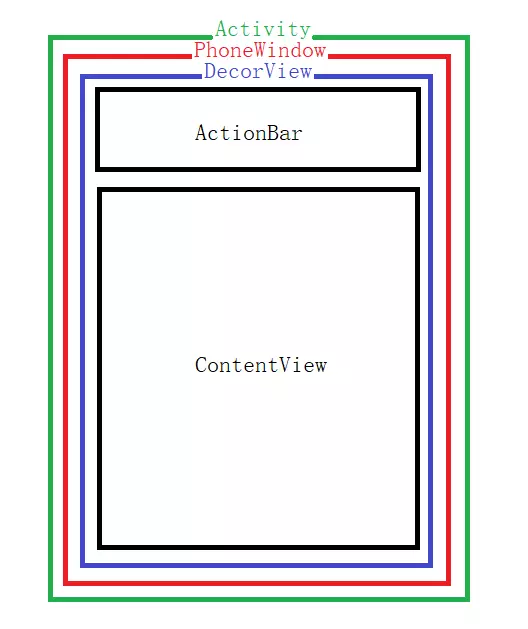
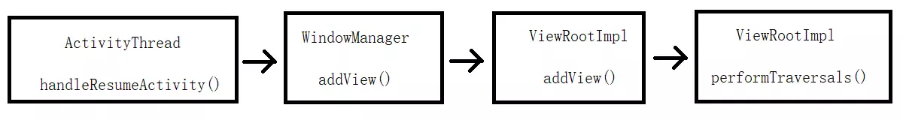
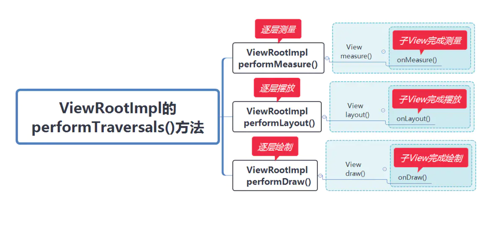
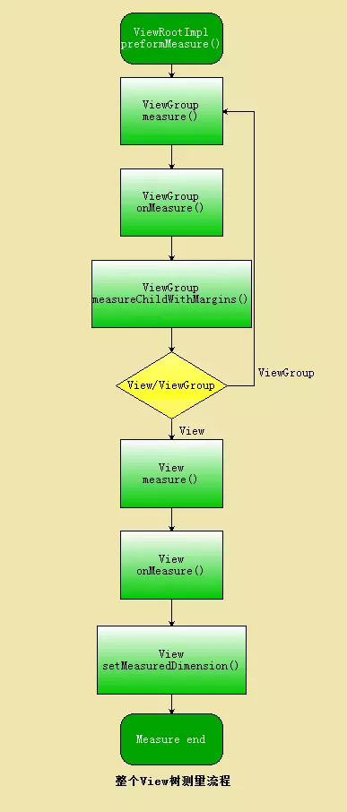
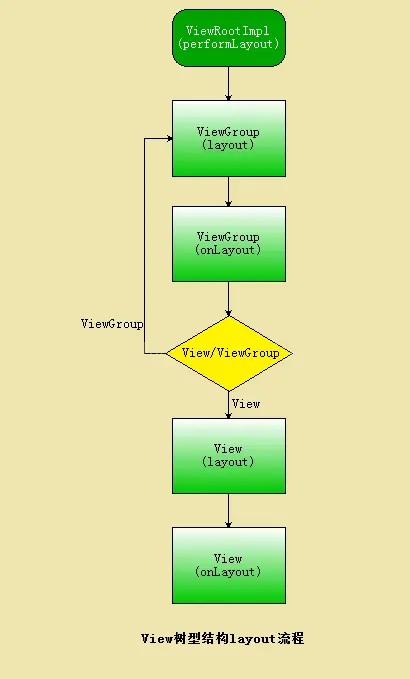
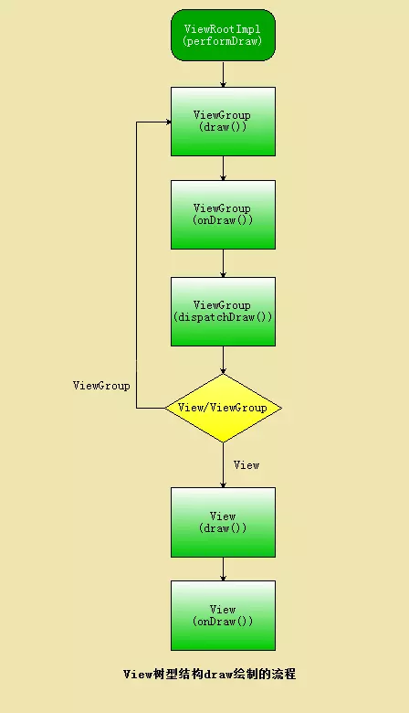

# 自定义View

## 一、Android的UI层级绘制体系


Android中的Activity是作为应用程序的载体存在的，它代表一个完整的用户界面并提供了窗口进行视图绘制。

- 在这里，我们这里所说的视图绘制，实质上就是在对View及其子类进行操作。而**View作为视图控件的顶层父类**，在本文中会对其进行详细分析。我们以Android的UI层级绘制体系为切入点对View进行探究。


  

​	

| 绘制体系中做了这些事情                                       |
| ------------------------------------------------------------ |
| ①当调用 Activity 的setContentView 方法后会调用PhoneWindow 类的setContentView方法（PhoneWindow是抽象类Windiw的实现类，Window用来描述Activity视图最顶端的窗口的显示内容和行为动作）。 |
| ②PhoneWindow类的setContentView方法中最终会生成一个DecorView对象（DectorView是是PhoneWindow的内部类，继承自FrameLayout）。 |
| ③DecorView容器中包含根布局，根布局中包含一个id为content的FrameLayout布局，Activity加载布局的xml最后通过LayoutInflater将xml文件中的内容解析成View层级体系，最后填加到id为content的FrameLayout布局中。 |

至此，View最终就会显示到手机屏幕上。

## 二、View的视图绘制流程剖析

### 1、DecorView被加载到Window中

DecorView被加载到Window的过程中，WindowManager起到了关键性的作用，最后交给ViewRootImpl做详细处理，通过如下的局部ActivityThread的源码分析这一点可以得到印证(在这里我只展示核心源码，详细源码可以在代码中查看)。

```dart
final void handleResumeActivity(IBinder token, boolean clearHide, boolean isForward, boolean reallyResume, int seq, String reason) {
        ActivityClientRecord r = mActivities.get(token);
       ...
       //在这里执行performResumeActivity的方法中会执行Activity的onResume()方法
        r = performResumeActivity(token, clearHide, reason);
       ...
       if (r.window == null && !a.mFinished && willBeVisible) {
          //PhoneWindow在这里获取到
          r.window = r.activity.getWindow();
          //DecorView在这里获取到
          View decor = r.window.getDecorView();
          decor.setVisibility(View.INVISIBLE);
          //获取ViewManager对象，在这里getWindowManager()实质上获取的是ViewManager的子类对象WindowManager
          ViewManager wm = a.getWindowManager();
          ...
          if (r.mPreserveWindow) {
          ...
          //获取ViewRootImpl对象
          ViewRootImpl impl = decor.getViewRootImpl();
           ...
          }
          if (a.mVisibleFromClient) {
              if (!a.mWindowAdded) {
                   a.mWindowAdded = true;
                   //在这里WindowManager将DecorView添加到PhoneWindow中
                   wm.addView(decor, l);
                   } 
                   ...
          }
          ...
    }
```

**WindowManager将DecorView添加到PhoneWindow中，即addView()方法执行时将视图添加的动作交给了ViewRoot**，ViewRoot作为接口，其实现类**ViewRootImpl具体实现了addView()方法**，最后，视图的具体绘制在performTraversals()中展开，如下图2.1所示：



图2.1 View绘制的代码层级分析


### 2、ViewRootImpl的performTraversals()方法完成具体的视图绘制流程

在源码中ViewRootImpl中视图具体绘制的流程如下：

```java
private void performTraversals() {
        // cache mView since it is used so much below...
        //mView就是DecorView根布局
        final View host = mView;
        //在Step3 成员变量mAdded赋值为true，因此条件不成立
        if (host == null || !mAdded)
            return;
        //是否正在遍历
        mIsInTraversal = true;
        //是否马上绘制View
        mWillDrawSoon = true;
         ...
        //顶层视图DecorView所需要窗口的宽度和高度
        int desiredWindowWidth;
        int desiredWindowHeight;

         ...
        //在构造方法中mFirst已经设置为true，表示是否是第一次绘制DecorView
        if (mFirst) {
            mFullRedrawNeeded = true;
            mLayoutRequested = true;
            //如果窗口的类型是有状态栏的，那么顶层视图DecorView所需要窗口的宽度和高度就是除了状态栏
            if (lp.type == WindowManager.LayoutParams.TYPE_STATUS_BAR_PANEL
                    || lp.type == WindowManager.LayoutParams.TYPE_INPUT_METHOD) {
                // NOTE -- system code, won't try to do compat mode.
                Point size = new Point();
                mDisplay.getRealSize(size);
                desiredWindowWidth = size.x;
                desiredWindowHeight = size.y;
            } else {//否则顶层视图DecorView所需要窗口的宽度和高度就是整个屏幕的宽高
                DisplayMetrics packageMetrics =
                    mView.getContext().getResources().getDisplayMetrics();
                desiredWindowWidth = packageMetrics.widthPixels;
                desiredWindowHeight = packageMetrics.heightPixels;
            }
    }
  ...
//获得view宽高的测量规格，mWidth和mHeight表示窗口的宽高，lp.widthhe和lp.height表示DecorView根布局宽和高
 int childWidthMeasureSpec = getRootMeasureSpec(mWidth, lp.width);
 int childHeightMeasureSpec = getRootMeasureSpec(mHeight, lp.height);

  // Ask host how big it wants to be
  //执行测量操作
 performMeasure(childWidthMeasureSpec, childHeightMeasureSpec);
  ...
  //执行布局操作
 performLayout(lp, desiredWindowWidth, desiredWindowHeight);
  ...
  //执行绘制操作
 performDraw();
}
```


 该方法主要流程就体现了View绘制渲染的三个主要步骤，分别是测量，摆放，绘制三个阶段。流程图如下图2.2所示：



​																		图2.2 View的绘制流程

接下来，我们对于 performMeasure()、performLayout()、 performDraw()完成具体拆解分析。实质上最后就需要定位到View的onMeasure()、onLayout()、onDraw()方法中。

## 三、MeasureSpec在View体系中的作用

### 1、MeasureSpec的作用

首先我们从performMeasure()入手分析，在上面的内容中，我们通过源码可以看到 performMeasure()方法中传入了childWidthMeasureSpec、childHeightMeasureSpec两个int类型的值，performMeasure方法的源码如下所示：

```java
private void performMeasure(int childWidthMeasureSpec, int childHeightMeasureSpec) {
        Trace.traceBegin(Trace.TRACE_TAG_VIEW, "measure");
        try {
            mView.measure(childWidthMeasureSpec, childHeightMeasureSpec);
        } finally {
            Trace.traceEnd(Trace.TRACE_TAG_VIEW);
        }
}
```

这两个值又传递到mView.measure(childWidthMeasureSpec, childHeightMeasureSpec)方法中，其中measure方法的核心源码如下：

```java
 public final void measure(int widthMeasureSpec, int heightMeasureSpec) {
        boolean optical = isLayoutModeOptical(this);
        if (optical != isLayoutModeOptical(mParent)) {
            Insets insets = getOpticalInsets();
            int oWidth  = insets.left + insets.right;
            int oHeight = insets.top  + insets.bottom;
            //根据原有宽高计算获取不同模式下的具体宽高值
            widthMeasureSpec  = MeasureSpec.adjust(widthMeasureSpec,  optical ? -oWidth  : oWidth);
            heightMeasureSpec = MeasureSpec.adjust(heightMeasureSpec, optical ? -oHeight : oHeight);
        }
        ...
        if (forceLayout || needsLayout) {
            // first clears the measured dimension flag
            mPrivateFlags &= ~PFLAG_MEASURED_DIMENSION_SET;

            resolveRtlPropertiesIfNeeded();

            int cacheIndex = forceLayout ? -1 : mMeasureCache.indexOfKey(key);
            if (cacheIndex < 0 || sIgnoreMeasureCache) {
                // measure ourselves, this should set the measured dimension flag back
                //在该方法中子控件完成具体的测量
                onMeasure(widthMeasureSpec, heightMeasureSpec);
                ...
            } 
         ...
    }
```

到这里我们应该明确，childWidthMeasureSpec, childHeightMeasureSpec是MeasureSpec根据原有宽高计算获取不同模式下的具体宽高值。

### 2、MeasureSpec剖析

MeasureSpec是View的内部类，内部封装了View的规格尺寸，以及View的宽高信息。在Measure的流程中，系统会将View的LayoutParams根据父容器是施加的规则转换为MeasureSpec，然后在onMeasure()方法中具体确定控件的宽高信息。源码及分析如下所示：

```java
public static class MeasureSpec {
        //int类型占4个字节，其中高2位表示尺寸测量模式，低30位表示具体的宽高信息
        private static final int MODE_SHIFT = 30;
        private static final int MODE_MASK  = 0x3 << MODE_SHIFT;

        /** @hide */
        @IntDef({UNSPECIFIED, EXACTLY, AT_MOST})
        @Retention(RetentionPolicy.SOURCE)
        public @interface MeasureSpecMode {}
        //如下所示是MeasureSpec中的三种模式：UNSPECIFIED、EXACTLY、AT_MOST                  

        /**
         * Measure specification mode: The parent has not imposed any constraint
         * on the child. It can be whatever size it wants.
         */
        public static final int UNSPECIFIED = 0 << MODE_SHIFT;

        /**
         * Measure specification mode: The parent has determined an exact size
         * for the child. The child is going to be given those bounds regardless
         * of how big it wants to be.
         */
        public static final int EXACTLY     = 1 << MODE_SHIFT;

        /**
         * Measure specification mode: The child can be as large as it wants up
         * to the specified size.
         */
        public static final int AT_MOST     = 2 << MODE_SHIFT;

        //根据尺寸测量模式跟宽高具体确定控件的具体宽高
        public static int makeMeasureSpec(@IntRange(from = 0, to = (1 << MeasureSpec.MODE_SHIFT) - 1) int size,
                                          @MeasureSpecMode int mode) {
            if (sUseBrokenMakeMeasureSpec) {
                return size + mode;
            } else {
                return (size & ~MODE_MASK) | (mode & MODE_MASK);
            }
        }

        /**
         * Like {@link #makeMeasureSpec(int, int)}, but any spec with a mode of UNSPECIFIED
         * will automatically get a size of 0. Older apps expect this.
         *
         * @hide internal use only for compatibility with system widgets and older apps
         */
        public static int makeSafeMeasureSpec(int size, int mode) {
            if (sUseZeroUnspecifiedMeasureSpec && mode == UNSPECIFIED) {
                return 0;
            }
            return makeMeasureSpec(size, mode);
        }

        //获取尺寸模式
        /**
         * Extracts the mode from the supplied measure specification.
         *
         * @param measureSpec the measure specification to extract the mode from
         * @return {@link android.view.View.MeasureSpec#UNSPECIFIED},
         *         {@link android.view.View.MeasureSpec#AT_MOST} or
         *         {@link android.view.View.MeasureSpec#EXACTLY}
         */
        @MeasureSpecMode
        public static int getMode(int measureSpec) {
            //noinspection ResourceType
            return (measureSpec & MODE_MASK);
        }

        //获取宽高信息
        /**
         * Extracts the size from the supplied measure specification.
         *
         * @param measureSpec the measure specification to extract the size from
         * @return the size in pixels defined in the supplied measure specification
         */
        public static int getSize(int measureSpec) {
            return (measureSpec & ~MODE_MASK);
        }

        //将控件的尺寸模式、宽高信息进行拆解查看，并对不同模式下的宽高信息进行不同的处理
        static int adjust(int measureSpec, int delta) {
            final int mode = getMode(measureSpec);
            int size = getSize(measureSpec);
            if (mode == UNSPECIFIED) {
                // No need to adjust size for UNSPECIFIED mode.
                return makeMeasureSpec(size, UNSPECIFIED);
            }
            size += delta;
            if (size < 0) {
                Log.e(VIEW_LOG_TAG, "MeasureSpec.adjust: new size would be negative! (" + size +
                        ") spec: " + toString(measureSpec) + " delta: " + delta);
                size = 0;
            }
            return makeMeasureSpec(size, mode);
        }

        /**
         * Returns a String representation of the specified measure
         * specification.
         *
         * @param measureSpec the measure specification to convert to a String
         * @return a String with the following format: "MeasureSpec: MODE SIZE"
         */
        public static String toString(int measureSpec) {
            int mode = getMode(measureSpec);
            int size = getSize(measureSpec);

            StringBuilder sb = new StringBuilder("MeasureSpec: ");

            if (mode == UNSPECIFIED)
                sb.append("UNSPECIFIED ");
            else if (mode == EXACTLY)
                sb.append("EXACTLY ");
            else if (mode == AT_MOST)
                sb.append("AT_MOST ");
            else
                sb.append(mode).append(" ");

            sb.append(size);
            return sb.toString();
        }
    }
```

MeasureSpec的常量中指定了两种内容，一种为尺寸模式，一种为具体的宽高信息。其中高2位表示尺寸测量模式，低30位表示具体的宽高信息。
 **尺寸测量模式有如下三种：**

| 尺寸测量模式的3种类型                                        |
| ------------------------------------------------------------ |
| ①UNSPECIFIED：未指定模式，父容器不限制View的大小，一般用于系统内部的测量 |
| ②AT_MOST：最大模式，对应于在xml文件中指定控件大小为wrap_content属性，子View的最终大小是父View指定的大小值，并且子View的大小不能大于这个值 |
| ③EXACTLY ：精确模式，对应于在xml文件中指定控件为match_parent属性或者是具体的数值，父容器测量出View所需的具体大小 |


​																		我帮你总结一下

**对于每一个View，都持有一个MeasureSpec，MeasureSpec保存了该View的尺寸测量模式以及具体的宽高信息，MeasureSpec受自身的LayoutParams和父容器的MeasureSpec共同影响。**


## 四、View的Measure流程分析

### 1、View树的Measure测量流程逻辑图



### 2、View的Measure流程分析

那么在上文3.1的分析中，我们能够明确在measure方法中最后调用onMeasure()方法完成子View的具体测量，onMeasure()方法的源码如下所示：

```cpp
    protected void onMeasure(int widthMeasureSpec, int heightMeasureSpec) {
        setMeasuredDimension(getDefaultSize(getSuggestedMinimumWidth(), widthMeasureSpec),
                getDefaultSize(getSuggestedMinimumHeight(), heightMeasureSpec));
    }
```

setMeasuredDimension()方法在onMeasure()中被调用，被用于存储测绘的宽度、高度，而不这样做的话会触发测绘时的异常。

```java
    protected final void setMeasuredDimension(int measuredWidth, int measuredHeight) {
        boolean optical = isLayoutModeOptical(this);
        if (optical != isLayoutModeOptical(mParent)) {
            Insets insets = getOpticalInsets();
            int opticalWidth  = insets.left + insets.right;
            int opticalHeight = insets.top  + insets.bottom;

            measuredWidth  += optical ? opticalWidth  : -opticalWidth;
            measuredHeight += optical ? opticalHeight : -opticalHeight;
        }
        setMeasuredDimensionRaw(measuredWidth, measuredHeight);
    }
```

在setMeasuredDimension()方法中传入的是getDefaultSize()，接着分析getDefaultSize()中做了哪些操作：

```cpp
    public static int getDefaultSize(int size, int measureSpec) {
        int result = size;
        int specMode = MeasureSpec.getMode(measureSpec);
        int specSize = MeasureSpec.getSize(measureSpec);

        switch (specMode) {
        case MeasureSpec.UNSPECIFIED:
            result = size;
            break;
        case MeasureSpec.AT_MOST:
        case MeasureSpec.EXACTLY:
            result = specSize;
            break;
        }
        return result;
    }
```

通过上文对MeasureSpec的分析，在这里我们就能明确，getDefaultSize实质上就是根据测绘模式确定子View的具体大小，而**对于自定义View而言，子View的宽高信息不仅由自身决定，如果它被包裹在ViewGroup中就需要具体测量得到其精确值。**

### 3、View的Measure过程中遇到的问题以及解决方案

View 的measure过程和Activity的生命周期方法不是同步执行的，因此无法保证Activity执行了onCreate、onStart、onResume时某个View已经测量完毕了。如果View还没有测量完毕，那么获得的宽和高都是0。下面是3种解决该问题的方法：

#### ①Activity/View的onWindowsChanged()方法

onWindowFocusChanged()方法表示 View 已经初始化完毕了，宽高已经准备好了，这个时候去获取是没问题的。这个方法会被调用多次，当Activity继续执行或者暂停执行的时候，这个方法都会被调用，代码如下：

```java
  public void onWindowFocusChanged(boolean hasWindowFocus) {
         super.onWindowFocusChanged(hasWindowFocus);
       if(hasWindowFocus){
       int width=view.getMeasuredWidth();
       int height=view.getMeasuredHeight();
      }      
  }
```

#### ②View.post(runnable)方法

通过post将一个 Runnable投递到消息队列的尾部，然后等待Looper调用此runnable的时候View也已经初始化好了

```java
@Override  
protected void onStart() {  
    super.onStart();  
    view.post(new Runnable() {  
        @Override  
        public void run() {  
            int width=view.getMeasuredWidth();  
            int height=view.getMeasuredHeight();  
        }  
    });  
}  
```

#### ③ViewTreeObsever

使用 ViewTreeObserver 的众多回调方法可以完成这个功能，比如使用onGlobalLayoutListener 接口，当 View树的状态发生改变或者View树内部的View的可见性发生改变时，onGlobalLayout 方法将被回调。伴随着View树的变化，这个方法也会被多次调用。

```java
  @Override  
  protected void onStart() {  
    super.onStart();  
    ViewTreeObserver viewTreeObserver=view.getViewTreeObserver();  
    viewTreeObserver.addOnGlobalLayoutListener(new ViewTreeObserver.OnGlobalLayoutListener() {  
        @Override  
        public void onGlobalLayout() {  
            view.getViewTreeObserver().removeOnGlobalLayoutListener(this);  
            int width=view.getMeasuredWidth();  
            int height=view.getMeasuredHeight();  
        }  
    });  
} 
```

当然，在这里你可以通过setMeasuredDimension()方法对子View的具体宽高以及测量模式进行指定。

## 五、View的layout流程分析

### 1、View树的layout摆放流程逻辑图



### 2、View的layout流程分析

**layout 的作用是ViewGroup来确定子元素的位置**，当 ViewGroup 的位置被确定后，在layout中会调用onLayout ，在onLayout中会遍历所有的子元素并调用子元素的 layout 方法。
 在代码中设置View的成员变量 mLeft，mTop，mRight，mBottom 的值，这几个值是在屏幕上构成矩形区域的四个坐标点，就是该View显示的位置，不过这里的具体位置都是相对与父视图的位置而言，而 onLayout 方法则会确定所有子元素位置，ViewGroup在onLayout函数中通过调用其children的layout函数来设置子视图相对与父视图中的位置，具体位置由函数 layout 的参数决定。下面我们先看View的layout 方法(只展示关键性代码)如下：

```java
/*  
 *@param l view 左边缘相对于父布局左边缘距离 
 *@param t view 上边缘相对于父布局上边缘位置 
 *@param r view 右边缘相对于父布局左边缘距离 
 *@param b view 下边缘相对于父布局上边缘距离 
 */  
    public void layout(int l, int t, int r, int b) {
        ...
        //记录 view 原始位置  
        int oldL = mLeft;
        int oldT = mTop;
        int oldB = mBottom;
        int oldR = mRight;
        //调用 setFrame 方法 设置新的 mLeft、mTop、mBottom、mRight 值，  
        //设置 View 本身四个顶点位置  
        //并返回 changed 用于判断 view 布局是否改变  
        boolean changed = isLayoutModeOptical(mParent) ?
                setOpticalFrame(l, t, r, b) : setFrame(l, t, r, b);
        //第二步，如果 view 位置改变那么调用 onLayout 方法设置子 view 位置  
        if (changed || (mPrivateFlags & PFLAG_LAYOUT_REQUIRED) == PFLAG_LAYOUT_REQUIRED) {
        //调用 onLayout  
            onLayout(changed, l, t, r, b);
            ...
        }
        ...
    }
```

## 六、View的draw流程分析

### 1、View树的draw绘制流程逻辑图



#### 2、View的draw流程分析

在View的draw()方法的注释中，说明了绘制流程中具体每一步的作用，源码中对于draw()方法的注释如下，我们在这里重点分析注释中除第2、第5步外的其他步骤。

```cpp
        /*
         * Draw traversal performs several drawing steps which must be executed
         * in the appropriate order:
         *
         *      1. Draw the background（绘制背景）
         *      2. If necessary, save the canvas' layers to prepare for fading（如果需要的话，保存画布背景以展示渐变效果）
         *      3. Draw view's content（绘制View的内容）
         *      4. Draw children（绘制子View）
         *      5. If necessary, draw the fading edges and restore layers（如果需要的话，绘制渐变边缘并恢复画布图层。）
         *      6. Draw decorations (scrollbars for instance)（绘制装饰（例如滚动条scrollbar））
         */
```

#### ①View中的drawBackground()绘制背景

核心源码如下：

```java
  private void drawBackground(Canvas canvas) {
        final Drawable background = mBackground;
        if (background == null) {
            return;
        }
        ...
        final int scrollX = mScrollX;
        final int scrollY = mScrollY;
        if ((scrollX | scrollY) == 0) {
            background.draw(canvas);
        } else {
            canvas.translate(scrollX, scrollY);
            background.draw(canvas);
            canvas.translate(-scrollX, -scrollY);
        }
    }
```

如果背景有偏移，实质上对画布首先做偏移处理，然后在其上进行绘制。

#### ②View内容的绘制

View内容的绘制源码如下所示：

```cpp
    protected void onDraw(Canvas canvas) {
    }
```

该方法是空实现，就根据不同的内容进行不同的设置，自定义View中就需要重写该方法加入我们自己的业务逻辑。

#### ③子View的绘制

子View的绘制源码如下所示：

```cpp
    protected void dispatchDraw(Canvas canvas) {

    }
```

该方法同样为空实现，而对于ViewGroup而言对子View进行遍历，并最终调用子View的onDraw方法进行绘制。

#### ④装饰绘制

装饰绘制的源码如下所示(只展示核心源码)：

```cpp
    public void onDrawForeground(Canvas canvas) {
        //绘制前景装饰
        onDrawScrollIndicators(canvas);
        onDrawScrollBars(canvas);
       ...
            foreground.draw(canvas);
    }
```

很明显，在这里onDrawForeground()方法用于绘制例如ScrollBar等其他装饰，并将它们显示在视图的最上层。

## 七、视图重绘

### 1、requestLayout重新绘制视图

子View调用requestLayout方法，会标记当前View及父容器，同时逐层向上提交，直到ViewRootImpl处理该事件，ViewRootImpl会调用三大流程，从measure开始，对于每一个含有标记位的view及其子View都会进行测量、布局、绘制。

### 2、invalidate在UI线程中重新绘制视图

当子View调用了invalidate方法后，会为该View添加一个标记位，同时不断向父容器请求刷新，父容器通过计算得出自身需要重绘的区域，直到传递到ViewRootImpl中，最终触发performTraversals方法，进行开始View树重绘流程(只绘制需要重绘的视图)。

### 3、postInvalidate在非UI线程中重新绘制视图

这个方法与invalidate方法的作用是一样的，都是使View树重绘，但两者的使用条件不同，postInvalidate是在非UI线程中调用，invalidate则是在UI线程中调用。

- 总结一下
   一般来说，如果View确定自身不再适合当前区域，比如说它的LayoutParams发生了改变，需要父布局对其进行重新测量、摆放、绘制这三个流程，往往使用requestLayout。而invalidate则是刷新当前View，使当前View进行重绘，不会进行测量、布局流程，因此如果View只需要重绘而不需要测量，布局的时候，使用invalidate方法往往比requestLayout方法更高效。


